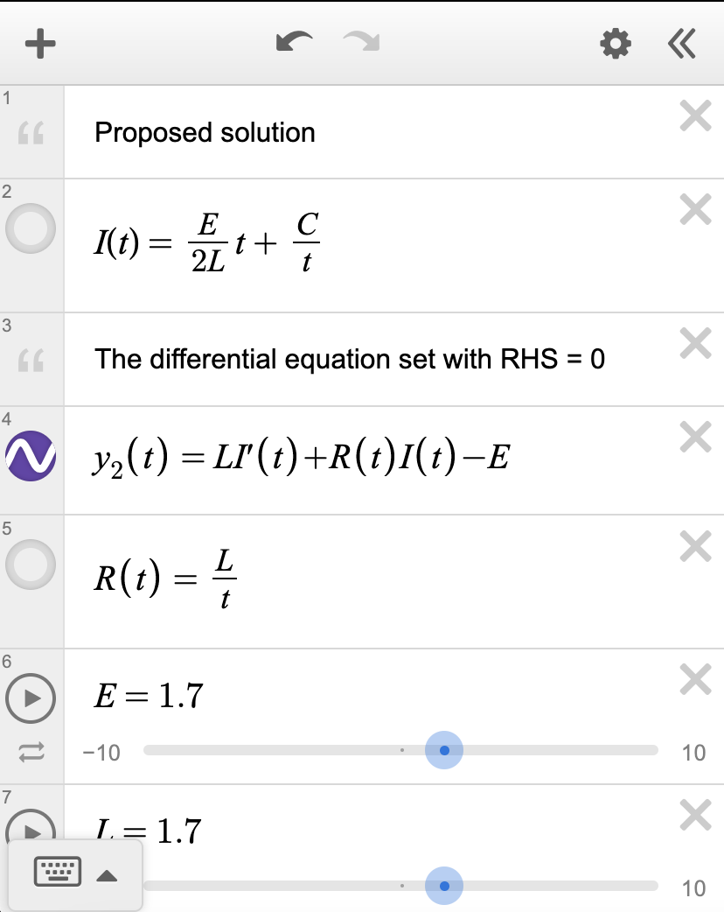
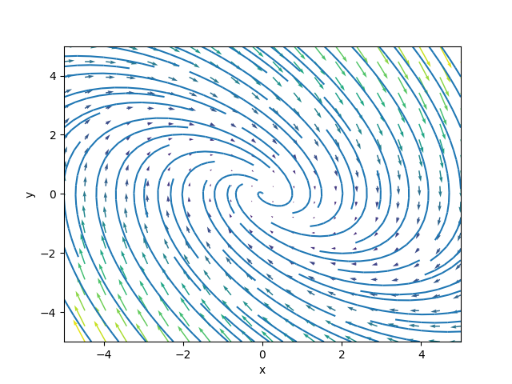

+++
title = "Notes on Differential Equations"
date = 2024-01-10
+++

These are notes taken in RPI's MATH 2400 course, on an introduction to differential equations. A special thanks to Dr. Kam of Rensselaer Polytechnic Institute for her excellent instruction and permission to share these notes.

<!-- more -->

Note that the general [Calculus series](@/calculus-series.md) and specifically the [Integration notes](@/integration.md) might be good to read alongside.

## Introduction

A _differential equation_ is an equation that contains derivatives of an unknown function. They are a powerful tool to describe a variety of physical processes.

We write differential equations because many relationships in physics, engineering, and other sciences relate one changing quantity to another. For instance, the radioactive decay rate $r$ is proportional to the amount of a radioactive substance $N$, so $r = kN$. But $r = \frac{dN}{dt}$, so we rewrite $r = kN$ as $\frac{dN}{dt} = kN$. We've now derived a differential equation.

Differential equations are classified via three main characteristics.

- Ordinary vs partial
- Order
- Linear vs nonlinear

These characteristics determine how they should be solved.

First, we can classify differential equations as either ordinary (ODE) or partial (PDE). ODEs contain an unknown function, typically $y$, of only one independent variable, typically $x$ or $t$. Meanwhile PDEs contain an unknown function, typically $u$, or more than one independent variable, such as $x, y, z$. How to distinguish? Just look for the derivative sign - if it contains $\partial$ (the partial derivative symbol), then it's a PDE, otherwise it's most likely an ODE.

For instance, an ODE could be:


\frac{d^2 y}{dx^2} + x \frac{dy}{dx} = 2y


Note that an ODE could contain several unknown functions (especially in systems of differential equations) so long as each function has only one independent variable:


\frac{d^2 x}{dt^2} + 3 \frac{dy}{dt} = 3x + 5y


And a PDE could be:


\frac{\partial^2 z}{\partial x^2} + \frac{\partial^2 z}{\partial y^2} = 1


Note that partial derivatives can also be denoted by subscripts (i.e. $\frac{\partial^2 z}{\partial x^2} = z_{xx}$) and ordinary derivatives can also be denoted by primes (i.e. $\frac{dy}{dx} = y'$).

Second, we can classify differential equations by order. The order is the order of the highest derivative. For instance, if the differential equation contains at most a 1st derivative, then it is of first-order. If it contains at most a 2nd derivative, then it is of second-order. Note: if you have something like $(\frac{dy}{dx})^2$, this is still a first-order derivative, despite the square!

Third, we can classify differential equations as either linear or nonlinear. In general, linear differential equations are easier to solve and analyze. A linear equation is **only** composed of derivative terms multiplied by functions of $x$ (or whatever the independent variable is). This is the most important distinguishing factor of a linear differential equation: there are **no functions of $y$ or functions of the derivatives of $y$ present**. 

The general form of a linear ordinary differential equation is:


f(x) \frac{d^n y}{dx^n} + \dots + g(x) \frac{d^2 y}{dx^2} + h(x) \frac{dy}{dx} + k(x) y = a(x)


If the equation can be rewritten such that $a(x) = 0$, then the differential equation is called _homogeneous_; otherwise, it is called _non-homogeneous_. The more informal definition is that a homogeneous differential equation must have either $y$ or a derivative of $y$ in every term when written in the form (left-hand-side) = 0. Homogeneity only applies for linear ODEs; any nonlinear ODE cannot be classified in this way.

An intuitive idea of homogeneity is to compare the general forms of a 1st-order homogeneous ODE with a 1st-order non-homogeneous ODE:


\begin{matrix}
\text{Homogeneous:} & y' + a(x) y = 0 \\
\text{Non-homogeneous:} & y' + a(x) y + b(x) + c = 0
\end{matrix}


Notice how the non-homogeneous equation has an extra $b(x) + c$ term but the homogeneous equation does not. This is a good way to tell the difference: if the differential equation has any isolated terms involving only $x$ or only a constant when written in the form (LHS) = 0, then it is non-homogeneous.

If a differential equation doesn't follow the general form of a linear differential equation, it is called _nonlinear_. For instance, the following is a nonlinear differential equation, because there is a function of the derivative $y'$ present:


\left(\frac{dy}{dx}\right)^3 + xy = 0


Similarly, the following is a nonlinear differential equation, because there is a function of $y$ present:


3y' + \sin(y) x^3 = 5x


Meanwhile, the following differential equation is linear and non-homogenous, because it has a term involving only $x$, but doesn't have any functions of $y$ or functions of derivatives of $y$:


x\frac{dy}{dx} + 3xy = 5x


Modifying it makes it homogeneous:


x \frac{dy}{dx} + 3xy = 0


Partial differential equations can also be linear so long as they don't have functions that depend on the dependent variable. For example, if the dependent variable is $u$, then the following is linear, because there is no function $f(u)$ in the equation:


\frac{\partial u}{\partial x} + 2 \frac{\partial u}{\partial y} + xy = 0


To solve a differential equation, there are 3 general steps:

- Is there a solution at all? (existence)
- How many solutions are there? (uniqueness)
- Can we determine the solutions? If so, how?

Generally, existence and uniqueness are topics handled by pure mathematicians, and one only usually needs to determine the solution via the appropriate method. The general idea typically involves matching the differential equation with a known case (i.e. a type of differential equation that has already been solved before). To check that the solution is correct, it is possible to verify by putting the solution back into the equation.

Solutions can be of two main types - explicit and implicit. An explicit solution is in the form of $y = y(x)$, such as $y = 3e^x$. An implicit solution is in the form $f(y) = g(x)$, such as $\sin(y) = 5x^3$. Explicit solutions are usually preferred, but sometimes only implicit solutions can be found.

Finally, differential equations are by no means a finished field. New methods of solving them and analyzing them are constantly being developed, but even so, there are many differential equations that simply have not yet been solved.

## A note on solutions

This is something that wasn't really mentioned much in MATH 2400, but is definitely crucial for solving differential equations outside the classroom. When we say that we "solve" a differential equation, we can mean a lot of different things.

The first idea of a solution is an **explicit solution** expressed in terms of **elementary functions**. For instance, the equation $y = \sin x$ is an explicit and elementary solution to the differential equation $y'' + y = 0$. It is explicit because it is in the form $y = y(x)$, with only $x$ terms on the right-hand side, and it is elementary because it involves combinations of only rational, trigonometric, exponential, logarithmic, and power functions. Or, more informally, it is elementary because it is written in terms of "familiar" functions.

Note that it is _a_ solution and not _the_ solution. This is because $y = 3\sin x$ is _also_ an explicit, elementary solution to $y'' + y' = 0$. In fact, so is $y = 6\sin x$ or $y = 11\sin x + 9 \cos x$ or $y = 2 \cos x$. So we typically want **general solutions** that describe all the possibilities that satisfy the differential equation. In this case, we can say that the explicit, elementary general solution to $y'' + y = 0$ is $y = A\sin x + B \cos x$, where $A$ and $B$ can be any constants. If we know the value of $y$ at one point, we can determine a _particular_ solution. For instance, if we know that $y(0) = 1$, then it must be true that $A = 0$ and $B = 1$, so the particular solution is $y = \cos x$, whereas if we know that $y(0) = 0$, then it must be true that $A = 1$ and $B = 0$, and so the particular solution is $y = \sin x$. 

General explicit solutions that are expressed in terms of elementary functions are the "nicest" type of solution, but these solutions are very rare. The next best thing is typically a general **implicit solution** expressed in terms of elementary functions. These are solutions that are in the form $F(x, y) = 0$, but still using the familiar set of functions (rational, trig, exponential, power, etc.). For example, the equation of a unit circle, that is, $x^2 + y^2 = 1$, is an implicit equation. These are more difficult to work with by hand, but modern graphing software like Desmos can plot implicit solutions just as well as explicit solutions, and so an implicit solution is "good enough" when it is the only thing available. In addition, a general solution, whether implicit or explicit, is almost always preferred, but in cases where a general solution cannot be found (which is often true for PDEs), a solution that isn't general is sufficient.

Finally, sometimes a solution cannot even be expressed in terms of elementary functions. However, they can be expressed using integrals. For instance, the solution to the differential equation $y'' + 2xy' = 0$ cannot be expressed using elementary functions, but can be written in terms of an integral:


y(x) = \int_0^x e^{-t^2}dt


These types of solutions are often called **reduction to quadrature** (quadrature is an antiquated term for what we would now call integration). They can be implicit or explicit, and modern computer software can plot both to good precision, albeit with more difficulty than solutions that don't involve integrals.

What if a differential equation can't be expressed in terms of elementary functions, and can't be expressed either implicitly or explicitly in terms of quadratures? There is then a third option - a **series solution**, which is a solution expressed in terms of infinite series. For example, the solution to the exponential growth equation is given by:


y = \sum_{n = 0}^\infty \frac{x^n}{n!}


Series solutions can be plotted readily using a computer, but are much less useful, because they often converge extremely slowly. A famous example is the three-body problem in astrophysics; a series solution exists, but for all intents and purposes it is useless because it takes millions of terms to converge.

Finally, there are differential equations that cannot be solved by _any_ of these methods. So instead, we aim for a **numerical solution** - an approximation to the differential equation using numerical algorithms, usually using a computer (though in the past there were analog machines that were constructed for this purpose, see [differential analyzer](https://en.wikipedia.org/wiki/Differential_analyser)). The vast majority of differential equations are solved this way.

## Separation of variables

Consider a first-order ODE in the form:


\frac{dy}{dx} = g(x) f(y)


Such an ODE can be rewritten in the form:


a(y) dy = b(x) dx


And with integration, it can be solved:


\int a(y) dy = \int b(x) dx


The idea is to move all the terms in $x$ to one side, move all the terms in $y$ to the other side, and integrate both sides. This gives a **general solution** to the differential equation, which is a family of functions. A particular solution (a single exact function) can be found if initial conditions are provided.

As an example, consider the exponential change differential equation, where $k$ is a constant:


\frac{dy}{dt} = ky


This differential equation is saying that an unknown function $y(t)$ changes through time proportionally to its value. It's natural that this would lead to exponential behavior: as the value of $y$ it changes more and more rapidly. The precise type of change depends on sign - if $k$ is positive, then the change is growth, if $k$ is negative, the change is decay.

To solve, we will use separation of variables, which involves treating the derivative as almost a fraction. We first multiply both sides by $dt$:


\frac{dy}{dt} dt = ky dt


The two $dt$'s cancel out so the result is:


dy = ky dt


Now we divide both sides by $y$ so that on the left of the equation, we only have variables in terms of $y$, and on the right, we only have variables in terms of $t$. So:


\frac{dy}{y} = kdt


We now integrate both sides:


\int \frac{dy}{y} = \int kdt


The result is:


\ln |y| + C_1 = kt + C_2


Here, we can define $C_3 = C_2 - C_1$. Remember, these are arbitrary constants of integration, so we can add them and subtract them and multiply and divide them at will, as long as they remain constants, the solution will still be satisfied. So the result is:


\ln |y| = kt + C_3


We take the exponential of both sides:


e^{\ln |y |} = e^{kt + C_3}


The left side cancels out so we just have:


y = e^{kt + C_3}


We can write this in a slightly more elegant way though. To do so, we first note that:


e^{kt + C_3} = e^{kt} e^{C_3}


Now we can define a fourth constant $C_4 = e^{C_3}$ - remember we can perform arbitrary manipulation on integration constants so long as they remain _constants_. We are left with:


e^{kt + C_3} = C_4 e^{kt}


So plugging that back in for $y$, we have:


y = C_4 e^{kt}


This is called the _general solution_, because it represents a family of solutions, each with a different constant for $C_4$. To find a _particular solution_, we need to know an initial value, which is typically provided. For instance, we may be told that $y(0) = 1$. That means:


1 = C_4 e^{k \cdot 0} \Rightarrow 1= C_4


We can now substitute $C_4 = 1$. Therefore, for the initial value $y(0) = 1$, the _particular solution_ is:


y(t) = e^{kt}


As another example, consider the differential equation of a falling object undergoing drag, where $m$ and $k$ are constants:


m \frac{dv}{dt} = mg - kv


We want to use separation of variables to solve. To do this, we first divide by $m$ to get:


\frac{dv}{dt} = g - \frac{k}{m} v


Now, we can multiply $dt$ to both sides to get:


dv = \left(g - \frac{k}{m} v\right) dt


And then dividing by the term on the RHS in brackets, we get:


\frac{dv}{g - \frac{k}{m} v} = dt


We can now integrate both sides (and this is why integration techniques are useful):


\int \frac{dv}{g - \frac{k}{m} v} = \int dt


The integration requires just a u-substitution on the LHS, and results in:


-\frac{m}{k} \ln \left | g - \frac{kv}{m} \right | + C_1 = t + C_2


Here, $C_1$ and $C_2$ are respectively the constants of integration from each integral - note that they are **not** the same. To clean up the equation, we can set a new constant of integration $C_3$, where $C_3 = C_2 - C_1$. Therefore, we have:


-\frac{m}{k} \ln \left | g - \frac{kv}{m} \right | = t + C_3


Now, we can multiply both sides by $-\frac{k}{m}$ to remove the constant from the LHS:


\ln \left | g - \frac{kv}{m} \right | = -\frac{k}{m} t - \frac{k}{m} C_3


We can define a new constant $C_4$, where $C_4 = -\frac{k}{m} C_3$:


\ln \left | g - \frac{kv}{m} \right | = -\frac{k}{m} t + C_4


Finally, we can raise both sides to the exponential to cancel out the natural log (here using the notation that $\exp(x) = e^x$):


\exp \left(\ln \left | g - \frac{kv}{m} \right |\right) = \exp \left(-\frac{k}{m} t + C_4 \right)


We know that the exponential of a natural log is just the argument to the natural log, so the LHS simplifies readily:


g - \frac{kv}{m} = e^{-\frac{k}{m} t + C_4}


Using properties of exponentials, we know that $e^{a + b} = e^a e^b$:


g - \frac{kv}{m} = e^{-\frac{k}{m} t} e^{C_4}


We'll now define a final constant $C$ where $C = e^{C_4}$, so:


g - \frac{kv}{m} = C e^{-\frac{k}{m} t}


Finally, solving for $v$, we get:


v(t) = \frac{m}{k} \left(g - C e^{-\frac{k}{m}t} \right)


First - is our solution _correct_? To verify it is correct, we can take its derivative and plug that derivative back into the original differential equation. Recall that the original equation was:


m\frac{dv}{dt} = mg - kv


If we take our solution $v(t)$, and differentiate it, we get:


\frac{dv}{dt} = Ce^{-\frac{k}{m} t}


Now, we can plug it back into the original differential equation:


mCe^{-\frac{k}{m} t} = mg - k \cdot \frac{m}{k} \left(g - C e^{-\frac{k}{m}t} \right)


If we simplify, we get:


m Ce^{-\frac{k}{m} t} = m Ce^{-\frac{k}{m} t}


The two sides match, so we can now declare that we have found a **general explicit solution** to this differential equation - general because $C$ is an arbitrary constant, so the solution really represents a _family_ of solutions:


v(t) = \frac{m}{k} \left(g - C e^{-\frac{k}{m}t} \right)


Suppose we are given the **initial condition** that $v(0) = 0$. If we substitute this into the equation, we have:


0 = \frac{m}{k} \left(g - C e^{-\frac{k}{m} \cdot 0} \right)


This simplifies to:


0 = \frac{mg}{k} - C


Therefore, given our specified initial condition, it must be true that:


C = \frac{mg}{k}


If we substitute this value of $C$ back into the equation, we get the _particular_ (or unique) solution of the differential equation, given the initial values:


v(t) = \frac{m}{k} \left(g - \frac{mg}{k} e^{-\frac{k}{m}t} \right)


## The method of substitution

Substitutions are often useful for turning inseparable differential equations into separable ones that are much easier to solve. However, they are not frequently taught, and were not a topic covered in RPI's MATH 2400. Thus, this is a supplemental section. 

There is _no_ general rule for a substitution - the only real guideline is that they simplify the differential equation, but knowing _what_ exactly to substitute is typically a matter of inspired guesswork. As an example, consider the following equation:


\frac{dy}{dx} = 6x + 2y

 In this case, a substitution that seems reasonable might be $u = 6x + 2y$. Therefore, the differential equation can be rewritten as:


\frac{dy}{dx} = u


If we take the derivative of $u$ with respect to $x$, we can use implicit differentiation to find:


\frac{du}{dx} = 6 + 2 \frac{dy}{dx}


Since $\frac{dy}{dx} = u$, we can substitute that in:


\frac{du}{dx} = 6 + 2 u


This is a separable equation, which can be straightforwardly solved - the steps are essentially identical to any other separable 1st-order ODE:


\int \frac{du}{6 + 2u} = \int dx \Rightarrow u = \frac{1}{2} Ce^{2x} - 3


We now simply need to substitute $6x + 20y$ back in for $u$, to obtain:


6x + 2 y = \frac{1}{2} Ce^{2x} - 3


Solving for $y$, we have:


y = \frac{1}{4} Ce^{2x} - 3x - \frac{3}{2}


Or written in a cleaned-up form:


y = \frac{1}{4} Ce^{2x} - 3\left(x + \frac{1}{2}\right)


There are many more substitutions, such as $u = \ln x$, $u = \frac{1}{x}$, $u = \frac{y}{x}$ that are useful for ODEs, and even more that extend to PDEs. They are a powerful tool in solving some differential equations that seem untackable.

## The method of integrating factors

Consider the first-order linear ODE:


\frac{dy}{dx} + p(x)y = q(x)


The method of integrating factors works only for 1st-order linear ODEs. To do so, we multiply the ODE by an **integrating factor** $\mu(x)$:


\mu(x) \frac{dy}{dx} + \mu(x)p(x)y = \mu(x) q(x)


Or in simplified notation:


\mu y' + \mu p y = \mu q


Now we're going to impose the restriction that $\mu(x)$ can't just be any function - it has to satisfy $\mu'(x) = \mu(x) p(x)$. Therefore we can say that $\mu p y = \mu' y$, so if we substitute that in, we have:


\mu y' + \mu'y = \mu q


Notice now that the LHS looks a lot like the expanded version of the product rule! Indeed it is, so we can rewrite it as:


(\mu y)' = \mu q


We can integrate both sides to get:


\mu y = \int \mu(x) q(x) dx


However, we still haven't figured out $\mu$, other than knowing it satisfies the differential equation $\mu' = \mu p$. Luckily this is a separable differential equation, which we can solve straightforwardly (here we call the integration constant $A$):


\frac{d\mu}{dx} = \mu p



\int \frac{d\mu}{\mu} = \int pdx



\ln|\mu| = \int pdx



\mu = Ae^{\int p(x) dx)}


If we substitute this back in, we have:


\mu y = \int \mu(x) q(x) dx \Rightarrow Ae^{\int p(x) dx} y = \int q(x) Ae^{\int p(x)dx} dx


The two integration constants $A$ on the LHS and RHS cancel out to have:


e^{\int p(x) dx} y = \int q(x) e^{\int p(x) dx} dx


Which we can solve for $y$ by multiplying by the inverse of $\displaystyle e^{\int p(x) dx}$ on the left:


y = e^{-\int p(x) dx} \int q(x) e^{\int p(x) dx} dx + Ce^{-\int p(x) dx}


This can seem very complicated, but at its core, it is just two important results that provide all we need to solve any differential equation in the form $y' + py = q$:


\mu y = \int \mu q(x) dx, \quad \mu' = \mu p(x)


As an example, consider the differential equation of an electrical circuit with an inductor and a resistor:


L \frac{dI}{dt} + R(t) I = \mathcal{E}


where $R(t) = \frac{L}{t}$ (this is a made-up resistance function, but the differential equation itself is real). We can use the method of integrating factors to solve. To do so, we first write out $R(t)$ explictly and divide by $L$ so that the equation takes the standard form of $y' + p(x) y = q(x)$. This results in:


\frac{dI}{dt} + \frac{1}{t} I = \frac{\mathcal{E}}{L}


Now, we can multiply an integrating factor $\mu(t)$ to every term:


\mu \frac{dI}{dt} + \mu \frac{1}{t} I = \mu \frac{\mathcal{E}}{L}


We find $\mu$ through integration:


\mu = \exp \left(\int p(x) dx \right) = \exp \left(\int \frac{1}{t} dt \right) = t


And now, we can finally use the integrating factor to solve for $I$:


\mu I = \int \mu q(t) dt \Rightarrow t I = \int t \frac{\mathcal{E}}{L} dt


Solving the integral, the result is:


t I = \frac{\mathcal{E}}{L} \frac{t^2}{2} + C


We isolate $I$ by dividing by $\frac{t}{L}$ to find the explicit general solution:


I(t) = \frac{1}{t} \left(\frac{E}{L} \frac{t^2}{2} + C\right)


So the final result is:


I(t) = \frac{E}{2L} t + \frac{C}{t}


As another more nontrivial example, consider the logistic differential equation, whose solution is the famous sigmoid function. This differential equation is given by:


y' - y = -y^2


We can simplify this differential equation by dividing by $y^2$ from all sides:


y^{-2} y' - y^{-1} = -1


And then moving every term other than $y'$ to the RHS:


y^{-2} y' = y^{-1} -1


The logistic differential equation is a special case of the Bernoulli differential equation with $n = 2$; the general form of a Bernoulli differential equation is:


y' + p(x) y = q(x) y^n


The Bernoulli differential equations can all be solved using the substitution $u = y^{1 - n}$. In this case, since $n = 2$, we use $u = y^{-1}$. Then, using implicit differentiation:


u' = \frac{du}{dx} = \frac{du}{dy}\frac{dy}{dx} = -y^{-2} y'


So, plugging in $u'$ and $u$, for $-y^{-2} y'$ and $y^{-1}$, we have:


-u' = u - 1


Or simplified:


u' + u = 1


This can be solved using the method of integrating factors. However, since we already used $u$, we would desire to use a different symbol for the integrating factor to avoid confusion - for instance, our integrating factor can be $\beta$. Then:


\beta u' - \beta u = \beta


We can compare this to the general form $\beta u' + p(x) \beta u = q(x)$ and use the definition of the integrating factor - that is, $\beta' = p(x) \beta$, where $p(x) = 1$ - in order to obtain:


\beta = \exp \left(\int 1dx\right) = e^x


If we substitute in $\beta'$, we have:


\beta u' + \beta' p(x) u = \beta


The LHS is just a product rule, so we can rewrite as:


(\beta u)' = \beta


We integrate both sides to get:


\beta u = \int \beta~dx


If we substitute in $\beta = e^{-x}$ we have:


e^x u = \int e^x~dx


Which becomes:


e^x u = e^x + C


We divide both sides by $e^{-x}$ to get:


u = \frac{e^x + C}{e^x}


We can now substitute $u = y^{-1}$ back to get:


y^{-1} = \frac{e^x + C}{e^x}


From which we can find $y$, the general solution:


y = \frac{e^x}{e^x + C}


If we solve for the condition $y(0) = 0.5$, then we have:


0.5 = \frac{e^0}{e^0 + C} \Rightarrow C = 1


Which means the _particular_ solution to the logistic differential equation given $y(0) = 0.5$ is given by:


y = \frac{e^x}{e^x + 1} = \frac{1}{1 + e^{-x}}


This is the easily recognizable sigmoid function extensively used in machine learning.

## Interlude: the desmos checking approach

Even after painstakingly finding a solution to a differential equation, it can be very, very tedious to manually verify that the solution to a differential equation is correct. Desmos can help tremendously. To do so, enter the proposed solution into desmos as a function of $x$. Then, enter in the differential equation cast in the form (LHS = 0). For example, the LR circuit differential equation shown previously might look something like this in desmos:

If the solution is correct, the plot of (ODE LHS = 0) should look like the line $y = 0$. If not, then it might be helpful to check if the solution is indeed correct.

## 2nd-order ODE general forms

The general form of a 2nd-order linear ODE is given by:


a_2(x) \frac{d^2 y}{dx^2} + a_1 (x) \frac{dy}{dx} + a_0(x)y = g(x)


Or in Lagrange notation:


a_2(x) y'' + a_1(x) y' + a_0(x) y = g(x)


Note that this means that any 2nd-order linear ODE can be written as a system of 2 first-order differential equations. If we let $v = y'$, then we can say:


\begin{align*}
a_2(x) v' + a_1(x) v + a_0(x)y &= g(x) \\
y' &= v
\end{align*}


Each of these two first-order differential equations has a unique solution given an initial condition - $v(0)$ (which is equal to $y'(0)$) for the first and $y(0)$ for the second. This means that the original 2nd-order linear ODE must have two solutions and two initial conditions. The two solutions, denoted $y_1(x)$ and $y_2(x)$, must also be _linearly independent_. Linearly independent means that $y_1(x) \neq c y_2(x)$ and $y_2(x) \neq c y_1(x)$ - one cannot be expressed as a constant multiple of the other. The reason for this is that we want two unique solutions, and if one can be expressed in terms of the other we essentially just have one solution, but we know that would be inconsistent with the fact two solutions must exist. Thus, the two solutions must be linearly independent.

The general solution of such a 2nd-order differential equation is obtained by a linear combination of both solutions:


y(x) = c_1 y_1(x) + c_2 y_2(x)


To find whether two solutions $y_1(x)$ and $y_2(x)$ are linearly independent, we check the **Wronskian**. Suppose the IVP has two solutions $y_1$ and $y_2$:


\begin{align*}
c_1 y_1 (x) + c_2 y_2 (x) &= 0 \\
c_2 y_1'(x) + c_2 y_2'(x) &= 0
\end{align*}


We can write this as a matrix $A \mathbf{x} = \mathbf{b}$:


\begin{pmatrix}
y_1 & y_2 \\
y_1' & y_2'
\end{pmatrix}
\begin{pmatrix}
c_1 \\
c_2
\end{pmatrix} =
\begin{pmatrix}
0 \\
0
\end{pmatrix}


The Wronskian is the determinant of $A$:


W = \det(A) = \begin{vmatrix}
y_1 & y_2 \\
y_1' & y_2'
\end{vmatrix} = y_1 y_2' - y_1' y_2


If $W \neq 0$, then the solutions are linearly independent. The derivation is straightforward but long and won't be presented here.

### Abel's formula

Abel's formulas says that if $y_1(x)$ and $y_2(x)$ are solutions of $y'' + p(x) y' + q(x) y = 0$, then:


W = C \exp \left(-\int p(x) dx\right)


Note that the general form of a linear 2nd-order ODE can be cast into this form by dividing by $a_2(x)$:


y'' + \frac{a_1(x)}{a_2(x)} y'' + \frac{a_0(x)}{a_2(x)}y = 0 \Rightarrow p(x) = \frac{a_1(x)}{a_2(x)}, q(x) = \frac{a_0(x)}{a_2(x)}


To prove this, we first know that:


\begin{align*}
y_1'' + py_1' + qy_1 &= 0 \\
y_2'' + py_2' + qy_2 &= 0
\end{align*}


If we eliminate $q$ by multiplying the top equation by $y_2$ and the bottom equation by $y_1$, we get:


y_2 y_1 '' + py_2 y_1' - y_1 y_2'' - py_1 y_2' = 0


We recognize the Wronskian $W = y_1 y_2' - y_2 y_1'$ if we factor out the second term:


(y_2 y_1'' - y_1 y_2'') - p(y_2 y_1' + y_1 y_2')


(y_2 y_1'' - y_1 y_2'') + p(-W) = 0


In addition, given the definition of the Wronskian, we can find that $W' = y_1 y_2'' - y_2 y_1''$. Therefore, the entire equation reduces down to:


-W' -pW = 0


Or:


W' + pW = 0


Solving this results in:


W = C \exp \left(-\int p(x) dx \right)


## The method of the characteristic equation

A typical 2nd-order constant-coefficient homogenous ODE is an ODE that can be written in the form:


a_2 y'' + a_1 y' + a_0 y = 0


Again, note that:
- It's _2nd-order_ because the highest order of derivatives is 2nd-order
- It's _constant-coefficient_ because $a_2$, $a_1$, and $a_0$ are all constants
- It's homogeneous because it doesn't contain any constant terms or a standalone $a(x)$ term on the LHS when written in the standard form (LHS = 0)

To solve this type of ODE, we first _propose_ a solution in the form $y = e^{rx}$. When we substitute this solution into the ODE, we have:


a_2 r^2 e^{rx} + a_1 re^{rx} + a_0e^{rx} = 0


Factoring, we have:


e^{rx} (a_2 r^2 + a_1 r + a_0) = 0


Given that $e^{rx}$ is always positive (a property of exponential functions), this can only be true if:


a_2 r^2 + a_1 r + a_0 = 0


We call this quadratic equation the _characteristic equation_. Therefore, solving for the roots of the characteristic equation $a_2 r^2 + a_1 r + a_0 = 0$ will yield the solution to the differential equation. There are several possible cases:

1. 2 real but distinct roots $r_1, r_2$
2. 2 real but repeated root $r_1, r_2$
3. 2 imaginary roots $r_1, r_2$

In the first case, the general solution is given by:


y = C_1 e^{r_1 x} + C_2 e^{r_2 x}


In the second case where $r_1 = r_2 = a$, the quadratic becomes $(x - a)^2 = 0$, and so the first general solution is no longer applicable because the two solutions $C_1 e^{ax}$ and $C_2 e^{ax}$ would be linearly dependent (i.e. just constant multiples of each other). Instead, the proposed solution can be modified to $y = ue^{ax}$, where $u$ is an unknown function. After computing $y''$ and $y'$ from this proposed solution, the general form of the ODE reduces to:


u'' e^{ax} = 0


Since $e^{ax} \neq 0$ (the exponential is always positive), the above differential equation simplifies to $u'' = 0$, which has the general solution $u = C_1 x + C_2$. Therefore, the general solution of the second case is:


y = (C_1 x + C_2) e^{r_1 x}


In the third case, we know that the roots $r_1, r_2$ are a conjugate pair, which means that if $r_1 = \alpha + \beta i$ then $r_2 = \alpha - \beta i$. Then the general form is given by:


y = c_1 e^{(\alpha + i\beta)} + c_1 e^{(\alpha - i\beta)}


Using the identity $e^{ix} = \cos x + i\sin x$, we can rewrite as:


y = e^{ax} (c_3 \cos \beta x + c_4 \sin \beta x)


As an example, **Hooke's law** describes the motion of an oscillating spring. It states that the force to extend or compress the spring by a certain distance $x$ is given by:


F = -kx


Since $F = ma$, and acceleration can be written as the second derivative of position, Hooke's law therefore naturally generalizes to the differential equation:


m\frac{d^2 x}{dt^2} = -kx


After some rearranging, the equation can be cast into the form:


\frac{d^2 x}{dt^2} + \frac{k}{m} x = 0


This is a homogeneous, linear second-order ODE, and can be solved by the method of the characteristic equation. First, we note that the characteristic equation is given by:


r^2 + \frac{k}{m} = 0


Solving for $r$, we find that:


r = \sqrt{\frac{k}{m}}i


And if we say that $r = \alpha + \beta i$, then:


\beta = \sqrt{\frac{k}{m}}


Recalling that when imaginary roots exist, the solution is given by $y = e^{\alpha t} (C_1 \cos \beta t + C_2 \sin \beta t)$, we can substitute $\alpha = 0$ and $\beta = \sqrt{\frac{k}{m}}$ to find:


y = e^{0t} \left(C_1 \cos \sqrt{\frac{k}{m}}t + C_2 \sin \sqrt{\frac{k}{m}} t \right)


We can now simplify by noting that $e^{0t} = 1$ and by defining $\omega = \sqrt{\frac{k}{m}}$, allowing the general solution to become:


y = C_1 \cos \omega t + C_2 \sin \omega t


## Primer: simultaneous equations

In the study of differential equations it is sadly often necessary to solve systems of two (or occasionally more) simultaneous equations. That is, simultaneous equations in the form:


\begin{align*}
a_1 x + b_1 y = c_1 \\
a_2 x + b_2 y = c_2
\end{align*}


To be able to solve these equations quickly and efficiently, we can take advantage of **Cramer's rule**. First, we define a quantity $D$ via the determinant of a special matrix:


D = \begin{vmatrix}
a_1 & b_1 \\
a_2 & b_2
\end{vmatrix}


We also define two quantities $D_1$ and $D_2$, where we count columns cycling from the right to the left:


D_1 = \begin{vmatrix}
c_1 & b_1 \\
c_2 & b_2
\end{vmatrix}



D_2 = \begin{vmatrix}
a_1 & c_1 \\
a_2 & c_2
\end{vmatrix}


Then the solution of the system of simultaneous equations is:


x = \frac{D_1}{D}, \quad y = \frac{D_2}{D}


## The method of undetermined coefficients

A 2nd-order constant-coefficient _inhomogeneous_ ODE is in the form:


a_2 y'' + a_1 y' + a_0 y = g(x)


The general solution of this type of ODE is given by:


y(x) = y_h(x) + y_f(x)


Here, $y_h(x)$ is the homogenous solution, which is the solution if it was true that $g(x) = 0$ (that is, if the ODE was homogeneous). Meanwhile, $y_f(x)$ is a fitting solution that "fits" the homogeneous solution $y_h(x)$ to work with the inhomogeneous term in the ODE.

> Note: for historical reasons, the fitting solution $y_f$ is often confusingly referred to as the _particular_ solution. This has nothing to do with the other definition of particular solution (the unique solution for a given initial-value problem).

The method of undetermined coefficients works with cases in which $g(x)$ has a finite number of linearly independent derivatives. For instance, $g(x)$ can take the form of these following functions:

- $x^k$
- $e^{\alpha x}$
- $\sin \alpha x$
- $\cos \alpha x$
- Any linear combination of the above functions in the form $a f_1(x) + b f_2(x) + c f_3(x) + \dots + z f_n(x)$, where $a, b, c$ are constant coefficients 

The idea is to first solve for the homogenous version of the ODE - this solution we call $y_h(x)$. Then we solve for a "fitting solution" $y_f(x)$. This fitting solution unfortunately has to be guessed, there is no direct procedure for doing so. However, there are a few general strategies for finding a good guess. First, each term in the guess should have an adjacent _undetermined coefficient_. Second, each term in the guess should ideally match a similar term in $g(x)$, like so:

| Term present in $g(x)$ | Term to add to fitting solution guess |
|----|-----|
| $x^k$ | $Ax^k + Bx^{k - 1} + \dots + Nx + M$ |
| $e^{kx}$ | $Ae^{kx}$ |
| $\sin kx$ or $\cos kx$ | $A \sin kx + B \cos kx$ |

For instance, if $g(x) = 3x^2 + 5e^{-2t}$, a possible guess could be:


y_f(x) = Ax^2 + Bx + C + De^{-2t}


And third, the fitting solution shouldn't contain any terms that are linearly dependent, or repeat terms in the homogeneous solution. For instance, it would be incorrect to write $Ax + Bx$ because those two terms are linearly dependent. Similarly, if the homogeneous solution (when fully distributed-out) contained a term $5 \sin 2x$, then the guess cannot contain a term $A \sin 2x$, because those two terms would be linearly dependent. Instead, a term $A x \sin (2x)$ could be added instead, which would not be linearly dependent with $5 \sin 2x$. This can be extended to a general technique - add powers of $x$ in front of a term every time a term could potentially be linearly dependent. Essentially, if $A\sin(2x)$ is linearly dependent, try $Ax \sin(2x)$, and if that still is linearly dependent, try $Ax^2 \sin(2x)$, and if that still doesn't work try $Ax^3 \sin(2x)$, and so on and so forth.

As an example of using this method, consider a rocket that is escaping a gravitational field, like that of the Earth. Without going too much into the physics, the basic idea is that the effect of gravity can be approximated, at least when the rocket is not too far from earth, by the differential equation:


\frac{d^2 r}{dt^2} + \sigma^2 r = \frac{F_0}{m}


where $\sigma$ is a constant, $m$ is the rocket's mass, and $F_0$ is the rocket engine's thrust force, and the solution is given by $r(t)$. For precise reasons about why this works, see the classical dynamics notes on the Taylor expansion of potential energy. In any case, the precise derivation of this differential equation isn't important; we only need to solve it, and we can use the **method of undetermined coefficients**.

To do so, we first need to find a homogeneous solution $r_h$ for the homogeneous version of this differential equation, and then a fitting solution $r_f$ (note: $r$ instead of $y$ because $r$ is the dependent variable here). Recall that the homogeneous version is just this differential equation with the RHS = 0, that is:


r'' + \sigma^2 r = 0


We solve this using the method of the characteristic equation. Since we are already using the variable $r$, we will switch to $q$ for the characteristic equation. As a reminder, a differential equation in the form $ay'' + by' + cy = 0$ has the characteristic equation $aq^2 + bq + c = 0$. In this case, we have $q^2 + \sigma^2 = 0$. The solutions to this characteristic equation are $q = \pm \sigma i$. So the general homogeneous solution is given by the imaginary roots case (mentioned previously), resulting in:


r_h = e^{0t} (C_1 \cos \sigma t + C_2 \sin \sigma t) = C_1 \cos \sigma t + C_2 \sin \sigma t


Now, we need to solve for a fitting solution. Since the RHS of the equation is a constant, which is essentially a term in the form $k \cdot t^0$, we use the terms table (mentioned above) to guess a fitting solution in the form:


r_f = At^2 + Bt + C


How do we find $A$, $B$, and $C$? We just plug $y_f$ into the LHS of the differential equation and see what those constants have to be to satisfy the RHS. To do this, we take derivatives of $r_f$:

| $r_f$ | $r_f'$ (first derivative) | $r_f''$ (second derivative) |
| ---- | ---- | ---- |
| $At^2 + Bt + C$ | $2At + B$ | $2A$ |

If we plug these back into the original differential equation $r'' + \sigma^2 r = \frac{F_0}{m}$ we get:


(2A) + \sigma^2 (At^2 + Bt + C) = \frac{F_0}{m}


We can just distribute and solve this equation for $A$, $B$, and $C$, but that is a lot of tedious algebra and it would be easy to make mistakes. Instead, we can use an equivalent tabular approach. To do this, we split the terms on the LHS of the differential equation to get:

| $r''$ | $\sigma^2 r$ |
| ---- | ---- |
| (to be filled...) | (to be filled...) |

Now we can fill in these columns with our calculated values of $r_f$, $r_f'$, and $r_f''$ from our earlier derivatives table. Here we can omit $r_f'$ here since there isn't a $r'$ term in the differential equation, and put the rest in:

| $r''$ | $\sigma^2 r$ |
| ---- | ---- |
| $2A$ | $A \sigma^2 t^2 + B \sigma^2 t + C \sigma^2$ |

Then, since we had a $t^2$ term, a $t$ term, and a constant ($t^0$) term in our guess for $r_f$, we count the number of $t^2$ terms, $t$ terms, and constant terms on both the LHS (our previous table) and RHS of the differential equation:

| Term | Coefficients in $r''$ term | Coefficients in $\sigma^2 r$ term | Coefficients on RHS |
| ---- | ---- | ---- | ---- |
| $t^2$ | 0 | $A \sigma^2$ | 0 |
| $t$ | 0 | $B \sigma^2$ | 0 |
| $t^0$ (i.e. constant) | $2A$ | $C \sigma^2$ | $\frac{F_0}{m}$ |

From here, we get three simultaneous equations:


\begin{align*}
0 + A\sigma^2 &= 0 \\
0 + B \sigma^2 &= 0 \\
2A + C \sigma^2 &= \frac{F_0}{m}
\end{align*}


The first two equations tell us that $A = B = 0$, and substituting $A = 0$ for the third equation tells us that $C = \frac{F_0}{\sigma^2 m}$. Substituting these values back into our fitting solution $r_f = At^2 + Bt + C$ gives us:


r_f = 0x^2 + 0x + \frac{F_0}{\sigma^2 m} \Rightarrow r_f = \frac{F_0}{\sigma^2 m}


Recalling that the solution to an inhomogeneous differential equation is the sum of the homogeneous solution $r_h$ and the fitting solution $r_f$, we have:


r(t) = r_h + r_f = C_1 \cos \sigma t + C_2 \sin \sigma t + \frac{F_0}{\sigma^2 m}


So the general solution is given by:


r(t) =  C_1 \cos \sigma t + C_2 \sin \sigma t + \frac{F_0}{\sigma^2 m}


For model rockets launched close to the surface of the Earth, this should be a reasonably good approximation. However, please do not launch a human-carrying rocket bound for space using this equation, unless you want to see a rocket blow up!

## Variation of parameters

The method of the **variation of parameters** is an alternative method to solve non-homogeneous linear 2nd-order ODEs. The method is extremely similar to the method of undetermined coefficients, in that first, a homogeneous solution $y_h$ is found, and then a fitting solution $y_f$ is found. The method does impose the additional requirement that the differential equation must be written in the form:

y'' + p(x) y' + q(x) y = g(x)


which means that to cast a differential equation in this form, any coefficients in front of $y''$ have to be divided out. As with previously, the general solution of such a differential equation is given by:

y(x) = y_h + y_f


The process starts by extracting the two solutions $y_1$ and $y_2$ from the homogeneous solution $y_h (x)$.  We are now going to _guess_ that the fitting solution $y_f(x)$ is given by:


y_f(x) = u_1(x) y_1 + u_2(x) y_2


What constraints can we use to obtain $u_1(x)$ and $u_2(x)$? First, we know that $y_f$ must satisfy the differential equation. Second, we're going to impose (guess) the additional constraint that $u_1' y_1 + u_2' y_2 = 0$. These facts allow us to write $u_1$ and $u_2$ as a system of two linear equations in the form $A \mathbf{x} = \mathbf{b}$:


\begin{bmatrix}
y_1 & y_2 \\
y_1' & y_2'
\end{bmatrix}
\begin{bmatrix}
u_1' \\
u_2'
\end{bmatrix} =
\begin{bmatrix}
0 \\
g(x)
\end{bmatrix}


The Wronskian is given by $W = \det(A)$, and if $W \neq 0$, then the system has a unique solution given by Cramer's rule:


u_1(x) = \int \frac{W_1}{W}, u_2(x) = \int \frac{W_2}{W}


where:


W_1 = \begin{vmatrix}
0 & y_2 \\
g(x) & y_2'
\end{vmatrix},
\quad
W_2 = \begin{vmatrix}
y_1 & 0 \\
y_1' & g(x)
\end{vmatrix}


Note that the order of the determinants can be remembered by looking at the system of equations from right-to-left column order and cycling in the "right-middle-left-right" order. $W_1$ has the right and middle columns, and $W_2$ has the left and right columns.

## Special cases of linear second-order ODEs

We consider the Euler differential equation:


a_2 x^2 y'' + a_1 x y' + a_0 y = 0


To solve, we propose the solution $y = x^k$. If we substitute into the equation, we have:


a_2 x^2 k(k - 1) x^{k - 2} + a_1 x kx^{k - 1} + a_0 x^k = 0


If we now factor out $x^k$, we have:


x^k (a_2 k(k - 1)  + a_1 k + a_0) = 0


Therefore, the characteristic equation becomes:


a_2 k^2 + (a_1 - a_2) k + a_0 = 0


For the case where $a_2 = 1$, which we can get by dividing all the terms of the differential equation by the leading coefficient of the $y''$, we have:


k^2 + (a_1 - 1) k + a_0 = 0


As with before, there are several cases:

- Two distinct real roots $k_1, k_2$
- One repeated real root $k_1$
- Two distinct complex root $k_1, k_2$

For the first case, the general solution is given by the linear combination of $y = x^k$ for each root:


y = C_1 x^{k_1} + C_2 x^{k_2}


For the second case, the previous general solution fails as it would be linearly dependent. Instead, we propose an alternate solution $y_2 = u(t)x^k$ and if we solve and use the substitution $x = e^t$, we get the general solution:


y = (C_1 \ln x + C_2) x^{k_1}


And for the third case, the general solution given the root $k = \alpha + \beta i$ is given by:


y = x^{\alpha k} (C_1 \cos (\beta \ln x) + C_2 \sin(\beta \ln x))


For the non-homogeneous case, the method is similar as that of non-homogeneous constant-coefficient 2nd-order ODEs. In particular, both variation of parameters and the method of undetermined coefficients would work.

## Reduction of order for 2nd-order ODEs

Consider the general 2nd-order homogeneous linear ODE:


f_2(x) y'' + f_1(x) y' + f_0(x) y = 0


If a known solution $y_1$ is known, the general solution is in the form:


y(x) = y_1 (x) v(x)


To find $v(x)$, we first substitute this general solution into the general form of the differential equation. 


f_2(y_1'' v + 2y_1'v' + y_1 v'') + f_1(y_1' v + y_1 v') + f_0 y_1 v= 0


The terms cancel out and we can factor to get:


f_2 y_1 v'' + (2 f_2 y_1' + f_1 y_1)v' = 0


If we let $u = v'(x)$, then we get the first-order _separable_ differential equation:


f_2 y_1 \frac{du}{dx} + (2 f_2 y_1' + f_1 y_1)u = 0


We can also consider the inhomogeneous case:


f_2(x) y'' + f_1(x) y' + f_0(x) y = g(x)


Which results in:


f_2 y_1 v'' + (2 f_2 y_1' + f_1 y_1)v' = g(x)


Again with the substitution $u = v'$, we end up with:


f_2 y_1 u' + (2 f_2 y_1' + f_1 y_1)u = g(x)


This a linear 1st-order differential equation that can be solved using the method of integrating factors.

Reduction of order isn't just useful for solving differential equations analytically. For the general 2nd-order differential equation $y'' = f_1 y' + f_2 y + g(x)$, then we can use $u_1 = y$, $u_2 = y'$. Then the equation can be written as two first-order differential equations:


u_1' = u_2 \\
u_2' = f_1 u_2 + f_2 u_1


Or:


\begin{pmatrix}
u_1' \\ u_2'
\end{pmatrix} =
\begin{pmatrix}
0 & 1 \\
f_2 & f_1
\end{pmatrix}
\begin{pmatrix}
u_1 \\ u_2
\end{pmatrix} +
\begin{pmatrix}
0 \\ g(x)
\end{pmatrix}


Which can be solved by computer algorithms.

## Systems of linear ODEs

We will now proceed to discussing _systems_ of linear ODEs. The methods of solving systems of linear ODEs come from linear algebra, which studies systems of **linear equations**. As a review of solving linear systems, consider the following system of two linear equations:


\begin{align*}
ax + by = k_1 \\
cx + dy = k_2
\end{align*}


This system of equations can be written in the form $A\mathbf{x} = \mathbf{B}$ in the following manner:


\begin{bmatrix}
a & b \\
c & d \\
\end{bmatrix}
\begin{bmatrix}
x \\
y
\end{bmatrix} = 
\begin{bmatrix}
k_1 \\
k_2
\end{bmatrix}


Where $A$ is a $2 \times 2$ matrix in the general form:


A = 
\begin{pmatrix}
a & b \\
c & d \\
\end{pmatrix}


The determinant of $A$, denoted $\det(A)$, is given by $ad - bc$. If $\det(A) \neq 0$, then it is said to have an **inverse** $A^{-1}$:


\frac{1}{\det(A)} 
\begin{bmatrix}
d & -b \\
-c & a
\end{bmatrix}


The significance of finding the inverse is that if the inverse $A^{-1}$, is known, then:


\mathbf{x} = A^{-1} b


A special case is that of a homogeneous system $A \mathbf{x} = 0$. In this case, if $A$ is **non-singular**, then there exists one unique solution; if $A$ is **singular**, there exists infinitely many solutions.

| Matrix Type | Invertibility  | Homogeneous System $ A\mathbf{x} = \mathbf{0} $ | Inhomogeneous System $ A\mathbf{x} = \mathbf{b} $ |
|----|----|----|---|
| **Non-Singular** | Invertible | Unique solution: $ \mathbf{x} = \mathbf{0} $ (trivial solution) | Unique solution: $ \mathbf{x} = A^{-1} \mathbf{b} $ (non-trivial solution) |
| **Singular** | Non-Invertible | Infinitely many non-trivial solutions | No solution or infinitely many non-trivial solutions |

Finally, two solution vectors $\mathbf{x}_1$ and $\mathbf{x}_2$ are linearly independent if one cannot be written in terms of the other multiplied by a constant. For instance $(1, 2)$ and $(2, 4)$ aren't linearly independent, but $(1, 2)$ and $(1, 3)$ are. Linear independence can be rigorously proven by checking that the equation $c_1 \mathbf{x}_1 + c_2 \mathbf{x}_2 = 0$ is satisfied only if $c_1 = c_2 = 0$.

### Eigenvalue problems

We can solve special cases of linear systems of equations by rewriting them as eigenvalue problems. First, it is helpful to define what eigenvalues are. Typically, a matrix applied to a nonzero vector $\mathbf{x}$ outputs a vector that isn't a scalar multiple of the original vector. However, in some cases, a matrix applied to a vector outputs a vector that _is_ a scalar multiple of the original vector. That is, we can write that:


A \mathbf{x} = \lambda \mathbf{x}


Any vector $\mathbf{x}$ that satisfies this property is called an **eigenvector** of $A$, and $\lambda$ is called the **eigenvalue**. This is important because the eigenvalue equation above can be rewritten as:


\det (A-I\lambda) \mathbf{x} = 0


Therefore:


\det (A-I\lambda) = 0


And _any_ linear system of equations in the form $A\mathbf{x} = \lambda \mathbf{x}$ can be solved using techniques of eigenvalue problems.

For a general $2 \times 2$ matrix $A$ as given before in the form:


A = 
\begin{pmatrix}
a & b \\
c & d \\
\end{pmatrix}


Then the eigenvalue equation becomes:


(a - \lambda)(d - \lambda) - bc = 0


and can be solved for $\lambda$ using typical quadratic methods. In the special case that one value of $\lambda$ is imaginary, the other value of $\lambda$ is its conjugate pair.

Then, from substitution of each eigenvalue into the eigenvector equation $(A - \lambda I) \mathbf{x} = 0$, the eigenvectors $\mathbf{x}$ can be found. Note that a $N \times N$ matrix has at most $N$ eigenvectors. In the case that the matrix is a $2 \times 2$ matrix, it has at most 2 (but possibly fewer) eigenvectors.

### Finding eigenvalues and eigenvectors

As an example, consider the matrix:


A = \begin{pmatrix}
6 & -1 \\
2 & 3
\end{pmatrix}


We want to find its eigenvalues and its eigenvectors. To do so, we recall that $\det (A - \lambda I) = 0$. Therefore:


\det
\begin{pmatrix}
\begin{bmatrix}
6 & -1 \\
2 & 3
\end{bmatrix} - \lambda \begin{bmatrix}
1 & 0 \\
0 & 1
\end{bmatrix}
\end{pmatrix} = 0


Which simplifies to:


\det \begin{pmatrix}
6 - \lambda & -1 \\
2  & 3 - \lambda
\end{pmatrix} = 0


If we compute the determinant, we have:


(6 - \lambda) (3 - \lambda) - (-1)(2) = 0 \Rightarrow \lambda^2 -9\lambda + 20 = 0


The solution is:


(\lambda - 4)(\lambda - 5) \Rightarrow \lambda_1 = 4, \lambda_2 = 5


Now we must find the actual eigenvectors \mathbf{x}_{e, i} (there may be one eigenvector or two eigenvectors for a 2D matrix). To do so, we substitute each eigenvalue into $(A - \lambda_i I) \mathbf{x}_{e, i} = 0$. We first compute $A - \lambda_i I$ for $i = 1$:


A - \lambda_1 I=
\begin{pmatrix}
6 & -1 \\
2 & 3
\end{pmatrix} - 4 \begin{pmatrix}
1 & 0 \\
0 & 1
\end{pmatrix}
 = \begin{pmatrix}
2 & -1 \\
2 & -1
\end{pmatrix}


So the eigenvector equation $(A - \lambda_1 I) \mathbf{x}_{e, 1} = 0$ becomes:


(A - \lambda_1 I) \mathbf{x}_{e, 1} =
\begin{pmatrix}
2 & -1 \\
2 & -1
\end{pmatrix}
\begin{pmatrix}
x_1 \\
x_2
\end{pmatrix} =
\begin{pmatrix} 0 \\ 0 \end{pmatrix}

> The mathematical reader may note that here $C = A - \lambda I$ must be a _singular_ matrix with infinitely many solutions for nonzero $\mathbf{x}$. 

We want to solve for the eigenvectors of this matrix. To do so, we first assume the eigenvector is in the form:


\mathbf{x}_{e, 1} = \begin{pmatrix} a \\ x_2 \end{pmatrix}


Where $a$ is an arbitrary constant. If we do the matrix-vector multiplication on the first row, we get:


\begin{pmatrix} 2 & -1 \end{pmatrix}
\begin{pmatrix} a \\ x_2 \end{pmatrix} = 0 \Rightarrow 2a - x_2 = 0


From here, we can solve $x_2 = 2a$. Therefore, the **first eigenvector** is $\mathbf{x}_{e, 1} = (a, 2a)$, which we can rewrite as:


\mathbf{x}_{e, 1} = \begin{pmatrix} a \\ 2a \end{pmatrix} = a \begin{pmatrix} 1 \\ 2 \end{pmatrix}


Any scalar multiple of an eigenvector is also an eigenvector, since $a$ is an arbitrary constant, and we typically prefer to write eigenvectors in their simplest integer form, so there are no denominators in the eigenvector. Therefore, we can set $a = 1$ to get the eigenvector in simplest integer form:


\mathbf{x}_{e, 1} = \begin{pmatrix} 1 \\ 2 \end{pmatrix}


Since the first row and second row in the matrix $A - \lambda_1 I$ are identical, we do not need to repeat the process for the second row. Therefore, we have our first set of associated eigenvalues and eigenvectors:


\lambda_1 = 4, \quad \mathbf{x}_{e, 1} = \begin{pmatrix} 1 \\ 2 \end{pmatrix}


We do the same with $\lambda_2 = 5$. Then the matrix $A - \lambda_2 I$ expands to:


A - \lambda_2 I = 
\begin{pmatrix}
6 & -1 \\
2 & 3
\end{pmatrix} - 5 \begin{pmatrix}
1 & 0 \\
0 & 1
\end{pmatrix}
 = \begin{pmatrix}
1 & -1 \\
2 & -2
\end{pmatrix}


Therefore, the eigenvector equation becomes:


(A - \lambda_2 I) \mathbf{x}_{e, 2} = 
\begin{pmatrix}
1 & -1 \\
2 & -2
\end{pmatrix} 
\begin{pmatrix} a \\ x_2 \end{pmatrix} = 
\begin{pmatrix} 0 \\ 0 \end{pmatrix}


We again assume an eigenvector in the form:


\mathbf{x}_{e, 2} = \begin{pmatrix} a \\ x_2 \end{pmatrix}


By doing matrix-vector multiplication we get $1 a - 1 x_2 = a - x_2 = 0 \Rightarrow x_2 = a$. Therefore:


\mathbf{x}_{e, 2} = \begin{pmatrix} a \\ a \end{pmatrix} = a\begin{pmatrix} 1 \\ 1 \end{pmatrix}


Again we want the simplest integer form of $\mathbf{x}_{e, 2}$, so we can set $a = 1$ to obtain:


\mathbf{x}_{e, 2} = \begin{pmatrix} 1 \\ 1 \end{pmatrix}


Therefore our second set of associated eigenvalues and eigenvectors:


\lambda_2 = 5, \quad \mathbf{x}_{e, 2} = \begin{pmatrix} 1 \\ 1 \end{pmatrix}


So our two eigenvectors for $\lambda_1 = 4, \lambda_2 = 5$ are:


\mathbf{x}_{e, 1} = \begin{pmatrix} 1 \\ 2 \end{pmatrix}, \quad
\mathbf{x}_{e, 2} = \begin{pmatrix} 1 \\ 1 \end{pmatrix}


The same process can be repeated for any other matrix. The process is simpler with complex eigenvalues: once one eigenvector is computed, the other eigenvector is the complex conjugate of the first. A helpful identity for simplifying complex eigenvectors is $\frac{1}{a + bi} = \frac{a-bi}{a^2 - b^2}$ - for instance $\frac{1}{i} = -1$.

> Note: sometimes, it is desirable to multiply complex-valued eigenvectors by $i$ in order to allow the components to be entirely positive, or to make one of the components real instead of complex. This has no effect on the eigenvector, since a scalar multiple of an eigenvector is still an eigenvector.

## Linear systems of ODEs

Any nth-order linear system of ODEs can be written as a first-order ODE system in the form $\mathbf{y'} = A\mathbf{y}$. The general solution of such an ODE can then be found by taking the eigenvalues and eigenvectors of $A$.

In the case that there are two distinct real eigenvalues $\lambda_1, \lambda_2$, and two associated eigenvectors \mathbf{x}_{e, 1}$ and $\mathbf{x}_{e, 2}, then the general solution is given by:


\mathbf{y} = C_1 \mathbf{x}_{e, 1} e^{\lambda_1 t} + C_2 \mathbf{x}_{e, 2} e^{\lambda_2 t}


Meanwhile, in the case there is one repeated real eigenvalue $\lambda$, and therefore one associated eigenvector $\mathbf{x}_e$:


\mathbf{y} = C_1 \mathbf{x}_e e^{\lambda t} + C_2 (t\mathbf{x}_e + \vec \varphi)e^{\lambda t}


where $(A - \lambda I) \vec \varphi = \mathbf{x}_e$.

Finally, in the case that there are two complex eigenvalues $\lambda_1 = \alpha + \beta i$ and $\lambda_2 = \alpha - \beta i$, then the eigenvectors are a conjugate pair. If the associated eigenvector of $\lambda_1$ is denoted $\mathbf{x}_e$, then:


\mathbf{u}_1 = e^{\alpha t} [\mathbf{x}_e (\cos \beta t + i\sin \beta t)]


And the general solution is:


\mathbf{y} = C_1 \operatorname{Re}(\mathbf{u}_1) + C_2 \operatorname{Im}(\mathbf{u}_2)


## Steady states

Most solutions to differential equations, even within the small category that can be written in exact form, are dynamic - they take on different values at different times. However, some solutions to differential equations stay constant through time. These solutions are known as **steady-state solutions** or steady states.

The steady states can be found for a system $\mathbf{y}' = A \mathbf{y}$ by solving for $A\mathbf{y} = 0$. The corresponding value of $\mathbf{y}$ is called a steady state solution. For nonlinear systems $\mathbf{y'} = F(\mathbf{y})$, then solve for $F(\mathbf{y}) = 0$, and the corresponding value(s) of $\mathbf{y}$ are all steady-state solutions. There are three cases:

- If there are *any* eigenvalues that have a *positive* real part, then the steady state is unstable
- If *all* eigenvalues have a *negative* real part, then the steady state is asymptotically stable
- If *all* eigenvalues are purely imaginary, then the steady state is stable (also called *neutrally stable*)

> Note that steady states of higher-order linear ODEs can be found by rewriting them as a first-order system.

## Phase portraits

Differential equations can be visualized with phase portraits. Phase portraits are a plot of $(x, y)$ for a first-order ODE system, or $(x, v) = (x, \dot x)$ for a second-order ODE recast as a first-order system. In both cases it shows trajectories of differential equations.

Phase portraits are difficult to draw exactly by hand. However, the geometrical characteristics of phase portraits can be determined by the eigenvalues of the linear system:
- Real distinct and opposite signs - saddle
- Real (can be distinct or repeated) and same sign - source/sink node
- Complex - spiral (or circle or ellipse)
- Imaginary - rays shooting towards or away from a center

Plotting a few points of the phase portrait on a plot is often helpful in determining how exactly the phase portrait will look. Phase portraits can also be drawn by computer automatically to save time and effort. For instance, the first-order ODE system given by:


\frac{d}{dt} \begin{pmatrix} x \\ y \end{pmatrix} = 
\begin{pmatrix} y \\ -x - y \end{pmatrix} = \begin{pmatrix} 0 & 1 \\ -1 & -1 \end{pmatrix} \begin{pmatrix} x \\ y \end{pmatrix}


Has the phase portrait given below:

## Nonlinear systems

Nonlinear first-order systems of ODEs can also be written in vector form $\mathbf{y'} = F(\mathbf{y})$. Exact solutions typically cannot be found for nonlinear systems. Therefore, we find local linearizations about a nonlinear system's steady-states $\mathbf{y_s} = (x_s, y_s)$ to solve approximately. These local linearizations require the use of a special matrix known as the **Jacobian**.

For nonlinear systems given by:


\frac{d}{dt} \begin{pmatrix} x \\ y \end{pmatrix} = \begin{pmatrix} F_1 \\ F_2 \end{pmatrix}


Then the Jacobian matrix of the system is given by:


J = 
\begin{pmatrix}
\nabla F_1 \\
\nabla F_2
\end{pmatrix} =
\begin{pmatrix}
\partial_x F_1 & \partial_y F_1 \\
\partial_x F_2 & \partial_y F_2
\end{pmatrix}


And the linear version of the system is given by evaluating the Jacobian at the steady states:


\mathbf{y'} = J(x_s, y_s) \mathbf{y}


We can then solve the system approximately about each steady state as a linear system. As an example of finding the steady states, consider the nonlinear system (taken from a textbook):


\begin{align*}
x' &= x - x^2 - xy \\
y' &= \frac{3}{2} y - y^2 - xy
\end{align*}


Note that keeping $x$ constant, in the first equation, $x'$ decreases as $y$ increases. Meanwhile, keeping $y$ constant, in the second equation, $y'$ decreases as $x$ increases. Therefore an initial constant value of $x$ would decrease following an increase in $y$, and an initial constant value of $y$ would decrease following an increase in $x$. So the system is in competition.

Critical points are found by setting $x' = 0$ and $y' = 0$ and solving for the values in which this is true. For the first:


\begin{align*}
x(1 - x - y) = 0 \\
y \left(\frac{3}{2} - y - x\right) = 0
\end{align*}


We can consider this a system of the following:


\begin{align*}
AB = 0 \\
CD = 0 \\
\end{align*}


Therefore, there are 4 pairs of resulting simultaneous equations to solve each for a $(x, y)$ solution pair:


\begin{matrix}
\begin{cases}
A = 0 \\ C = 0
\end{cases} &
\begin{cases}
A = 0 \\ D = 0
\end{cases} \\\\
\begin{cases}
B = 0 \\ C = 0
\end{cases} &
\begin{cases}
B = 0 \\ D = 0
\end{cases}
\end{matrix}


Or in this case:


\begin{align*}
&\begin{cases}
x = 0 \\ y = 0
\end{cases} 
&\begin{cases}
x = 0 \\ \frac{3}{2} - y - x = 0
\end{cases} \\\\
&\begin{cases}
1-x-y = 0 \\ y = 0
\end{cases} &
\begin{cases}
1-x-y \\ \frac{3}{2} - y - x = 0
\end{cases}
\end{align*}


So the critical points are $(0, 0), (0, \frac{3}{2}), (1, 0)$.

### Nonlinear systems in population growth

Consider a closed environment where two species $x$ and $y$ are competing. Let $x(t)$ and $y(t)$ be the population of each respective species. Then the Lotka-Volterra equations model the two populations' evolution through time:


\begin{align*}
\frac{dx}{dt} &= x(a_1 - b_1 x - c_1 y) \\
\frac{dy}{dt} &= y(a_2 - b_2 y - c_2 x)
\end{align*}


Where:
- $a_1, a_2$ are the growth rates of each population
- $a_1 / b_1, a_2 / b_2$ are the saturation levels
- $c_1, c_2$ are the degree of interference by the opposite species

As this is a nonlinear system, it must be linearized about its steady-states to be solved approximately using analytical methods.

In the specific case that $x(t)$ is the prey and $y(t)$ is the predator, then the Lotka-Volterra equations become:


\begin{align*}
\frac{dx}{dt} &= a_1 x - a_1 xy \\
\frac{dy}{dt} &= \beta xy - cy
\end{align*}


## Laplace transforms

The Laplace transform is a tool for solving differential equations by converting differential equations to algebraic equations. The Laplace transform of a function $f(t)$ gives a new function $f(x)$, and is notated:


\mathscr{L} \{f\} (s) = \int_0^\infty f(t) e^{-st}dt


> Note: The Laplace transform is _only_ defined when the improper integral converges.

### Introduction to Laplace transform

Consider the function $f(t) = 1$. Then, its Laplace transform would be given by:


f(s) = \int_0^\infty 1 e^{-st} dt = \lim_{b \to \infty} -\frac{1}{s}e^{-st} \bigg|_0^b = \frac{1}{s},\quad s > 0


### Table of Laplace transforms

Manually computing Laplace transforms is very tedious and time-consuming. Therefore, it is useful to consult a table of Laplace transforms. A full table is available [here](https://web.stanford.edu/~boyd/ee102/laplace-table.pdf), but the essentials are as follows:

| Function $f(t)$ | Laplace transform $F(s) = \mathscr{L}(f(t))$ |
|------|-----|
| 1 | $\dfrac{1}{s}$ |
| $e^{\alpha t}$ | $\dfrac{1}{s-\alpha}$ |
| $t^n, n = 1, 2, \dots$ | $\dfrac{n!}{s^{n + 1}}$ |
| $\sin \alpha t$ | $\dfrac{\alpha}{s^2 + \alpha^2}$|
| $\cos \alpha t$ | $\dfrac{s}{s^2 + \alpha^2}$|
| $e^{\alpha t} \sin \beta t$ | $\dfrac{b}{(s-\alpha)^2 + \beta^2}$ |
| $e^{\alpha t} \cos \beta t$ | $\dfrac{s-\alpha}{(s-\alpha)^2 + \beta^2}$ |
| $H_c(t) \equiv H(t - c)$ (Heaviside function) | $\dfrac{1}{s}e^{-cs}$ |
| $\delta(t - c)$ (Dirac delta) | $e^{-cs}$ |
| $e^{\kappa t} f(t)$ | $F(s - c)$ |
| $t^n f(t), n = 1, 2, \dots$ | $(-1)^n \dfrac{d^n F(s)}{ds^n}$ |
| $\dfrac{df}{dt}$ | $sF(s) - f(0)$ |
| $\dfrac{d^2 f}{dt^2}$ | $s^2 F(s) - sf(0) - f'(0)$ |

_Thanks to [Lamar's online notes](https://tutorial.math.lamar.edu/classes/de/laplace_table.aspx), which served as the basis for this table._

### Laplace transform for piecewise functions

A piecewise function given by:


f(t) = \begin{cases}
a(t), x < k \\
b(t), x \geq k \\
\end{cases}


has a Laplace transform given by:


\mathscr{L}\{f(t)\} = \int_0^k a(t) e^{-st}dt + \int_k^\infty b(t) e^{-st}dt


### Heaviside step function

The **Heaviside step function** is a special function defined as:


H(t - c) = H_c(t) = \begin{cases}
0, t < c \\
1/2, t = c \\
1, t > c
\end{cases}


One very useful property of the Heaviside step function is that it has a very elegant Laplace transform:


\mathscr{L} \{H_c (t) f(t - c)\} = \mathscr{L} \{f(t)\} e^{-cs} = F(s) e^{-cs}


### Inverse Laplace transform

It is often desirable to find the original function from its Laplace transform, a problem solved by an _inverse_ Laplace transform. This involves a process of reverse pattern-matching using Laplace transform tables. That is to say, we identify the Laplace transformed function (on the right column of the table), and we match it to the original function (on the left column of the table) - that original function is the _inverse Laplace transform_.

However, in many cases, it is difficult to find an inverse Laplace transform that perfectly matches the Laplace transform table. Techniques we may then use to fit a function's Laplace transform to their original function include:

- Using the linearity of the Laplace transform - constants can just be factored out
- Partial fraction decomposition
- Completing the square

### Laplace transform for derivatives

The Laplace transforms for the first and second derivatives are given by:


\mathscr{L} \{y'\} = s \mathscr{L}\{y\} - y(0)



\mathscr{L} \{y''\} = s^2 \mathscr{L}\{y\} - y'(0) - sy(0)


Taking the Laplace transform of a differential equation gives an algebraic solution that can then be solved.

### The Dirac Delta Function

The **Dirac Delta function** is a "spike" function defined with:


\delta(t - c) = \begin{cases}
0, t \neq c \\
1, t = c
\end{cases}


It has the special properties that:


\int_{-\infty}^\infty \delta(t - c)~dt = 1



\int_{c - \epsilon}^{c + \epsilon} f(t) \delta(t - c)~dt = f(c)


The Laplace transform of the Dirac Delta function is therefore:


\mathscr{L}\{\delta(t - c)\} = e^{-sc}


## Fourier Series

A periodic function is a function that satisfies $f(x + T) = f(x)$ where $T$ is the period and the frequency is given by $f \equiv \frac{1}{T}$. A **Fourier series** represents such types of functions as the the sum of an infinite number of sinusoidal waves. The Fourier series of a periodic function $f(x)$ is given by:


f(x) = \frac{a_0}{2} + \sum_{n = 1}^\infty \left(a_n \cos \frac{n\pi x}{L} + b_n \sin \frac{n\pi x}{L}\right)


where $T = 2L$ and:


a_0 = \frac{1}{L}\int_{-L}^L f(x)~dx



a_n = \frac{1}{L} \int_{-L}^L f(x) \cos \frac{n\pi x}{L} dx



b_n = \frac{1}{L} \int_{-L}^L f(x) \sin \frac{n\pi x}{L} dx


## Sine and cosine series

The full Fourier series is sometimes not necessary to represent a function when the function can be represented by a sine or cosine series. This is possible when a function exhibits _parity_.

It is helpful to first review the two forms of parity for functions: even functions and odd functions. An **even function** is symmetric about the $y$ axis - that is, $f(x) = f(-x)$. Intuitively, it looks exactly the same to the left and to the right. For example, $f(x) = x^2$ is even. An **odd function**, meanwhile, is symmetric about the origin - that is $f(x) = -f(-x)$. Intuitively, the left is the flipped version of the right. Importantly, $\cos x$ is even, and $\sin x$ is odd.

The cosine series of an **even function** $f(x)$ is a variation of the Fourier series, given by:


f(x) = \frac{a_0}{2} + \sum_{n = 1}^\infty a_n \cos \left(\frac{n\pi x}{L}\right)~dx



a_0 = \frac{2}{L} \int_0^L f(x)~dx



a_n  = \frac{2}{L} \int_0^L f(x) \cos \left(\frac{n\pi x}{L} \right)~dx


The sine series of an **odd function** $f(x)$ is also a variation of the Fourier series, and is given by:


f(x) = \sum_{n = 1}^\infty b_n \sin \frac{n \pi x}{L}



b_n = \frac{2}{L} \int_0^L f(x) \sin \left(\frac{n \pi x}{L} \right)~dx


## Partial differential equations

**Partial differential equations** form the majority of the differential equations that describe natural and mechanical phenomena. They describe an unknown _multivariable_ function in terms of its partial derivatives.

### The heat equation

The heat equation describes the conduction of heat within a material. In one dimension, such as in the case of a thin rod of length $L$, it takes the form:


\frac{\partial u}{\partial t} = \alpha^2 \frac{\partial^2 u}{\partial x^2}


Where $u = u(x, t)$ describes the heat distribution within the rod and $\alpha$ is the constant of thermal diffusivity.

The general solution to the heat equation can be found through the method of _separation of variables_. To do so, we assume that the solution is in the form $u(x, t) = X(x) T(t)$. Therefore, taking the partial derivatives in space and time of $u(x, t)$ results in:


\begin{align*}
\frac{\partial u}{\partial x} &= \frac{dX}{dx} T + \cancel{X \frac{dT}{dx}} = X'T \\
\frac{\partial^2 u}{\partial x^2} &= \frac{d}{dt}(X'T) = X''T \\
\frac{\partial u}{\partial t} &= XT'
\end{align*}


Notice how the partial derivatives result in zeros . Therefore the heat equation results in:


\alpha^2 X''T = XT'


which we can rearrange to:


\frac{X''}{X} = \frac{1}{\alpha^2} \frac{T'}{T}


Or written more explicitly:


\frac{1}{X} \frac{d^2 X}{dx^2} = \frac{1}{\alpha^2 T} \frac{dT}{dt}


However, if value is equal to two derivatives in different variables, then the value must be equal to a constant. We name this constant $-\lambda^2$ (the square and negative make it more convenient to solve for later), but we could just as well use $C$, any constant or product of constants will work. Therefore:


\frac{1}{X} \frac{d^2 X}{dx^2} = \frac{1}{\alpha^2 T} \frac{dT}{dt} = -\lambda^2


This results in two ODEs:


\begin{align*}
\frac{X''}{X} &= -\lambda^2 \Rightarrow X'' + \lambda^2 X = 0 \\
\frac{T'}{\alpha^2 T} &= -\lambda^2 T \Rightarrow T' = -\lambda^2 \alpha^2 T
\end{align*}


The first ODE may be solved using the method of the characteristic equation, which results in:


X(x) = k_1 \cos \lambda x + k_2 \sin \lambda x


The second ODE can simply be solved by separation of variables for ODEs, which results in:


T(t) = k_3 e^{-\lambda^2 \alpha^2 t}


Therefore, the general solution is given by substituting $X(t)$ and $T(t)$ back into the guessed solution $u(x, t) = X(x) T(t)$, resulting in: 


u(x, t) = XT = k_3 e^{-\lambda^2 \alpha^2 t} (k_1 \cos \lambda x + k_2 \sin \lambda x)


which has 4 unknown constants $\lambda, k_1, k_2, k_3$, allowing it to describe the full set of solutions to the heat equation.

However, a unique solution of the heat equation can only be obtained when _boundary conditions_ are specified, resulting in **boundary value problems** or BVPs. These are analogous to IVPs for ODEs, with the primary difference that the boundary conditions are _functions_ rather than constants. A boundary condition in time (that is, when $u(x, t=0)$ is provided) is often called an _initial condition_. Several common boundary conditions for the heat equation include:

| Type | Physical description | Spatial part | Temporal part | 
|----|----|----|---|
| Dirichlet | Constant temperature at edges | $u(x=0, t) = 0$ and $u(x=L, t) = 0$ | $u(x, t=0) = f(x)$ in time |
| Neumann | Insulated boundary (no heat loss through edges) | \frac{\partial u}{\partial x} \big|_{(x = 0, t)} and  \frac{\partial u}{\partial x} \big|_{(x = L, t)} = 0 | $u(x, t=0) = f(x)$ in time |

To solve with the Dirichlet boundary condition, we substitute in the respective boundary conditions into $u(x, t)$ to find the value of the 4 unknown constants. This results in:


u(x, t) = k_2 k_3 e^{-\frac{n^2 \pi^2 \alpha^2}{L^2}t} \sin \left(\frac{n \pi x}{L}\right)


We can relabel with $C_1 = k_2 k_3$:


u(x, t) = C_1 e^{-\frac{n^2 \pi^2 \alpha^2}{L^2}t} \sin \left(\frac{n \pi x}{L}\right)


For all values of $n$, that is, $n = 1, 2, \dots n_i$. By the **principle of superposition**, which is due to the fact that the heat equation is a linear differential equation, $u(x, t)$ can be written as a linear combination of


u(x, t) = \cancel{u_0 (x, t)} + \sum_{n = 1}^\infty C_n e^{-\frac{n^2 \pi^2 \alpha^2}{L^2}t} \sin \left(\frac{n \pi x}{L}\right)


where $u_0(x, t) = u(x=0, t=0)$, which due to $\sin(0) = 0$, reduces to zero. The initial condition $u(x, t=0) = f(x)$ can finally be applied to find $C_n$. By using the Fourier series representation of $f(x)$, we can find that $C_n$ is given by:


C_n = \frac{2}{L} \int_0^L f(x) \sin \left(\frac{n \pi x}{L} \right)dx


### The wave equation

The wave equation is given by:


\frac{\partial^2 u}{\partial t^2} = v^2 \frac{\partial^2 u}{\partial x^2}


We may use the same method of the separation of variables to find the general solution of the wave equation, given by:


u(x, t) = (k_1 \cos \lambda x + k_2 \sin \lambda x)(k_3 \cos \lambda v t + k_4 \sin \lambda v t)


We may also take a superposition of waves, which still solves the wave equation by the superposition principle. For instance, in Fourier series form, the particular solution for waves on a string with applied boundary conditions are given by:


\begin{align*}
u(x, t) &= \sum_{n = 1}^\infty a_n \sin \left(\frac{n\pi x}{L}\right) \cos \left(\frac{n\pi ct}{L}\right) \\ &+ \sum_{n = 1}^\infty b_n \sin \left(\frac{n\pi x}{L}\right) \sin \left(\frac{n \pi ct}{L}\right)
\end{align*}


### The fundamental nature of differential equations

We have now come to the end of this introductory series, where we will take a brief section to explain the motivation behind why we learn about differential equations. Differential equations are not just mathematically elegant - they are powerful mathematical tools that describe the Universe. The most fundamental phenomena in the Universe are modelled by differential equations, or are derived from phenomena that result from various large-scale or limiting cases of these PDEs. Being able to solve these PDEs, essentially, **allows you to know everything (classically) knowable about the universe**. _This_ is why learning differential equations matters.
