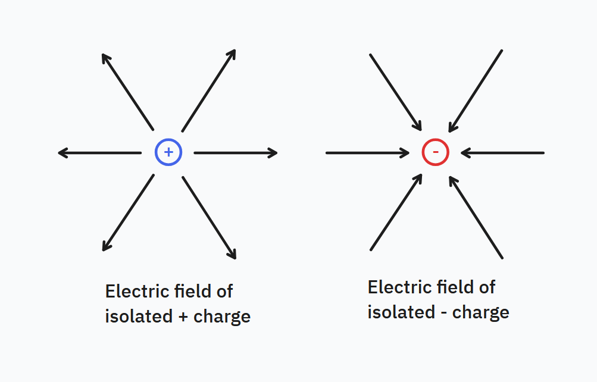
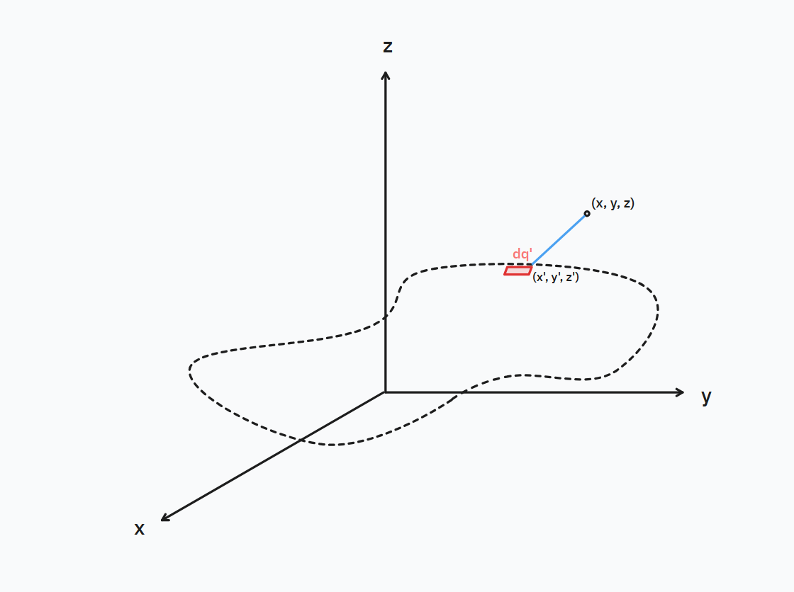
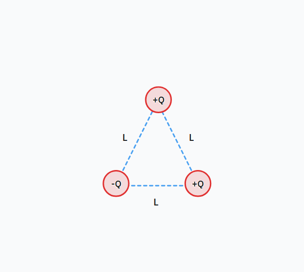
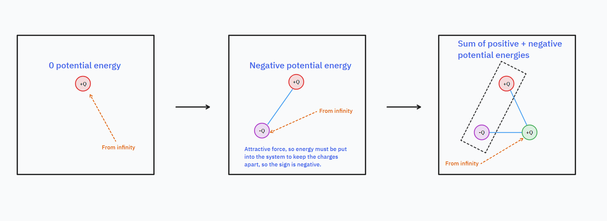
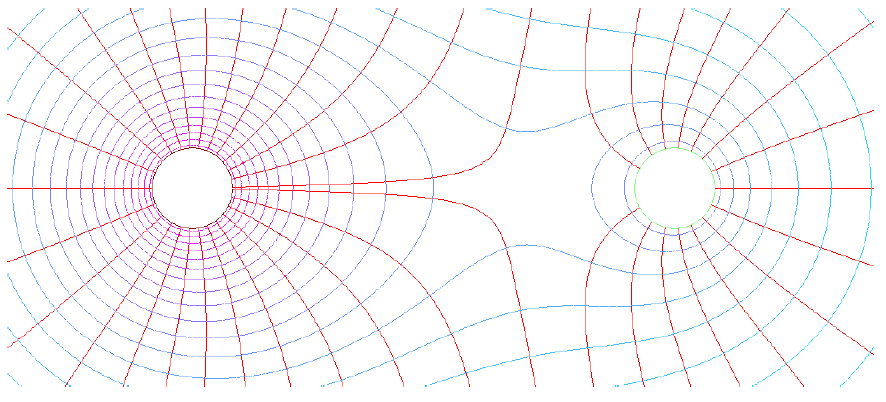

+++
title = "Fundamentals of Electromagnetic Theory"
date = 2024-05-15
+++

These are my personal notes (in some sense, more of a mini-book) on classical electromagnetism. Topics covered include Coulomb's law, electromagnetic fields, electrical potential, introductory circuit analysis, and the Maxwell equations.

<!-- more -->

These notes are shared with the express permission of Dr. Esther Wertz of Rensselaer Polytechnic Institute, to whom I am greatly thankful.

## Introduction

All that we can see, feel, and touch is the product of one fundamental interaction in physics - the electromagnetic interaction. It is due to electromagnetism that contact forces exist, that photons can interact with electrons to help us see, and that radio, satellite, and internet communications are possible at all. The relativistic nature of electromagnetism also has a key role in relativity and the theories of spacetime. We want to study electromagnetism because it is such a key part of the universe.

I have tried to make it so that there is something for everyone here. For those new to electromagnetism, just follow the main guide. For more advanced readers or those seeking a review of electromagnetism, there are asides that contain the advanced details. Electromagnetism was once considered magic, and is still magical; I do hope these notes preserve that magic while being informative and educative as well.

## A brief overview

Electromagnetic theory governs the behavior of **charges**. Charge is a fundamental property of matter, and comes in two forms, positive (+) and negative (-). Objects are **charged** due to an imbalance in their number of protons and electrons. As protons are immobile (generally speaking), the *movement of electrons* causes changes in charge. 

All macroscopic charged objects are the result of an object having more or less electrons. Objects gaining electrons become negatively-charged, objects losing electrons become positively charged. The fundamentals of the theory can be summed up as follows:

- Charge is conserved
- Charge is quantized (can only come in discrete values and in certain steps)
- We can model electromagnetic phenomena through _fields_

> **Note for the _very_ advanced reader:** the whole of electromagnetism can be said to manifest from $U(1)$ symmetry, from which the evolution of electromagnetic fields and the existence of charge can be derived. Specifically, the conservation of electric charge arises from the quantity known as the four-current $J^\nu$ which can be shown to satisfy the continuity equation $\partial_\nu J^\nu = 0$.

## Constants used in electromagnetic theory

The following constants are ubiquitous in electromagnetic theory, and are given in conventional SI units below:

| Constant     | Name                                       | Value                   | Unit                     |
| ------------ | ------------------------------------------ | ----------------------- | ------------------------ |
| $\epsilon_0$ | Permittivity of free space                 | $8.854 \times 10^{-12}$ | $\pu{N^{-1} m^{-2} C^2}$ |
| $k$          | Coulomb constant $k = 1/(4\pi \epsilon_0)$ | $9 \times 10^9$         | $\pu{N * m^2 * C^{-2}}$  |
| $e$          | Fundamental charge                         | $1.6 \times 10^{-19}$   | $\pu{C}$                 |
| $m_e$        | Electron mass                              | $9.11 \times 10^{-31}$  | $\pu{kg}$                |
| $m_p$        | Proton mass                                | $1.67 \times 10^{-27}$  | $\pu{kg}$                |
| $m_C$        | Carbon atom mass                           | $20 \times 10^{-27}$    | $\pu{kg}$                |

> Note that protons and electrons have the same charge $e$, just with opposite signs, $+e$ for protons and $-e$ for electrons. Neutrons have neutral charge and essentially the same mass as the proton.

## Coulomb's law

We observe that in nature, an attractive or repulsive force develops between two or more charges. Coulomb's law is the analytical expression of this force for charge $q_1$ acting on (inducing a force on) charge $q_2$:


\mathbf{F}_E = \frac{1}{4\pi \epsilon_0} \frac{q_1 q_2}{r^2} \hat r_{12}


Where $\hat r_{12}$ is the unit vector between charge 1 and charge 2, $q_1, q_2$ are the charges, and $r$ is the distance between the charges. The vector nature of this force is important to recognize as it is directional (and specifically, that it **always points in the direction of the $\hat r_{12}$ unit vector**), and it is an inverse-square law because its effects falls off by the inverse-square of distance but never completely vanishes.

## Electric fields

While a force-based formulation can sometimes be useful, fields are the preferred formulation of classical electromagnetism. Formally, a field assigns a quantity to every point in space. The electric field $\mathbf{E}$ is a vector-valued function that returns a force vector for every point in space. It is defined by:


\mathbf{F}_E = q \mathbf{E}


The intuitive idea of a field is a spread-out force medium created by electric charges and determining how charges move. To paraphrase John Archibald Wheeler:

> _Electric fields_ tell charges how to move; *charges* tell _electric fields_ how to form.
> **John Archibald Wheeler (paraphrased)**

The power of the field formulation of electromagnetic theory is that once the **electric field is known**, the **motion of all charges within the field is completely determined**, _including that of the charges creating the field_. For multi-charge systems, Newton's second law very easily becomes unworkable, with very complicated vector sums; for 16 charges, we would need to calculate *240 different individual forces* to find the 16 net forces! But with knowledge of the electric field, we simply solve for the field, and then the equations of motion for each charge can be found directly from the field.

In the case of a single charge located at the origin of a Cartesian coordinate system, the electric field takes the expression:


\mathbf{E} = \frac{kq}{r^2}\hat r


Or for a charge offset from the origin and at position $\mathbf{r}_0$, then:


\mathbf{E} = \frac{kq}{\|\mathbf{r}-\mathbf{r}_0\|^2} (\hat r - \hat r_0) = kq\frac{\mathbf{r} - \mathbf{r}_0}{\|\mathbf{r} - \mathbf{r}_0\|^{3/2}}


For such an electric field, the configuration is known as a _monopole_. The field vectors in this case converge towards negative charges and away from positive charges, and a visual of this field configuration is shown below:

> **For the advanced reader:** later on the fact that electric field vectors point inwards towards negative charges and outwards towards positive charges becomes associated with the nature of electrical potential energy. Specifically, the electromagnetic potential energy descends down from positive charges to negative charges; higher regions of potential energy push (accelerate) particles away from them to descend down to lower regions. The field analogue of the potential energy is the potential $V$ and for electrostatics it obeys $\mathbf{E} = -\nabla V$.

Electric fields from one charge and another charge sum; this is known as **superposition**. The general expression for the electric field produced from a collection of $n$ charges $q_1, q_2, q_3, \dots q_n$ is given by:


\mathbf{E}(x, y, z) = \sum_i \frac{q_i}{4\pi \epsilon_0} \frac{(x-x_i)\hat{\mathbf{i}} + (y-y_i)\hat{\mathbf{j}}+ (z-z_i)\hat{\mathbf{k}}}{((x-x_i)^2 + (y-y_i)^2 + (z-z_i)^2)^{3 \over 2}}


Where $(x_i, y_i, z_i)$ are the position of the charges and $(x, y, z)$ is the position of a point in space. Note that both for the discrete single-charge and multiple charge case, these equations for the $\mathbf{E}$ are only valid for localized charges (i.e. when charges can be considered approximately pointlike). Point charges do not exist in the real world and the whole expression blows up at $r = 0$, so rather these equations for the field must be used only within the limits of validity for these equations of the electric field. This could be a coupled condition $r > D$ where $D$ is some form of inner bound of the region where the approximation works.

### Other formulations for the electric field produced by discrete charges

We may write the electric field produced by discrete charges in a simpler fashion as follows:


\mathbf{E}(x, y, z) = \sum_i \frac{q_i}{4\pi \epsilon_0} \frac{1}{(r-r_i)^2} \hat{\mathbf{r}}


Where $\hat{\mathbf{r}}$ is the unit vector pointing at point $(x, y, z)$ and $r = \sqrt{(x-x_i)^2 + (y-y_i)^2 + (z-z_i)^2}$ is the distance from a point $(x, y,z)$ in space and $(x_i, y_i, z_i)$. We may show this with:


\begin{align*}
\mathbf{E}(x, y, z) &= \sum_i \frac{q_i}{4\pi \epsilon_0} \frac{(x-x_i)\hat{\mathbf{i}} + (y-y_i)\hat{\mathbf{j}}+ (z-z_i)\hat{\mathbf{k}}}{((x-x_i)^2 + (y-y_i)^2 + (z-z_i)^2)^{3 \over 2}} \\
&= \sum_i \frac{q_i}{4\pi \epsilon_0} \frac{(x-x_i) + (y-y_i)+ (z-z_i)}{((x-x_i)^2 + (y-y_i)^2 + (z-z_i)^2)^{3 \over 2}} \hat{\mathbf{r}} \\
&= \sum_i  \frac{q_i}{4\pi \epsilon_0} \frac{r-r_i}{(r - r_i)^\frac{3}{2}} \hat{\mathbf{r}} \\
&= \sum_i  \frac{q_i}{4\pi \epsilon_0} \frac{1}{(r - r_i)^2} \hat{\mathbf{r}}
\end{align*}


This formulation is also very useful when there are symmetries in the field that simplify the formulation of the field, and also for simplicity when there is a simple expression for $r$.

## Continuous distributions of charges

We have seen the case of a discrete distribution of static charges $q_1, q_2, q_3, \dots$ located at positions $(x_1, y_1, z_1), (x_2, y_2, z_2), \dots$, the electric field is given by:


\mathbf{E}(x, y, z) = \sum_i \frac{q_i}{4\pi \epsilon_0} \frac{(x-x_i)\hat{\mathbf{i}} + (y-y_i)\hat{\mathbf{j}}+ (z-z_i)\hat{\mathbf{k}}}{((x-x_i)^2 + (y-y_i)^2 + (z-z_i)^2)^{3/2}}


So long as we consider *all* the charges in the superposition of charges, then the electric field contains the contribution of every charge and knowledge of the electric field uniquely determines the motion of each charge in the system by $\mathbf{F} = m \ddot{\mathbf{r}} = q\mathbf{E}$; unlike Newtonian mechanics, there is no need to compute all the inter-particle forces to find the equations of motion.

One unique feature of electric fields is that the electric field *magnitude* at each point _only_ depends on the **position** of each charge and the **total charge** in the system, given by the sum of the **absolute value** of each charge. Neither the sign of each of the charges, or the vector direction of the electric field, have **any effect** on the electric filed.

Consider a distribution of static charges arranged throughout space such that we may model all the charges as a single object of continuous density function. This may be a curved metal rod that contains a great number of static charges (electrons), such that the object may be modelled as a continuous distribution of charge. Remember that for continuous problems, we must use integration. In integral form, the electric field caused by a continuous and non-uniform distribution of charges is given by:


\mathbf{E}(x, y, z) =  \frac{1}{4\pi \epsilon_0} \int \frac{(x-x')\hat{\mathbf{i}} + (y-y')\hat{\mathbf{j}}+ (z-z')\hat{\mathbf{k}}}{\left[(x-x')^2 + (y-y')^2+ (z-z')^2\right]^{3/2}} dq'


This expression may seem very complex and confusing; therefore it must be clarified as follows:

* $x, y, z$ denotes a point in space at $(x, y, z)$, from which the field is measured, i.e. the same $x, y, z$ as in $\mathbf{E}(x, y, z)$
- $x', y', z'$ denotes the location of an infinitesimal element (e.g. line element, surface element, volume element) along the object of continuous charge, which is integrated over the entire object
- $dq' = \lambda dx' = \sigma\, dA' = \rho\, dV'$ where $dx', dA', dV'$ are the line element, surface element, and volume element respectively expressed in the coordinates $(x', y', z')$, and substitution of one of these is necessary to be able to solve the integral

Visually, we may represent the integration process as shown in the below diagram:

Note that these equations apply only for static fields (i.e. unchanging with time). The integrals in general are non-trivial and can only be solved numerically, but symmetries in the problem may simply the integral sufficiently to be solved analytically.

In practice, due to the difficulties of modelling, when there is a dominant charged object, we often consider only the contribution of a single object and consider the other charges as contributing negligibly to the field. This technically does not model the problem exactly but approximately holds. This is analogous as the classical field theory of Newtonian gravity, where the common approximation $\displaystyle \mathbf{g} = -\frac{GM_\mathrm{sun}}{r^2} \hat r$ is approximately true and yields the correct orbits if one uses it to solve for the gravitational field (and thus orbits of planets) within the solar system, since the Sun is so much more massive than all the planets.

> **Note for the advanced reader:** We can, in fact, model multiple charged objects that are each continuous charge distributions but separated by space, such as several non-uniform metal shapes. In this case for $N$ objects that have varying charge distributions that are separated by space we may use the Dirac delta "function" (it technically is not a function but can be treated as a function by:


\mathbf{E}(x, y, z) = \frac{1}{4\pi \epsilon_0} \int \sum_{i=1}^N \frac{\delta(\mathbf{r} - \mathbf{r}_i')}{\|\mathbf{r} - \mathbf{r}_i'\|^{3/2}} \,dq'


> **Mathematical interlude:** some texts use the notation $| \mathbf{r} - \mathbf{r}_i'|^{3/2}$ instead, this is functionally equivalent to $\|\mathbf{r} - \mathbf{r}_i' \|^{3/2}$ because of the vector identity $| \mathbf{v} | = \sqrt{v^2} = \sqrt{\mathbf{v} \cdot \mathbf{v}} = \| \mathbf{v}\|$

There are some symmetries that can be used to simplify the integral in special cases:

- The electric field is **always zero** within a conductor, even when placed beside a charged object, because the mutual attraction and repulsion of electrons cancels out
- The electric field is **always zero** within a spherically-symmetric shell of charge
- The electric field **outside** a spherically-symmetric object is equivalent to $\mathbf{E} = \frac{kQ}{r^2} \hat r$ **even if** the interior charge density is non-uniform; the interior charge density simply must be spherically symmetric

### Other formulations for the electric field produced by continuous charges

In many cases, the symmetries of a problem lead to some of the components of the electric field canceling out. Therefore, it is often more helpful to use the alternative component-valued formulation, and only solve for the nonzero components:


\begin{align*}
E_x =  \frac{1}{4\pi \epsilon_0} \int \frac{x-x'}{\left[(x-x')^2 + (y-y')^2+ (z-z')^2\right]^{3/2}} dq' \\
E_y =  \frac{1}{4\pi \epsilon_0} \int \frac{y - y'}{\left[(x-x')^2 + (y-y')^2+ (z-z')^2\right]^{3/2}} dq' \\
E_z =  \frac{1}{4\pi \epsilon_0} \int \frac{z-z'}{\left[(x-x')^2 + (y-y')^2+ (z-z')^2\right]^{3/2}} dq' 
\end{align*}


In addition, we can also use the radial formulation, where $r'$ is the distance to the location of an infinitesimal charge element along the charged object's surface:


\mathbf{E}  = \frac{1}{4\pi \epsilon_0} \int \frac{r - r'}{[(r - r')^2]^{3/2}} dq'


### Problems analytically solvable by Coulomb's law

#### Electric field of a charge (monopole)

The electric field produced by a single charge $Q$ is by definition given by:


\mathbf{E} = \frac{kQ}{r^2} \hat r = \frac{1}{4\pi \epsilon_0} \frac{Q}{r^2} \hat r


#### Electric field of a dipole

Consider two charges $q_1, q_2$ at $(x_1, y_1, z_1)$ and $(x_2, y_2, z_2)$. This is a good approximation for various molecules that have a positively charged and negative charged end (see [this PDF](https://scholar.valpo.edu/cgi/viewcontent.cgi?filename=8&article=1000&context=engineering_oer&type=additional) to read more about this). We use the superposition principle and just add up the respective electric fields of each charge to obtain:


\begin{align*}
E_x = \frac{1}{4\pi \epsilon_0}
\left(\frac{q_1(x - x_1)}{\left(x - x_1)^2 + (y - y_1)^2 + (z - z_1)^2\right)^{3/2}} + \frac{q_2(x - x_2)}{\left(x - x_2)^2 + (y - y_2)^2 + (z - z_2)^2\right)^{3/2}}\right) \\
E_y = \frac{1}{4\pi \epsilon_0}
\left(\frac{q_1(y - y_1)}{\left(x - x_1)^2 + (y - y_1)^2 + (z - z_1)^2\right)^{3/2}} + \frac{q_2(y - y_2)}{\left(x - x_2)^2 + (y - y_2)^2 + (z - z_2)^2\right)^{3/2}}\right) \\
E_z = \frac{1}{4\pi \epsilon_0}
\left(\frac{q_1(z - z_1)}{\left(x - x_1)^2 + (y - y_1)^2 + (z - z_1)^2\right)^{3/2}} + \frac{q_2(z - z_2)}{\left(x - x_2)^2 + (y - y_2)^2 + (z - z_2)^2\right)^{3/2}}\right)
\end{align*}


For the electrical field of an **electrical dipole**, the fields of the charges cancel outside the charge of the _smaller magnitude_ (here we refer to the space between the charge as the _inside_, and the opposite space, directed away from each charge towards infinity, as the _outside_).

### Conductors, dielectrics, and polarization

Materials respond differently when they are placed within an electric field. In conductors, where charges are free to move, 

A **dielectric** is a material that is (roughly speaking) composed of bound positive and negative charges. When an external electric field (such as that of a charged rod) is placed near a dielectric, negative charges will feel a force against the direction of the field. Therefore, the negatively charges within the insulator orient themselves against the field, and the positive charges orient themselves towards the field. But since all electrons are bound tightly to their atoms in dielectrics, the charges cannot redistribute themselves to make the overall charge neutral; thus the dielectric exhibits all the same effects of polarization. That is to say, while no charges can flow through a dielectric, it nonetheless has an inner electric field (also called _polarization field_, denoted $\mathbf{D}$) and is considered **polarized**. Note that while all dielectrics are insulators, **not all insulators are dielectrics** because not all insulators have polar molecules (roughly, bound positive and negative charges). A dielectric need not be a material at all; a vacuum is technically a dielectric because an externally applied electric field creates an inner electric field within the vacuum.

We characterize dielectrics by a **dielectric constant** $\kappa$, where $\kappa = \dfrac{E_0}{E}$, $E_0$ is the electric field if the dielectric was not present, and $E$ is the actual electric field. With a known dielectric constant, and a known electric field configuration in the absence of a dielectric, we can therefore find the actual electric field by $E = \dfrac{E_0}{\kappa}$.

The electric field inside a conductor **must** be zero, no matter the charge(s) placed within it. Therefore, if the said conductor is a shell, the **inner surface charge** of such a conductor will equal the **total charge placed within the conductor**, such that the electric field produced by inner charges and the inner surface charge cancels out and therefore the net electric field inside the conductor is zero. Even when a conductor is polarized, no electric field develops in the conductor, because the charges within redistribute themselves so that the electric field from the charges _exactly_ cancels out the external field so that the interior field is zero. The electric field outside a polarized conductor (really, for any conductor) can be [very nontrivial](https://physics.stackexchange.com/questions/247076/does-a-conductor-in-an-external-electric-field-have-a-positive-charge-density-an), but the electric field inside is **always, always zero**.

## Gauss's law

We will now introduce another method to calculate the electric field: **Gauss's law**. Gauss's law relates the **flux** $\Phi_E$ (directional spread) of an electric field within a region of space to the **total charge** *enclosed* by a shape in that region of space:


\Phi_E =\oint\limits_\mathrm{closed} \mathbf{E} \cdot \, d\mathbf{A}  = \frac{Q_\mathrm{enclosed}}{\epsilon_0}


Where $d\mathbf{A} = \hat{\mathbf{n}}\, dA$ is an infinitesimal patch of the shape's surface, $\hat{\mathbf{n}}$ is the normal vector to that patch and the circled integral is a **surface integral** over the surface of the shape. For instance, if the shape was a square, then $d\mathbf{A} = \hat{\mathbf{n}}\,dx\,dy$; if the shape was a sphere, then $d\mathbf{A} =  4\pi r^2 \hat{\mathbf{n}} dr$ (from the surface area formula of a sphere. In the general case, the flux can be visualized as follows:

_Original source: [Wikipedia](https://commons.wikimedia.org/wiki/File:Surface_integral_-_definition.svg)_

> **Note for the advanced reader:** in alternate (typically more advanced) formulations Gauss's law can be equivalently written in terms of the charge density and the Coulomb constant:


\oint \limits_{\partial \Omega} \mathbf{E} \cdot d\mathbf{A}  = 4\pi k \iiint \limits_\Omega \rho\, dV


In some cases with symmetries, Gauss's law is able to simplify calculations for the electric field as compared to integration by Coulomb's law. While remaining an integral equation, three specific symmetries for the electric field lead to straightforward analytical expressions: **spherical, cylindrical, and planar**. For example, consider a point charge $Q$ surrounded by an (imaginary) sphere of radius $r$. By Gauss's law we have:


\oint\limits_\mathrm{closed} \mathbf{E} \cdot \, d\mathbf{A}  = \oint\limits_\mathrm{closed} \mathbf{E} \cdot \, 4\pi r^2\, \hat{\mathbf{n}}\,dr


The normal vector to the sphere's surface is given by $\hat r$ and the electric field also spreads spherically outwards, that is, $\mathbf{E} = E\, \hat r$. Thus, the dot product is equal to one, as shown:


\oint\limits_\mathrm{closed} E\, \hat r \cdot \, 4\pi r^2\, \hat{\mathbf{n}}\,dr


When applying Gauss's law, there are a lot of specific areas to take notice, lest they mess up your calculation:

- The flux within an imaginary sphere surrounding any **spherically symmetric** charge or charge distribution is always $\Phi(r) = E\, 4\pi r^2$ for any spherically symmetric object. This is because the normal vectors and electric field vectors both point along $\hat r$.
- Gauss's law does **not** apply to a non-closed surface.
- Gauss's law is typically not analytically computable when a surface has non-constant normal vectors
- Gauss's law works by taking _one region_ of the field and the integrating over the surface of that region, which then equates the field globally so long as the field is symmetric. That is why it works even for infinitely long wires or infinitely large diameter sheets, because we can surround the electric field in a _finite_ region and integrate over the _finite_ charge within that region. Remember that **you are only considering the enclosed charge, not the total charge** (which may very well be infinite for infinitely long wires and sheets)
- While there is zero electric field within a Gaussian surface of zero enclosed charge, this **does not mean** there are no charges within the Gaussian surface. There may certainly be charges that cancel out each other, resulting in **zero net charge, but nonzero regions of charge**. 
- **Nothing outside a Gaussian surface**, even the presence of other charges and external fields, can affect the electric field inside a Gaussian surface. This is because the flux of **any external electric field** across a closed Gaussian surface is **always zero**.
- Simply knowing the electric field within a Gaussian surface does not tell you anything about the electric field _outside the Gaussian surface_.

### Problems analytically solvable via Gauss's law

For a problem to be reasonably solvable by Gauss's law, the geometry of the problem should be such that it satisfies two conditions:

- A Gaussian surface may be found whose **surface normals** are **directly parallel** to the electric field vectors
- The field is **constant** through the Gaussian surface. This means that the electric field is **independent** of the Gaussian surface.

Due to this reason, complex geometries and electric fields are not typically analytically solvable by Gauss's law and must be numerically computed. However, approximate expressions for the electric field _can_ be found and be used as a starting point for higher-order corrections.

#### Infinitely-long conducting rod

This may be used, for instance, to model the electric field generated by an infinitely-long wire of uniform charge density $\lambda$. The Gaussian surface used is an (imaginary) cylinder of radius $r$ coaxial to the rod. We consider a segment of the wire with length $L$. Therefore the total charge within that segment is $Q = \lambda L$. The cylindrical Gaussian surface surrounding that segment of wire has surface area $2\pi r L + 2\pi r^2$, but as the electric field vectors are orthogonal to the normal vectors at the caps, their contributions are zero, and thus the effective surface area is simply $2\pi rL$. Therefore Gauss's law takes the form:


\oint \limits_{\mathrm{cylinder}} E(2\pi rL) = \frac{\lambda L}{\epsilon_0}


After rearranging we obtain:


\mathbf{E} = \frac{\lambda}{2\pi r\epsilon_0} \hat r


Note that the electric field of an infinite cylinder of charge can be obtained using similar methods and has a similar result.

#### Infinite double-sided sheet of charge

We can use this to model the electric field of any suitably flat surface of charge with uniform surface charge density $\sigma$. The Gaussian surface used is an (imaginary) cylinder of radius $R$ and height $h$, which is aligned vertically. The electric field vectors align with the flat top caps and bottom caps of the cylinder. Thus the total surface area $S_A = 2\pi rL + 2\pi R^2$ has only the contributions from the caps, and the effective surface area is $S_A = 2\pi R^2$. Meanwhile, the enclosed charge would be a circle of charge on the sheet enclosed by the cylinder of area $A = \pi R^2$ and thus we have:


\oint \mathbf{E} \cdot d\mathbf{A} = 2\pi R^2 E = \frac{\sigma A}{\epsilon_0} = \frac{\pi R^2 \sigma}{\epsilon_0}


And thus:


\mathbf{E} = \frac{\sigma}{2\epsilon_0} \hat z


Note that this is the same expression as the **electric field near the center of a double-sided disk of charge**, where the disk is of radius $R$ and has surface charge density $\sigma$ (in the single-sided disk of charge case, the electric field is double that, so $\mathbf{E} = \dfrac{\sigma}{\epsilon_0}\hat z$). This only holds _near the center_ of the disk, however; it is an approximate expression for the case that $r \ll R$.

#### Infinite single-sided sheet of charge

An infinite single-sided sheet of charge is a good approximation for the electric field of any charged surface that can be considered relatively flat and large. The calculations are the same as the double-sided case but we only consider one side, and therefore the effective surface area is one-half that of the previous, and thus $S_A = \pi R^2$. In this case:


\mathbf{E} = \frac{\sigma}{\epsilon_0} \hat z


 Additionally, by a similar argument, we may show that the **electric field between two charged plates** both of uniform surface charge density is also $\mathbf{E} = \dfrac{\sigma}{\epsilon_0}\hat z$.

 #### Near surface of an ideal conductor

 This is _equal_ to an infinite single-sided sheet of charge, because the electric field near the surface of an ideal conductor is equal to that of an infinite single-sided sheet of charge. Therefore:


\mathbf{E} = \frac{\sigma}{\epsilon_0} \hat z


#### Inside a spherical insulating sphere

We consider the electric field inside a spherically insulating sphere of uniform charge density $\rho$. Note that this is **not the same** as that of the electric field outside the sphere $\mathbf{E} = \dfrac{kq}{r^2} \hat r$. In this case the total charge within the sphere at radius $r$ becomes $Q(r) = \rho V(r) = \dfrac{4}{3} \pi r^3 \rho$ (where $V(r)$ is the volume at distance $r$ from the center of the sphere, not the electrical potential) and thus the electric field is $\mathbf{E} = \dfrac{\rho r}{3 \epsilon_0} \hat r$.

Note that the electric field inside a **spherical conducting sphere** is simply zero, and likewise for a **spherical shell of charge**.

#### Outside a conducting infinitely-long cylinder

We may surround a conducting infinitely-long cylinder of uniform linear charge density $\lambda$ with a cylindrical Gaussian surface with radius $r$ and length $L$, and therefore the enclosed charge becomes $Q_\mathrm{enc.} = \lambda L$. Thus, by Gauss's law:


\oint \mathbf{E} \cdot d\mathbf{A} = 2\pi rL E = \frac{\lambda L}{\epsilon_0}


By rearranging we get:


\mathbf{E} = \dfrac{\sigma}{2\pi r \epsilon_0} \hat r


## Electrical potential energy

The electrical potential energy is the energy stored within the electric field generated by a system of charges that can be released for charges to move. Electric potential energy is always defined against a specific reference point; if we define the electrical potential energy to be zero at infinity, then two charges brought towards each other a distance $r$ apart would have an electric potential energy $U_E$ of the following:


U_E = \dfrac{kq_1 q_2}{r}


For a system of $N$ charges $q_1, q_2, \dots q_N$ and defining relative to infinity, the expression for the electric potential energy is given by:


U_E = \frac{1}{2} \sum_{i = 1}^N \sum_{j = 1}^N \frac{kq_i q_j}{r_{ij}}


However, this is not a very useful formula as it is quite verbose. Rather, it is more useful to use another (more conceptual) approach. Suppose we had a system of three charges, with the magnitude of each charge being $Q$, arranged in an equilateral triangle of side lengths $L$:

We aim to obtain the electric potential energy of the system; that is, how much energy is stored in the system of charges if we consider the energy to be zero at infinity, which is important when considering problems that are solved using the conservation of energy.

To do so, we consider the process of bringing in each charge one by one, as illustrated below (the charges have been color-coded for clarity):

In the **first step**, the first charge is brought from infinity. There is nothing to resist its motion, and therefore the contribution to the potential energy is **zero**. In the **second step**, the second charge is brough from infinity to join the system. As it is oppositely charged, the potential energy is negative, meaning that energy must be put _into_ the system to keep the charges separate. Since there are only two charges, $Q$ and $-Q$, the contribution to the potential energy in the second step step is $\dfrac{k(Q)(-Q)}{r} = -\dfrac{kQ^2}{L}$ by application of the electric potential energy formula. In the third step, the third charge is brought from infinity. Its interaction with the existing two-charge system results in a potential energy of $\dfrac{kQ^2}{L}$ with the red charge $+Q$ (the positive charge in the two-charge system) and $-\dfrac{kQ^2}{L}$ with the purple charge $-Q$ (the negative charge in the two-charge system). Therefore the total potential energy contributed by the third step is the sum of these potential energies, i.e. $\dfrac{kQ^2}{L} + \left(-\dfrac{kQ^2}{L}\right) = 0$. Thus the total electrical potential energy is the sum of the potential energy contributions by each of the three steps, that is:


U_\mathrm{E}^{(\mathrm{total})} = U_1 + U_2 + U_3 = 0 + -\dfrac{kQ^2}{L} + 0 = -\dfrac{kQ^2}{L}


And thus we arrive at the result. This method is generalizable to any configuration of discrete charges.

## Electric potential

In **electrostatics**, we may define another field called the **electric potential** as the following line integral:


V(r) = -\int_{C[r_0 \to r]} \mathbf{E} \cdot d\mathbf{r} = -\int_{r_0}^r \mathbf{E} \cdot d\mathbf{r}


Where $r = (x, y, z)$ is a shorthand and $d\mathbf{r}$ is an infinitesimal segment of the parametric curve $C$ from $r_0$ to $r$. This definition is probably too abstract, so here is a more intuitive explanation.

Particles possess energy in one of two forms; either energy in motion (kinetic energy) or energy that is stored in some way (battery, rubber band, etc.). The second form - stored energy that has not been used - we refer to as _potential energy_. When an object is allowed to freely move, it loses its stored energy (potential energy). This is because you can never create more energy, as **energy is conserved**, so (kinetic) energy in motion necessarily decreases stored (potential) energy.

In electromagnetism, the electric field acts as a store and carrier of energy. Charges placed in the electric field gain energy, almost like a phone being plugged into a charging cable. The **electric potential** $V(r)$ is the *field* proportional to the *potential energy* within the electric field. Where the potential has a higher value, particles have more potential energy; where the potential has a lower value, particles have less potential energy.

But stable configurations in nature are the lowest potential energy configurations. So charges immediately try to get to the lowest potential energy point possible. As the charge moves within the electric field $\mathbf{E}$, it takes the path $\mathbf{r}(t)$ that will help it minimize its potential energy. 

We can therefore integrate along the path from the charge's original point $r$ to the point of zero potential energy $r_0$ (as in "ground point" or "zero point"), as follows, to find the total decrease in potential energy $\Delta U$:


\Delta U = \int_r^{r_0} q\mathbf{E} \cdot d\mathbf{r}


To find the original potential energy $U$ of the charge $q$ at point $r$, we simply work backwards, from $r_0$ to $r$, so we have:


\begin{align*}
U_{\text{at } r} - \Delta U &= U_{\text{at } r_0} \\
&\Rightarrow U_{\text{at } r} = \cancel{U_{\text{at } r_0}}^0 + \int_r^{r_0} q\mathbf{E} \cdot d\mathbf{r}
\end{align*}


But since we want this expression to show that we are finding the energy at $r$ relative to $r_0$ (which is mathematically identical but physically different), we can use the bound-switching property of integrals to rewrite as:


\int_r^{r_0} q\mathbf{E} \cdot d\mathbf{r} = -\int_{r_0}^r q\mathbf{E} \cdot d\mathbf{r}


We can then define the potential field $V(r) = U / q$, which gives the potential energy a charge would gain at every point in space, relative to a lowest energy point $r_0$:


V(r) = -\int_{r_0}^r \mathbf{E} \cdot d\mathbf{r}


> **Careful!** Here, $V(r)$ is a _field_, so we write it as a function of $r$, but $U$ is an _energy value_ so **do not** consider it as a function and **do not** write it as $U(r)$ even if it is sometimes mathematically convenient. It is better to write $U_r$ or (the somewhat clumsy) $U_{\text{at } r}$.

Unlike electrical potential energy $U$, which is the potential energy of a charge, the _electrical potential_ is a field quantity and is defined at every point $r$ in the electric field. This is why we describe it as a field _proportional_ to the potential energy within the electric field. Mathematically, we say that $U_E = q V(r)$ where $U_E$ is the potential energy of a charge $q$ at point $r$, relative to a zero point $r_0$.

> **A useful visualization:** One can visualize an electrical potential as a landscape with hills and valleys. A positive charge is like a ball placed onto such a landscape; the direction it will move in is towards the **direction of lowest potential**, which would be like **rolling down** the hill. A negative charge is like a ball that sees the landscape upside-down, so it **rolls up** the hill, because it sees everything flipped upside-down and thinks the hill is actually going _down_.

The line integral is notably **path-independent** such that integrating _any_ path between $r_0 \to r$ yields the same result, and therefore the simplest path is preferred for calculational convenience.

It is by common convention that when $r_0$ is not explicitly given, we may define the reference point $r_0$ to be infinitely far away, such that the potential vanishes at infinity $V_\infty = 0$. Then the potential becomes:


V(r) = -\int_\infty^r \mathbf{E} \cdot d\tilde{\mathbf{r}}


Where $d\tilde{\mathbf{r}}$ is still an infinitesimal curve segment, exactly the same as $d\mathbf{r}$, the switch in symbol is simply to avoid conflict with the $r$ in the integration bounds. With this definition, the electrical potential generated by a point charge at position $(0, 0, 0)$ is:


V(r) = -\int_\infty^r \frac{kq}{\tilde r^2}\, d\tilde r = \frac{kq}{r}, \quad r > 0


The electric potential, like the electric field, obeys the principle of superposition, such that the respective potentials of multiple charges sum together:


V(r) = \frac{1}{4\pi \epsilon_0} \sum_i \frac{q_i}{r_i}


And in the continuous case, the summation becomes an integral over a charge distribution:


V(r) = \frac{1}{4\pi \epsilon_0}
 \int \frac{1}{|r - r'|} \,dq'


As an example, consider a finite line charge of length $L$. We wish to calculate the potential at distance $x$ from the end of the line charge. In this case $dq = \lambda dx'$ and $|r - r'| = |x + x'|$ such that:


V = \frac{1}{4\pi \epsilon_0} \int \frac{\lambda dx'}{|x + x'|} = \frac{\lambda}{4\pi \epsilon_0} \ln \left(\frac{x + L}{x}\right)


If we have three points arranged such that $a > b > c$, the electric potential at point $c$ relative to point $a$ is equal to the sum of the electric potential at point $b$ (relative to point $a$) and the electric potential at point $c$ relative to point $b$. This clumsily-worded sentence can be much better be expressed mathematically:


\begin{align*}
V(c) &= -\int_a^b \mathbf{E} \cdot d\mathbf{r} + V(b) \\
&=\left(-\int_a^b \mathbf{E} \cdot d\mathbf{r}\right) + \left(-\int_b^c \mathbf{E} \cdot d\mathbf{r}\right) \\
&= \int_b^a \mathbf{E} \cdot d\mathbf{r} + \int_c^b \mathbf{E} \cdot d\mathbf{r}
\end{align*}


This is very useful, for instance, in deriving the electric potential within a sphere of radius $R$, where we must add up the electric potential at the surface of the sphere given by $V_0 = \dfrac{kq}{R}$ to find the expression of the total electric potential within the sphere $V(r) =  -\displaystyle\int_R^r \mathbf{E} \cdot d\mathbf{r} + V_0$ which evaluates to $V(r) = V_0 + \dfrac{\rho(R^2 - r^2)}{6\epsilon_0}$.

From the definition of the electrical potential, we may define the **potential difference** (more commonly called _voltage_) as the difference in the electrical potential between two points $a$ and $b$:


\Delta V = V(b)  - V(a)


Which we may also write via the line integral definition of the electrical potential:


\Delta V = -\int_a^b \mathbf{E} \cdot d\mathbf{r}


This is the same type of voltage as marked on household batteries; the nonzero voltage means that one end of the battery is at a higher potential as compared to the other end, so charges flow away from the higher-potential end to the lower-potential end. The electric potential energy $U$ of a charge at a point $(x, y, z)$ is related to the electrical potential by $U = qV$. Similarly, $\Delta U = q\Delta V$.

Additionally, the electric field can be computed from the electrical potential by taking the derivative of the electric potential in every coordinate direction. This uses the gradient (nabla) operator from vector calculus, as shown below:


\mathbf{E} = -\nabla V = -\left(\frac{\partial V}{\partial x} \hat{\mathbf{i}} + \frac{\partial V}{\partial y} \hat{\mathbf{j}} + \frac{\partial V}{\partial z} \hat{\mathbf{k}}\right)


In physical terms, this represents the fact that an electric field develops between regions of differing electrical potential, as charges, which form electric fields, are naturally pushed away from high potential regions and drawn towards low potential regions. We say that the two regions have a _potential gradient_ and therefore there is a nonzero electric field present between the regions. This is one of the most useful characteristics of the electric potential as knowledge of the electric potential uniquely determines the associated electrical field. We may graphically illustrate this fact by drawing isolines, which represent equipotential surfaces (surfaces of constant electrical potential). One such drawing is shown below:

_Credit: [TeX Stack Exchange](https://tex.stackexchange.com/questions/392942/how-to-draw-force-lines-onto-an-equipotential-contour-plot-using-tikz)_

Electrical field lines run across and perpendicular to equipotential surfaces, and electric fields exert forces on charges, so the trajectories of charges can simply be drawn by tracing curves perpendicular to the isolines. Note that the surface of an electrical conductor is **always** an equipotential surface due to the fact that the electric field within any electrical conductor is always zero.

> **Note for the advanced reader:** the electrical potential can also be understood through the electrostatic Poisson equation $\nabla^2 V = -4\pi k \rho$, where a conductor can be thought of as a specific Dirichlet boundary-value problem, for which that has the unique solution $V = C$ i.e. $V$ is a constant. More on this later.

## A brief vector calculus interlude

### Gradient

The gradient of a scalar-valued function, denoted $\nabla f$, is given by a vector containing all the partial derivatives of the function. In two dimensions, it is given by:


\nabla f(x, y) = \left\langle \frac{\partial f}{\partial x}, \frac{\partial f}{\partial y} \right\rangle


In three dimensions, it is similarly given by:


\nabla f(x, y, z) = \left\langle \frac{\partial f}{\partial x}, \frac{\partial f}{\partial y}, \frac{\partial f}{\partial z} \right\rangle


The gradient can be evaluated at a point $(x, y, z)$ by evaluating each of the partial derivatives at that point

### Divergence

Divergence, denoted by $\nabla \cdot \mathbf{F}$, represents the tendency of a vector field to flow out or in to a certain point:

- If vectors that point inwards towards a certain point are bigger than vectors that point outwards at that point, the divergence is **negative**, and we have a **sink**
- If vectors that point inwards towards a certain point are smaller than vectors that point outwards at that point, the divergence is **positive**, and we have a **source**
- If vectors that point inwards and vectors that point outwards at a certain point are equal in size, the divergence is **zero**

The divergence of a vector field $\vec F$ with components $\langle F_x, F_y, F_z\rangle$ is given by:


\nabla \cdot \vec F = \frac{\partial F_x}{\partial x} + \frac{\partial F_y}{\partial y} + \frac{\partial F_z}{\partial z}


Divergence is **only** defined on vector fields, not on scalar fields.

### Curl

Curl, denoted by $\nabla \times \vec F$, represents the tendency of a vector field to rotate around a certain point:

- **Positive curl** is a tendency of vectors to rotate **counterclockwise** around a point
- **Negative cur**l is a tendency of vectors to rotate **clockwise** around a point
- **Zero curl** is when counterclockwise and clockwise vectors cancel out or if the vectors do not rotate around a point
- As the curl of a vector field is another vector field, we can say that in a physical setting, taking the curl of a vector field **produces** a new *circulating* vector field (this will become relevant when studying the 3rd and 4th Maxwell equations)

In 2D, the curl of a vector field is given by:


\nabla \times \vec F = \frac{\partial F_y}{\partial x} - \frac{\partial F_x}{\partial y}


In 3D, the curl of a vector field is the determinant of a 3 x 3 matrix:


\nabla \times \vec F = 
\begin{vmatrix}
\hat i & \hat j & \hat k \\
\frac{\partial}{\partial x} & \frac{\partial}{\partial y} & \frac{\partial}{\partial z} \\
F_x & F_y & F_z
\end{vmatrix}


### Laplacian

The Laplacian, denoted by $\nabla^2 f$, is a scalar field formed from the second derivatives of a scalar field. It is given by:


\nabla^2 f = \frac{\partial^2 f}{\partial x^2} + \frac{\partial^2 f}{\partial y^2} + \frac{\partial^2 f}{\partial z^2}


A function is called **harmonic** if it satisfies $\nabla^2 f = 0$. This is a partial differential equation called **Laplace's equation**.

### The divergence theorem


\oint  \mathbf{E} \cdot d\mathbf{A} = \iiint \limits \nabla \cdot \mathbf{E} \, dV


Therefore Gauss's law may be equally written as:


\iiint \limits \nabla \cdot \mathbf{E} \, dV = \frac{Q_\mathrm{enc.}}{\epsilon_0} = \frac{1}{\epsilon_0}\iiint \rho \, dV


Thus with knowledge of the electric field we may find the total charge enclosed:


Q_\mathrm{enc.} = \epsilon_0 \iiint \nabla \cdot \mathbf{E} \, dV


In addition, note that the two integrals $\displaystyle \iiint \limits \nabla \cdot \mathbf{E} \, dV = \frac{1}{\epsilon_0}\iiint \rho \, dV$ mean that $\nabla \cdot \mathbf{E} = \dfrac{\rho}{\epsilon_0}$ which can be written in a slightly "prettier" form as:


\nabla \cdot \mathbf{E} = 4\pi k \rho


This is the **differential form of Gauss's law** and forms one of the four Maxwell equations.  Note, however, that typically the differential form of Gauss's law is **not solved directly**. Rather, we use the fact that $\mathbf{E} = -\nabla V$ and thus $\nabla \cdot \mathbf{E} = \nabla \cdot (-\nabla V) = -\nabla^2 V = 4\pi k \rho$. This is **Poisson's equation for electrostatics**:


\nabla^2 V = -4\pi k \rho


This has the distinctive characteristics of being _separable_ and _linear_, and we can solve it using the conventional techniques of solving such partial differential equations.

> **Note for the advanced reader:** It can be shown that the first two Maxwell equations ($\nabla \cdot \mathbf{E} = 4\pi k\rho$ and $\nabla \cdot \mathbf{B} = 0$) only act as constraints on the initial conditions and so long as they are satisfied at $t = 0$, they are satisfied for all $t$ and thus are not necessary. This means the two other Maxwell equations $\nabla \times \mathbf{E} = -\dfrac{\partial \mathbf{E}}{\partial t}$ and $\nabla \times \mathbf{B} = \mu_0 \mathbf{J} + \mu_0 \epsilon_0 \dfrac{\partial \mathbf{E}}{\partial t}$ are the only "real" equations. Thus, the two Maxwell equations are the equations of **electrostatics** (fields that don't change with time).

In the case that the charge is zero, then the Poisson equation reduces to **Laplace's equation for electrostatics** $\nabla^2 V = 0$, which, fully expanded, becomes:


\frac{\partial^2 V}{\partial x^2} + \frac{\partial^2 V}{\partial y^2} + \frac{\partial^2 V}{\partial z^2} = 0


In the 1D case this reduces to the much simpler $\dfrac{\partial^2 V}{\partial x^2} = 0$ with the general solution $V = ax + b$ where $a$ and $b$ are determined by the boundary conditions. Additionally, a highly useful trick is that the Laplace equation has a uniqueness theorem (unlike most PDEs): one and only one solution is possible after a fixed set of boundary conditions are given. Fixing the boundary conditions is guaranteed to result in a unique answer.

## The method of images

Recall that there are various ways that the electric field can be solved for:

- **Coulomb's law**, which is universal in the **electrostatic case** (time-independent fields)
- The *integral* form of **Gauss's law**, which is universal in the general case, including time-varying fields
- The *differential* form of **Gauss's law**
- The *electrical potential integral* $V = \dfrac{1}{4\pi \epsilon_0} \displaystyle \int \dfrac{r - r'}{|\mathbf{r} - \mathbf{r}'|}\,dq$ and using $\mathbf{E} = -\nabla V$
- The solution of the *Poisson equation* $\nabla^2 V = -\rho/\epsilon_0$ of electric potentials, which can in a lot of cases be reduced to *Laplace's equation* $\nabla^2 V = 0$; with appropriate boundary conditions applied through physical analysis, this can be solved exactly and be used to obtain the electric field, again through $\mathbf{E} = -\nabla V$

> **Note for the advanced reader:** while it may seem odd to solve Laplace's equation where the charge density is zero (what creates the field?) recall that the charge density is _always_ zero outside the interior of a charge distribution. That is, all points other than $r = 0$ for a unit charge, all points outside $r = R$ for a solid sphere of charge, all points other than the surface of a sheet of charge, etc. all have $\rho = 0$ so Laplace's equation certainly applies. 

> **Note for the _very_ advanced reader:** The fact that the Laplace equation can have non-trivial solutions is analogous to how the black hole metrics of General Relativity are non-zero despite the fact that they are vacuum solutions i.e. solutions in free space. In addition, (in advanced electromagnetic theory) the equations of motion of electromagnetic four-potential $\partial_\mu A^\mu = 0$ and $\partial^\mu \partial_\mu A^\nu = \mu_0 J^\nu$, of which the first is a gauge fixing condition, can be used. This may be solved using the _ansatz_ technique.

We will now focus on a new technique. One particularly elegant way to solve for the electric field is the **method of images**. We may recall that the electric field is always zero inside a conductor, and thus the potential (which is defined as the field that gives the potential energy at a point in space) is **constant**. This is what we refer to as an _equipotential surface_. Note that outside of the conductor, the field may be nontrivial, but the field lines must be perpendicular to the conductor's surface. These facts guide the development of the method of images.

Consider a very large, uniform conductor, above which we place a positive charge $q$ at height $h$ along the $+z$ axis. We may therefore consider two boundary conditions. First, that the potential vanishes at infinity, that is, $r = \infty \rightarrow V = 0$. Second, the potential is constant at the surface of the conductor. In particular, for a grounded conductor (one that has neutral net charge), the potential is zero. Thus we may state our boundary conditions as follows:

- $V = 0$ at $\infty$
- $V = 0$ at conductor surface

To use the method of images, place a charge $-q$ at distance $h$ _from the opposite side of the conductor_, that is, on the $-z$ axis. This is known as the _image charge_, which allows us to preserve the boundary conditions without doing a full calculation of the Laplace equation. Then, instead of solving the Laplace equation, we may pretend the conductor does not exist, and use the familiar formula for the potential created by a system of charges:


\begin{align*}
V(x, y, z) &= \dfrac{1}{4\pi \epsilon_0} \sum_i \dfrac{q_i}{|r - r_i|} \\ &= \dfrac{kq}{(x^2 + y^2 + (z - h)^2)^{1/2}} - \dfrac{kq}{(x^2 + y^2 + (z + h)^2)^{1/2}}
\end{align*}


Where $k = \dfrac{1}{(4\pi \epsilon_0)}$ as usual. Thus taking the derivatives to find the electric field via $\mathbf{E} = -\nabla V$ (a helpful formula is that $\dfrac{d}{dx} u^{-1/2} = -\dfrac{1}{2} x^{-3/2} \dfrac{du}{dx}$ we have:


\begin{align*}
E_x = -\dfrac{\partial V}{\partial x} = 
\dfrac{kqx}{(x^2 + y^2 + (z - h)^2]^{3 \over 2}} - \dfrac{kqx}{[x^2 + y^2 + (z + h)^2)^{3 \over 2}} \\
E_y = -\dfrac{\partial V}{\partial y} = 
\dfrac{kqy}{(x^2 + y^2 + (z - h)^2]^{3 \over 2}} - \dfrac{kqy}{[x^2 + y^2 + (z + h)^2)^{3 \over 2}} \\
E_z = -\dfrac{\partial V}{\partial z} = \dfrac{kq(z - h)}{[x^2 + y^2 + (z - h)^2]^{3\over 2}} - \dfrac{kq(z + h)}{[x^2 + y^2 + (z + h)^2]^{3 \over 2}}
\end{align*}


At $z = 0$, $E_x = E_y = 0$, remember, the electric field lines always are perpendicular to the surface, and point outwards normal to the surface, and thus with substitution we have:


E_z = -\dfrac{2kqh}{[x^2 + y^2 + h^2]^{3 \over 2}}


But recall the charge $-q$ on the opposite side is an image i.e. virtual charge. Therefore, $E_z$ is only valid on the side of the conductor of the real charge $+q$. In this way we have solved for the electric field given the boundary-value problem without needing to use any methods for partial differential equations.

We may also calculate, with a little more work, the **surface charge density** on the conductor below the point charge. opposite sign to the point charge

Recall that $\mathbf{E} = -\nabla V$, and that the surface of a hypothetical conductor that would have an equal electric field as this boundary value problem would have the electric field given by $\mathbf{E} = \dfrac{\sigma}{\varepsilon_0}$. Therefore rearranging we have:


\begin{align*}
\sigma &= -\varepsilon_0 \nabla V \big|_{z = 0} = -\varepsilon_0 \left(\dfrac{\partial V}{\partial x} + \dfrac{\partial V}{\partial z}\right)\bigg|_{z = 0} = -\varepsilon_0 \dfrac{\partial V}{\partial z} \bigg|_{z = 0} \\
&= \dfrac{2h\varepsilon_0 kq}{(x^2 + y^2 + h^2)^{3/2}}
\end{align*}


We note that this has a _negative_ sign; in general, the surface charge density must be opposite in sign compared to the point charge $q$. The physical reason is because conductors must have a zero **interior electric field**. Therefore, charges of the opposite sign within the conductor will drift to the surface of the conductor to create a opposing electric field that cancels out the external field to keep the interior field zero. This is why $\sigma$ must have the _opposite_ sign as compared to $q$.

## Capacitance

A **capacitor** is an arrangement of two conductors separated by a dielectric. The purpose of a capacitor is to store energy by maintaining a potential difference between its two plates. This, in some sense, is very similar to a battery. The *capacitance* of a capacitor is a proportionality constant $C$ where $C = Q/\Delta V$, $Q$ is the total charge on the capacitor, and $\Delta V$ is the potential difference between its two plates.

The SI unit for capacitance is called the **farad** $\pu{F} = \pu{CV^{-1}} =\pu{C^2 J^{-1}}$, named after English physicist Michael Faraday. Typical values of capacitance range from $\pu{1E-12 F} \leq C \leq \pu{1E-6 F}$, and any capacitance above $\pu{1 \mu F}$ is relatively uncommon. Among the rare systems that have a capacitance in the non-decimal digits is the capacitance of [the Earth's ionosphere](https://en.wikipedia.org/wiki/Farad#cite_note-14), which has a capacitance of about $\pu{1F}$.

The simplest capacitor is that of a **parallel plate capacitor** consisting of two plates of charge $+Q$ and $-Q$. The net charge of the system is zero, and thus there is no electric field outside of that between the two plates. Each plate has uniform surface charge density $\sigma = Q/A$. Via Gauss's law, we can solve for the field:


\oint \mathbf{E} \cdot d\mathbf{A} = E(2A) = \dfrac{q_\mathrm{enclosed}}{\epsilon_0} = \dfrac{2\sigma A}{\epsilon_0} \Rightarrow  \mathbf{E} = \dfrac{\sigma}{\epsilon_0} \hat z = \dfrac{Q}{\epsilon_0 A} \hat z


We may take the line integral of the field to find the potential difference:


\Delta V = \int \mathbf{E} \cdot d\ell = \int_0^d \dfrac{\sigma}{\epsilon_0} dx = \dfrac{\sigma d}{\epsilon_0} = \dfrac{Qd}{\epsilon_0 A}


From which we can find the capacitance:


C = \left| \dfrac{Q}{\Delta V} \right| = \dfrac{\epsilon_0 A}{d}


Similarly, consider a **spherical capacitor** formed by two concentric conducting shells, a smaller one of radius $a$ and a larger one of radius $b$. The electric field is $\mathbf{E} = \dfrac{kQ}{r^2}$, which we may integrate between the shells to find the potential difference:


\Delta V = -\int_a^b \dfrac{kQ}{r^2}\,dr = kQ \left(\frac{1}{b} - \frac{1}{a}\right) = kQ \left(\dfrac{a - b}{ab}\right)


Thus, the capacitance becomes:


C = \left|\dfrac{Q}{\Delta V}\right| = \dfrac{Q}{\left|kQ\left(\dfrac{a - b}{ab}\right)\right|} = 4\pi \epsilon_0 \left(\dfrac{ab}{b - a}\right)


> **Note:** Remember that we must take the absolute value, and that $b > a$ so therefore, when taking the absolute value we must swap $a - b$ to $b - a$ as otherwise we would have a negative value.

Incidentally, the electric field within a capacitor can be found by using Gauss's law in reverse with $Q_\mathrm{enc} = C \Delta V$ if the expression for the capacitance is known. For instance, in the case of a spherical capacitor, the interior electric field typically written as $\mathbf{E} = kQ/r^2$ is equivalently written:


\mathbf{E} = \dfrac{k C\Delta V}{r^2}\hat r


Note that the expression for the capacitance **does not depend on the charge**. Rather, it depends on the geometry and material properties of the capacitor.

#### Capacitors with dielectrics

It is common to place a dielectric - an insulator that can be strongly polarized - within the two conducting surfaces of a capacitor. The reason for this is that recall that capacitance is defined by $C = \dfrac{Q}{|\Delta V|}$ and therefore lowering the potential difference (voltage) across the plates will increase the capacitance, as $C \propto \Delta V^{-1}$. We use the **dielectric constant** previously mentioned (remember, $\kappa = E_0/E$) to define the capacitance of a capacitor with a dielectric:


C_\mathrm{dielectric} = \kappa C_0


### Capacitors in electrical circuits

> **Note:** In the following section for brevity, $V$ is used for the potential _difference_ (i.e. voltage) rather than the electric potential field as we typically use $V$ for. This is technically an abuse of notation

Electrical circuits are formed by combining electrical components, including capacitors, in various ways. Circuits are typically either in **parallel** or in **series**. In a series circuit, each component directly follows another. Capacitors connected in **series** essentially act as a one capacitor that has the **same charge** as the individual capacitors and a potential difference that is the **sum of potential differences** of the individual capacitors:


\begin{align*}
V_\mathrm{total} = V_1 + V_2 + \dots + V_n \\
Q_\mathrm{total} = Q_1 = Q_2 = Q_3 =  Q_n
\end{align*}


This is a consequence of the fact that **current is the same** at all points in a series circuit. The effective capacitance $C_\mathrm{total}$ of this equivalent one capacitor would be given by:


C_\mathrm{total} = \dfrac{Q_\mathrm{total}}{V_\mathrm{total}} = \dfrac{Q_1}{V_1 + V_2 + \dots + V_n} = \left(\dfrac{V_1}{Q_1} + \dfrac{V_2}{Q_2} + \dfrac{V_3}{Q_3} + \dots + \dfrac{V_n}{Q_n}\right)^{-1}


Where we used the fact that $Q_1 = Q_2 = Q_3 = Q_n$. We can rewrite the above expression in terms of $C_S$, the effective capacitance of a group of capacitors $C_1, C_2, \dots$ in a series combination, in a more elegant way as:


\dfrac{1}{C_S} = \dfrac{1}{C_1} + \dfrac{1}{C_2} + \dfrac{1}{C_3} + \dots + \dfrac{1}{C_n}


Capacitors connected in **parallel**, meanwhile, have the same potential across each individual capacitor, a consequence of the fact that each branch of a parallel circuit has the **same potential difference**. However, the current (and thus charge) is distributed among each individual capacitor. Thus we have:


\begin{align*}
V_\mathrm{total} = V_1 =  V_2 = V_3 = V_n \\
Q_\mathrm{total} = Q_1 + Q_2 + Q_3 + \dots + Q_n
\end{align*}


And therefore we may similarly find an expression for the effective capacitance $C_\mathrm{total}$ as follows:


C_\mathrm{total} = \dfrac{Q_\mathrm{total}}{V_\mathrm{total}} = \dfrac{Q_1 + Q_2 + Q_3 + \dots + Q_n}{V_1} = \dfrac{Q_1}{V_1} + \dfrac{Q_2}{V_2} + \dfrac{Q_3}{V_3} + \dots + \dfrac{Q_n}{V_n}


Therefore we may rewrite the above expression in terms of $C_P$, the effective capacitance of a group of capacitors $C_1, C_2, \dots$ in a series combination, in a more elegant way as:


C_P = C_1 + C_2 + C_3 + C_4 + \dots + C_n


We can find the **electrical potential energy** stored by a capacitor by integrating the work done for each charge against the potential difference $V = \dfrac{Q}{C}$ (the rearranged version of the definition for capacitance $C = \dfrac{Q}{V}$. Therefore we have:


U_E = \int V \,dQ = \int \dfrac{Q}{C}\,dQ = \dfrac{Q^2}{2C} = \dfrac{1}{2} QV = \dfrac{1}{2} CV^2


The **electrical energy density** $u_E$ is the electrical potential energy per unit volume $\mathscr{v}$, i.e. $u_E = U_E / \mathscr{v}$ (we use this unusual symbol to avoid confusion with $V$, the potential difference). By substitution of $V = \dfrac{Qd}{\epsilon_0 A}$ found from the expression for the potential difference of a parallel-plate capacitor we can find the expression for the electrical potential energy:


u_E = \dfrac{1}{2} \epsilon_0 \|\mathbf{E}\|^2 = \dfrac{1}{2} \epsilon_0 E^2


Note that this equation is _independent_ of capacitance or potential difference. This equation universally applies for electric fields and expresses the energy carried by electric fields - the energy that, among other things, carries heat and energy from the Sun to the Earth, making all life possible. Understandably, this is an _extremely_ important equation.

## Current and moving charges

Consider an electric field $\mathbf{E}$ applied on a conductor or conducting wire. The charges are free to move, and therefore they are accelerated by the electric field, causing them to move. In this case, we have a **current**, denoted $I$:


I = \dfrac{dQ}{dt}


> **Note:** By convention, the sign of the current is defined by the direction of the flow of **positive charges**. Clearly, electrons flow the opposite direction; for instance, in a battery, electrons flow from the negative terminal to the positive terminal. But this is the convention, and therefore we will consider current as going from positive to negative in this case. 

We may define the **current density** as the current over cross-sectional area (note: _not_ surface area!), and mathematically formulated as the charge density multiplied by the **average charge velocity**:


\mathbf{J} = \rho \mathbf{v}_a


Where we find the average charge velocity (also called _drift velocity_) as follows:


\mathbf{v}_a = \dfrac{1}{V} \int \mathbf{v}(x, y, z)\, dV 


The current density can be integrated to find the total current through:


I = \int \mathbf{J} \cdot d\mathbf{A}


Crucially, the current **does not depend** on the geometry or cross-sectional area of the conductor or wire, even though the _current density_ does.

### Resistivity and conductivity

Except under very specific conditions, most conductors do not perfectly conduct. Thus, charges are slowed down by imperfections in the conductor, and collide with other charges after a time $\tau_\mathrm{collision}$. The drift velocity can then be rewritten as:


\mathbf{v}_a = a \tau_\mathrm{collision} = \dfrac{q\mathbf{E}}{m} \tau_\mathrm{collision}

 
Thus, we may define a quantity known as the **resistivity** $\rho_R$, given by:


\mathbf{J} = \dfrac{\mathbf{E}}{\rho_R} \Leftrightarrow \mathbf{E} = \rho_R \mathbf{J} \Leftrightarrow \rho_R = \dfrac{\mathbf{E}}{\mathbf{J}}


We may also define the **conductivity** $\sigma_C$ (not to be confused with the _surface charge density_ $\sigma$) as:


\sigma_C = \dfrac{1}{\rho_R}


Note that it is also common to see the resistivity and conductivity denoted by $\rho$ and $\sigma$ respectively without the disambiguation subscripts, which can be very confusing because these are the same symbols used for volume charge density and surface charge density respectively. Just be aware of what the symbols are used for in each problem.

It bears repeating that both resistivity and conductivity are _properties of materials_ and depend _only_ on material composition and temperature. Resistivity and conductivity **do not depend** on the length or cross-sectional area, which means that they can be effectively regarded as **constants**. Conductors generally have low resistivity, insulators have high resistivity, and semiconductors have intermediate resistivity. However, from resistivity, we may define a _macroscopic_ quantity called the **resistance** $R$ measured in the unit Ohms (which uses the symbol $\Omega$), by:


R = \rho_R \dfrac{\ell}{A}


Note that unlike the resistivity, which depends only on material composition and temperature, _resistance_ also depends on the length and cross-sectional area of the conductor (e.g. wire).

### Power dissipation through resistance

Recall that for a specific charge in the case of constant current, the change in electrical potential energy $\Delta U_E = q \Delta V$ where $\Delta V$ is the potential difference. Then we may rewrite this with infinitesimals as $dU_E = dq V = I\, dt \Delta V$. Thus taking the derivatives on both sides, we have $\dfrac{dU_E}{dt} = I \Delta V$, which can be rewritten as a separate expression for the power $P$ delivered by the electric field that produces a potential difference $\Delta V$:


P = I \Delta V


> **Note:** unlike the formulas of dissipated power as a function of resistance given later, $P = I \Delta V$ is _always_ applicable.

The power is then radiated by the conductor, producing heat, where the *radiated power* is equal to the *power lost from the moving charges*, that is, $P_\mathrm{radiated} = P_\mathrm{loss} = I \Delta V$. Recall, however, also that the potential difference between two points can be found through its line integral definition:


\Delta V = -\int_0^L \mathbf{E} \cdot d\mathbf{r} = EL = \rho JL = IR


Thus, we have:


\Delta V = IR


This is the conventional (macroscopic) form of **Ohm's law**. It is important to understand its physical interpretation: it says that when a potential difference $\Delta V$ is applied between two points on a wire, then it produces a current within the wire proportional to $\Delta V$, and the proportionality constant is $R$, the resistance. Thus, Ohm's law $\Delta V = IR$ provides a macroscopic description of how a potential difference is proportional in magnitude to the current inside a material.

> **Note:** using an abuse of notation, is very common to write $V = IR$, but here it is _always_ the potential difference, not the potential field. This is also true for capacitance where it is always $C = Q/\Delta V$ and even in circuits with changing voltage where you would have $\Delta V(t)$ even if this is written (especially in engineering) as $V(t)$.

Ohm's law in its macroscopic form is typically only an approximation; resistivity is dependent on the material properties and may be nonlinear. Therefore, we speak of Ohm's law as only applying to _Ohmic_ materials and being an approximate description to the complex behavior of charges that we observe macroscopically as a current.

In all cases where Ohm's law holds, we can rearrange to write the equation for dissipated power as three equivalent relations:


P = I\Delta V = I^2 R = \dfrac{\Delta V^2}{R}


### More on electric power in circuits and resistance

Recall the relation $P = I \Delta V$. This is a generalization of $U = q \Delta V$, and has a very similar concept: the power supplied by the electric field is produced by the flow of charges (current) through a potential difference.

In a system that has resistance, we have $\Delta V = I R$. This is because, at least approximately, the current is proportional to the applied potential difference with the proportionality being the resistance $R$. Since the current is the same for all components connected in series, we can write an expression for the **effective resistance** of all connected resistors in series as:


IR_S = IR_1 + IR_2 + IR_3 + \dots + IR_n


Therefore, we can factor out the current from both sides to obtain:


R_S = R_1 + R_2 + R_3 + \dots + R_n


Meanwhile, for parallel-connected resistors, we recall that each electrical component in a parallel circuit has the same potential difference. Therefore, we can rearrange, with $I = \dfrac{\Delta V}{R}$ by:


\dfrac{\Delta V}{R_P} = \dfrac{\Delta V}{R_1} + \dfrac{\Delta V}{R_2} + \dfrac{\Delta V}{R_3} + \dots + \dfrac{\Delta V}{R_n}


This means that we can factor out $\Delta V$ to have:


\dfrac{1}{R_P} = \dfrac{1}{R_1} + \dfrac{1}{R_2} + \dfrac{1}{R_3} + \dots + \dfrac{1}{R_n}


Which we may write equivalently as:


R_P = \left(\dfrac{1}{R_1} + \dfrac{1}{R_2} + \dfrac{1}{R_3} + \dots + \dfrac{1}{R_n}\right)^{-1}


To continue the analysis of circuits, we need to define the **electromotive force** that is the source of voltage within a circuit. The electromotive force $\mathcal{E}$ is _not_ a force, but a **potential difference** that drives a current. The total voltage supplied to all the _components_ of the circuit is equal to $\mathcal{E}$ (which will be significant very shortly).

Second, we will introduce two rules, known as **Kirchhoff's rules**, that guarantee the conservation of charge. **Kirchhoff's first rule** (also known as the _junction rule_) requires that the sum of all currents at a junction (a point where several wires meet) **must be zero**:


\sum_n I_n = 0


We define, by convention, currents flowing _into_ a junction to have a positive current, and currents flowing _out of_ a junction to have a negative current, which is **necessary** for Kirchhoff's first law to be valid.

**Kirchhoff's second rule** requires that the sum of the potential differences of each circuit component must add up to zero:


\sum_n \Delta V_n = 0


While not essential to know, this is due to the fact that the electric field, at least in electrostatics, is conservative, and therefore the total potential difference around a closed loop for a circuit must be zero:


\Delta V = \oint \mathbf{E} \cdot d\ell = 0


To apply Kirchhoff's second rule we must first explore the fundamentals of how potential difference (voltage) rises and drops occur. Recall we define potential difference between a first point $a$ and second point $b$ as $\Delta V = V(b) - V(a)$. Resistors can be considered to have a **negative potential difference** in a circuit because they reduce potential energy by converting it to heat, and therefore charges passing the resistor would be at a lower potential energy and thus be at a lower potential. Capacitors also are a **negative potential difference** since they maintain an internal potential difference to store energy that is opposed to the potential difference provided by the EMF source. Therefore, again, current through a capacitor would have lower potential-energy charges and thus be at a lower potential at the other side. An **EMF source** such as a battery, however, increases potential difference in the circuit, meaning that charges _rise_ in potential energy. This means we have a **positive potential difference**.

_Source: [Lumen learning, SUNY physics](https://courses.lumenlearning.com/suny-physics/chapter/21-3-kirchhoffs-rules/)_

To apply Kirchhoff's second rule, the sign of $\Delta V$ is significant: due to the conventions for current, we consider $\Delta V = -IR$ in the case that we measure the potential difference in the **same direction** as the current and $\Delta V = IR$ in the case that we measure the potential in the **opposite direction** as the current. The same convention goes for capacitors: $\Delta V = -\dfrac{Q}{C}$ when we measure potential difference in the **same direction** as the current and $\Delta V = \dfrac{Q}{C}$ when we measure the potential difference in the **opposite direction** as the current. For EMF sources such as a battery, the sign convention is reversed; we have $\Delta V = \mathcal{E}$ when we measure potential difference in the **same direction** as the current and $\Delta V = -\mathcal{E}$ when we measure potential difference in the **opposite direction** as the current. As a summary:

- When measuring in the _same_ direction as the current, then the potential difference across:
	- EMF sources are **positive**
	- Resistors are **negative**
	- Capacitors are **negative**
- When measuring in the _opposite_ direction as the current, then the potential difference across:
	- EMF sources are **negative**
	- Resistors are **positive**
	- Capacitors are **positive**

A perhaps helpful intuitive picture is that current is like a river, an EMF source is like a water pump, a resistor is a place where the river narrows, and a capacitor is like a dam. The pump brings the water (charges) to a higher potential, so it is a **positive** potential difference, i.e. voltage rise. A narrow part of the river (resistor) dissipates energy from the river (circuit) by slowing it down, so it is a **negative** potential difference i.e. voltage drop. A dam (capacitor) uses the water to extract useful power, meaning the river downstream (remaining circuit) will flow more slowly, so it is also a **negative** potential difference. However, this is when we are calculating in the _downstream direction_ (measuring in the same direction as current); if you calculate in the _upstream_ direction, everything will be reversed.

#### Addendum: Ammeters and voltmeters

Ammeters and voltmeters are different scientific instruments used in electrical circuits. They have important distinguishing features:

- Ammeters are designed to measure **current**, are connected in **series** with the circuit, and have minimal resistance. Therefore, by Ohm's law, the *current* across an ammeter is **equal** to the current in the circuit, and the *voltage* across an (ideal) ammeter is **zero**.
- Voltmeters are designed to measure **voltage** (potential difference), are connected in **parallel** with the circuit, and have a high (or at least nonzero) resistance. This means that (ideally) they draw as little current as possible, since parallel circuits divide current across branches but have the same potential difference, so since $I = \dfrac{\Delta V}{R}$, a high resistance means that they draw very little current and don't affect the circuit (much). They internally consist of a joined resistor and ammeter, and therefore, by $\Delta V = I R$ where $I$ is found by the interior ammeter and $R$ is the resistance of the interior resistor, they can calculate and display the voltage.

## The Maxwell equations, summarized

Recall that electromagnetism is a **classical field theory**, where knowing the fields is sufficient to uniquely determine the motion of every charge within the fields (which is also every charge creating the field). The equations that govern how electromagnetic fields (the electric field $\mathbf{E}$ and the magnetic field $\mathbf{B}$) are the **Maxwell equations**, and here is a brief description of each:


\oiint \limits_\mathrm{surface} \mathbf{E} \cdot d\mathbf{A} = \dfrac{Q_\mathrm{enc.}}{\epsilon_0} = 4\pi k \iiint \limits_\mathrm{volume} \rho\, dV


If an imaginary closed surface was placed in space, the total flux (outward flow) of the electric field across the surface would be proportional to the total enclosed electric charge.


\oiint \limits_\mathrm{surface} \mathbf{B} \cdot d\mathbf{A} = 0


If an imaginary closed surface was placed in space, the total flux (outward flow) of the magnetic field across the surface is zero, because ingoing and outgoing field lines cancel out. Thus, there exist no magnetic monopoles (pure sources).


\oint \limits_\mathrm{loop} \mathbf{E} \cdot d\ell = -\dfrac{\partial}{\partial t} \iint \limits_\mathrm{surface} \mathbf{B} \cdot d\mathbf{A}


If an imaginary surface (that is not closed) was placed in space, the flux of the magnetic field across the surface induces an electric field that circulates in a loop across the boundary of the surface, and creates a current if the loop is a wire or conductor.


\oint \limits_\mathrm{loop} \mathbf{B} \cdot d\ell = \mu_0 I + \mu_0 \epsilon_0 \dfrac{\partial}{\partial t} \iint \limits_\mathrm{surface} \mathbf{E} \cdot d\mathbf{A}


If an imaginary surface (not closed) were placed in space, the flux of the electric field across the surface induces a magnetic field that circulates in a loop across the boundary of the surface.