+++
title = "Fundamentals of Chemistry"
date = 2024-09-26
+++

This is a mini-book covering the topics of a typical general chemistry course, including atomic structure, the theory of reactions, chemical equations, stoichiometry, Lewis theory, and a brief introduction to quantum chemistry. Additional topics covered include valence bonding theory, VSEPR theory, the kinetic theory of gases, and energy changes within reactions.

<!-- more -->

I owe a debt of gratitude to Professor [Steven Tysoe](https://faculty.rpi.edu/steven-tysoe) of Rensselaer Polytechnic Institute for his instruction and permission to share this with everyone, and I have tried to ensure there are as few sentences copied verbatim from his lecture materials as possible. There is no need for attribution for redistributing this mini-book in part of in whole, and they may be freely used for commercial purposes. In fact, I release it to the public domain (dual licensed with Creative Commons CC0, whichever is more permissive in the given jurisdiction) so that **it belongs to everyone**. Copy from it, study from it, and give it to others freely and without limits - I would welcome that!

> Note: this does not apply to some of the separately-licensed _external_ assets, including images and tables, which have license information attached separately.

In these notes, there is general information as well as optional asides for more advanced/interested readers that are _not important_ for studying general chemistry. Read the asides only if interested, otherwise, just read the main content.

## A high-level introduction to chemistry

Chemistry is the empirical (evidence and experimentally-based) study of the matter and the interactions of matter that analyzes the **microscopic properties** of matter to describe its **macroscopic** behavior.

While physics is usually on the scale of generally big life-sized things (projectiles, rockets, trains), very big things (black holes, galaxies, the entire universe even) or very very small things (elementary particles like electrons and quarks), chemistry analyzes things on the scale of atoms and molecules, and up to compounds and materials, that generally form a bigger whole.

Stability (that is, descent to a lower energy state that is more stable) and conservation (quantities that do not change) are essential to chemistry. In addition, the behavior of electrons is essential to understanding chemical interactions. This is because electrons are the mediators of the electromagnetic interaction and therefore responsible for **all** chemistry (other than nuclear chemistry). Armed with this knowledge, we can explain the rich and diverse landscape of chemistry.

### The quantum origins of chemistry

Fundamental chemistry comes from the quantum world that governs matter on the atomic and subatomic scales. Atoms constitute the fundamental building blocks of ordinary matter. Therefore, atoms and the structures they form are the main objects of study in chemistry.

Atoms are not the only important factor in the chemical properties of matter. For instance, graphite and diamond are both composed of carbon atoms, but their differing arrangement of electrons results in greatly different macroscopic properties.

As a high-level overview, matter is anything that occupies space (more technically, a cross-sectional area in which it interacts) and has mass. The **structure and composition** of matter determines its **properties**. In addition, the energy present in matter determines its state and structure. Energy is divided into two general types, kinetic energy and potential energy (energy that is stored in some thing and capable of being released). In chemistry, kinetic energy measured macroscopically typically takes the form of **thermal energy** (heat) and potential energy measured macroscopically typically takes the form of **chemical energy**.

> **Note for the advanced reader:** Chemical energy, which we can broadly speak of as energy stored in chemical bonds, is actually the sum of the individual electromagnetic potential energies associated with each of the electrons in matter. Quantum chemistry provides quantitative methods to describe chemical energy in terms of potential surfaces and atomic wavefunctions, but this is far beyond the scope of a general chemistry course.

### The chemistry lexicon

An **intensive property** is a characteristic that is intrinsic to a substance, but an **extensive property** can vary based on how much of the substance there is. 

**Significant figures** are the proper way to record scientific measurement, which involves writing a value in terms of a value and an uncertainty in the form of limited precision, such as $3.57 \pm 0.005\ \pu{kg}$. Significant figures ignore leading zeroes and round after a certain number of digits, truncating the rest and (often) writing an uncertainty to represent the fact that values were omitted.

**Accuracy** and **precision** are not identical in chemistry and have specific meanings. **Accuracy** is how well a measurement can be made to ensure that it is as close as possible to the real value. **Precision** is a measure of the spread of a measurement.

**Units** are a prerequisite for doing chemistry. The SI system of measurement is the predominant unit system used in science, but regardless of what unit is used, you should **never** report a measurement without units (unless if the quantity is dimensionless).

### Modern atomic theory

Modern atomic theory regards substances according to three key observations of nature:

- The **conservation of mass** - no mass is created or destroyed within a chemical reaction
- The **law of definite proportions** - the reactants participating in a chemical reaction are *proportional* to their products and furthermore these ratios must be *whole positive numbers*
- The **law of multiple proportions** - the ratios of reactants to products in chemical reactions are _fixed ratios_ no matter the quantities involved in the reaction; this means you can scale up the amounts of reactants but the formulas and laws describing the reaction will stay the same

> Note: the law of the conservation of mass takes a different form in relativistic quantum chemistry, in which case mass and energy may be converted into each other, and mass posseses intrinsic energy.

The chemist **John Dalton** was one of the originators of atomic theory. He recognized that elements do not magically turn into each other; rather they participate in chemical reactions that change the compounds they form. Chemist **J. J. Thomson** proved the existence of electrons as particles that are inside of atoms. Rutherford's **gold foil experiment** found that electrons are negatively charged, and that the nucleus is positively charged, and eventually it was formed that neutral **neutrons** as well as positively-charged **protons** made up of the nucleus. Elements are identified by the atomic number $Z$ which is the number of **protons** within the atom, as well as the atomic mass $A$ which is the sum of the number of protons and number of neutrons as given in atomic mass units $\pu{amu}$. We therefore notate an element with $\ce{^A_Z S}$ where $S$ is the element name. For instance, $\ce{^4_2 He}$ denotes the helium atom, with an atomic mass of 4 (2 protons and 2 neutrons) and an atomic number of 2 (because of its two protons).

Due to the equal and opposite charges of electrons as compared to protons, there are equal numbers of electrons and protons in a neutral atom, so that atoms are generally electrically neutral and thus stable. However, the same element can have different numbers of neutrons; variations of the same element are called **isotopes** and are important for nuclear chemistry and nuclear physics. One common example is uranium, which has several well-known isotopes, uranium-238 denoted \ce{^{238}_{92} U}, and uranium-235 denoted \ce{^{235}_{92} U}.

## The periodic table

The **periodic table** categorizes the properties of all known elements. All elements are represented by a specific *chemical symbol*, such as $\ce{Cu}$ for copper, $\ce{Fe}$ for iron, and $\ce{C}$ for carbon. The original periodic table was able to predict the properties of 2 then-unknown elements. The phenomena that allows the periodic table to exist is called **periodicity**, where repeating groups of elements share the same chemical properties. This is caused by the arrangement of valence (outermost) electrons, which are the same in elements of the same group. For example, the alkali metals (sodium, potassium, cesium, etc. referred together as group I) all have one valence electron. The phenomenon of periodicity culminated in the development of the **periodic table**, which organizes elements of common properties in vertical columns and adjacent to one another. The modern periodic table is shown below:

{{ wideimg(
  src="pubchem-periodic-table.png"
  desc="The periodic table, listing all known elements in their groups"
) }}

_Diagram source: [PubChem](https://pubchem.ncbi.nlm.nih.gov/periodic-table/)_

> **Note:** A very useful _interactive_ periodic table can be found at <https://ptable.com/>.

## Classifying chemical compounds

While it is possible to find naturally-occuring substances containing only one element, most chemical substances are composed of **compounds**. Compounds are formed by _chemical bonds_ between atoms of different elements. As an example, water, with the chemical formula $\ce{H2O}$, is composed of hydrogen and oxygen atoms. There are three main types of basic compounds: **covalent compounds**, **ionic compounds**, and **metallic compounds**. We will now examine covalent and ionic compounds in more detail.

### Covalent compounds

Covalent compounds formed by nonmetals are generally **covalent compounds** held together by **covalent bonds**. In covalent bonding, two atoms overlap and share electrons, creating molecules.

#### Naming conventions for covalent compounds

- Start with the element furthest to the left of the periodic table
- Name the second element with the _-ide_ suffix, and a greek prefix based on the number of that second element in the chemical formula:
  - _mono-_ for one (typically not used when naming the first element)
  - _di-_ for two
  - _tri-_ for three
  - _tetra-_ for four 
  - _pent-_ for five
  - _hexa-_ for six
- e.g. $\ce{O_2}$ is _dioxide_ (e.g. in $\ce{CO2}$ which is carbon dioxide)

Note that this process can be done in reverse to find the molecular formula for a covalent compound. E.g. carbon dioxide has the molecular formula $\ce{CO2}$ because the first element is carbon, which by convention is one carbon when not specified, and dioxide with the _di-_ prefix denotes two oxygen atoms.

### Ionic compounds

**Ionic compounds** are compounds formed by the transfer of electrons between ions. In ionic bonding, an electron (or several) is transferred from a positively-charged ion to a negatively-charged ion, creating a structured lattice. Ions are atoms or combinations of atoms that have a net electric charge.

> **Note for the advanced reader:** ions have a precise description via electromagnetic theory, which can be used to analyze the fundamental electromagnetic interactions of ions by their interaction through the _microscopic_ electric field. However, in general chemistry, we will only describe ions on a _macroscopic_ level.

The word "molecule" applies technically _only_ to covalent compounds. Ionic compounds do not form molecules because their atoms are arranged in lattices in which there is no distinct separation between bonded atoms.

#### Tables of ions

In general, alkali metals and alkaline earth metals have only one type of cation. The following table lists monatomic cations of metals that generally form only one cation:

| Metal     | Cation         | Metal     | Cation         |
| --------- | -------------- | --------- | -------------- |
| Lithium   | $\ce{Li^+}$    | Scandium  | $\ce{Sc^{3+}}$ |
| Sodium    | $\ce{Na^+}$    | Aluminium | $\ce{Al^{3+}}$ |
| Potassium | $\ce{K^+}$     | Zinc      | $\ce{Zn^{2+}}$ |
| Rubidium  | $\ce{Rb^+}$    | Silver    | $\ce{Ag^+}$    |
| Cesium    | $\ce{Cs^+}$    | Magnesium | $\ce{Mg^{2+}}$ |
| Calcium   | $\ce{Ca^{2+}}$ | Strontium | $\ce{Sr^{2+}}$ |
| Barium    | $\ce{Ba^{2+}}$ |           |                |

_Table replicated from Chemistry: A Molecular Approach, Pearson, Chapter 3.5, Figure 3.7. Shared under Fair Use._

Other metals can form different cations, and thus the type of cation must be specified, such as $\ce{FeO}$ denoted _iron(II) oxide_ as opposed to simply iron oxide, because the specific cation of iron that forms iron(II) oxide is the $\ce{Fe^{2+}}$ ion. Some examples of cations of common metals that have more than one cation are shown in the table below:

| Metal    | Cation           | Cation Name   |
| -------- | ---------------- | ------------- |
| Chromium | $\ce{Cr^{2+}}$   | Chromium(II)  |
| Chromium | $\ce{Cr^{3+}}$   | Chromium(III) |
| Iron     | $\ce{Fe^{2+}}$   | Iron(II)      |
| Iron     | $\ce{Fe^{3+}}$   | Iron(III)     |
| Cobalt   | $\ce{Co^{2+}}$   | Cobalt(II)    |
| Cobalt   | $\ce{Co^{3+}}$   | Cobalt(III)   |
| Copper   | $\ce{Cu^+}$      | Copper(I)     |
| Copper   | $\ce{Cu^{2+}}$   | Copper(II)    |
| Tin      | $\ce{Sn^{2+}}$   | Tin(II)       |
| Tin      | $\ce{Sn^{4+}}$   | Tin(IV)       |
| Mercury  | $\ce{Hg_2^{2+}}$ | Mercury(I)    |
| Mercury  | $\ce{Hg^{2+}}$   | Mercury(II)   |
| Lead     | $\ce{Pb^{2+}}$   | Lead(II)      |
| Lead     | $\ce{Pb^{4+}}$   | Lead(IV)      |

_Table replicated from Chemistry: A Molecular Approach, Pearson, Chapter 3.5, Table 3.3. Shared under Fair Use._

Non-metals can also often form multiple different anions, but some of the most common are shown in the table below:

| Non-metal  | Anion         | Anion Name |
| ---------- | ------------- | ---------- |
| Fluorine   | $\ce{F^-}$    | Fluoride   |
| Chlorine   | $\ce{Cl^-}$   | Chloride   |
| Bromine    | $\ce{Br^-}$   | Bromide    |
| Iodine     | $\ce{I^-}$    | Iodide     |
| Oxygen     | $\ce{O^{2-}}$ | Oxide      |
| Sulfur     | $\ce{S^{2-}}$ | Sulfide    |
| Nitrogen   | $\ce{N^{3-}}$ | Nitride    |
| Phosphorus | $\ce{P^{3-}}$ | Phosphide  |

_Table replicated from Chemistry: A Molecular Approach, Pearson, Chapter 3.5, Table 3.2. Shared under Fair Use._

Finally, ions are sometimes composed of multiple atoms, and a table of these **polyatomic ions** is given below:

| Name                             | Formula          | Name               | Formula           |
| -------------------------------- | ---------------- | ------------------ | ----------------- |
| Acetate                          | $\ce{C2H3O2}^-$  | Carbonate          | $\ce{CO3}^{2-}$   |
| Hydrogen carbonate (bicarbonate) | $\ce{HCO3}^-$    | Hydroxide          | $\ce{OH}^-$       |
| Nitrite                          | $\ce{NO2}^-$     | Nitrate            | $\ce{NO3}^-$      |
| Chromate                         | $\ce{CrO4}^{2-}$ | Dichromate         | $\ce{Cr2O7}^{2-}$ |
| Phosphate                        | $\ce{PO4}^{3-}$  | Hydrogen phosphate | $\ce{HPO4}^{2-}$  |
| Dihydrogen phosphate             | $\ce{H2PO4}^-$   | Ammonium           | $\ce{NH4}^+$      |
| Hypochlorite                     | $\ce{ClO}^-$     | Chlorite           | $\ce{ClO2}^-$     |
| Chlorate                         | $\ce{ClO3}^-$    | Perchlorate        | $\ce{ClO4}^-$     |
| Permanganate                     | $\ce{MnO4}^-$    | Sulfite            | $\ce{SO3}^{2-}$   |
| Hydrogen sulfite (bisulfite)     | $\ce{HSO3}^-$    | Sulfate            | $\ce{SO4}^{2-}$   |
| Hydrogen sulfate (bisulfate)     | $\ce{HSO4}^-$    | Cyanide            | $\ce{CN}^-$       |
| Peroxide                         | $\ce{O2}^{2-}$   |                    |                   |

_Table replicated from Chemistry: A Molecular Approach, Pearson, Chapter 3.5, Table 3.4. Shared under Fair Use._

#### Naming conventions for ionic compounds

Ionic compounds have simpler naming conventions as opposed to covalent compounds. The naming convention is simply the name of the cation followed by the name of the anion; the units name of the anion are not necessary (for instance, there is no need to use _dichloride_ for $\ce{MgCl2}$, simply _chloride_) because specifying the cation and anion _uniquely determines_ the chemical formula. One simply writes the cation name followed by the anion, such as magnesium chloride for $\ce{MgCl2}$ and iron(II) sulfate for $\ce{FeSO4}$.

## Molar calculations, molarity, and stoichiometry

A **mole** is a key unit used in chemistry, denoted $\pu{mol}$. It denotes a specific amount of units of something. It is chemically relevant because mol of an element's atoms has a mass in grams **equal to the atoms' atomic mass**. For instance, because (pure) carbon $\ce{^12_6 C}$ has an atomic mass of $\pu{12 amu}$, 1 mol of carbon atoms has a mass of 12 grams. More generally, for $N$ moles of atoms of a particular element:


M_\pu{grams} = N_\pu{mol} \cdot \frac{M_\pu{amu}}{\pu{1 mol}}


If we explicitly write out the units, we have:


\pu{Mass in grams} = \pu{Number of moles} \cdot \pu{Mass in amu} \cdot  \frac{\pu{gram}}{\pu{mol}}


We can define a new quantity called the **molar mass**, in units of grams per mole, as follows:


M_\mathrm{molar} = M_\mathrm{amu} \cdot  \pu{grams/mol}


Given that carbon $\ce{^12_6 C}$ has an atomic mass of $\pu{12 amu}$, its molar mass is $\pu{12 g/mol}$. This is technically only true for pure carbon-12; while $\ce{^12_6 C}$ is the most common isotope of carbon, there are other carbon isotopes as well, so carbon has an atomic mass of $\pu{12.011 amu}$ and thus the molar mass of carbon is $\pu{12.011 g/mol}$. Using the molar mass allows us to easily find the *mass in grams* for any element given the *known amount of that element* in moles.

The molar mass for compounds can be written as combinations of the molar mass of the constituent elements:


M_\mathrm{molar} = \sum_i M_i^{(\mathrm{molar})}


For instance, the molar mass of water, $\ce{H2O}$, is equal to the sum of the molar masses of its two hydrogen atoms and the molar mass of the oxygen atom. By calculation, we can find that $M_{\ce{H2O}}^{(\mathrm{molar})} = 2 \cdot M_{\ce{H}}^{(\mathrm{molar})} + M_{\ce{O}}^{(\mathrm{molar})} = 2 \cdot 1.008 + 15.999 \approx \pu{18.015 g/mol}$. Therefore, one mole of water molecules would have a mass of $\pu{18.015g}$. How many atoms are there in a mole? The answer is a preposterously big number, called **Avogadro's number**: 


N_A = 6.02214076 \times 10^{23}\, \frac{\pu{units}}{\pu{mol}}


Using the mole as a unit is greatly useful for calculating quantities of substances involved in a chemical reaction. Consider the combustion of hydrogen, $\ce{2H2(g) + O2(g) -> 2H2O(g)}$. The equation can be expressed directly in formula units: 2 moles of hydrogen gas reacts with 1 mole of oxygen gas to produce 2 moles of water. This formula can be scaled up and down with different numbers of moles, but the coefficients remain in fixed ratios and thus one needs to multiply all the coefficients by the scaling factor (say, 2 for the reaction quantities scaled up $\times 2$) and find the moles of reactants required and products produced.

In addition, molar units offer an efficient way to measure the concentration of solutions. The **molarity** is the number of moles per unit volume, in units of $\pu{M}$ which is a unit equivalent to $\pu{mol/L}$ (we use the fact that $\pu{1L} = \pu{1 dm^3} = \pu{1000cm^3}$). Thus converting formula units as expressed in chemical equations is straightforward, as formulas units are already given in units of moles.

Given the molarity, we can also make calculations to convert quantities between diluted and concentrated versions of the same solution. Dilution is simply reducing the molarity of a solution. A solution concentrated at molarity $M_1$ and volume $V_1$ is related to the same solution concentrated at molarity $M_2$ and volume $V_2$ follows the following relationship:


M_1 V_1 = M_2 V_2


Which can be used to solve for any one of $M_1, M_2, V_1, V_2$ given the parameters of the problem. Finally, we may derive chemical formulas from empirical measurements of an unknown chemical substance. We start from the data of each constituent element as a percent of the unknown substance's mass. This is the percent mass which is denoted here as M_\%. Then, we can find the number of moles of each constituent element by dividing the _percent mass_ with the _molar mass_ of each element:


n_\mathrm{moles} = \dfrac{M_\%}{M^{\mathrm{element}}_{(\mathrm{moles})}}


By finding the ratio of the number of moles of each constituent element, we can find the chemical formula. For instance, a substance with $\pu{0.66 mol}$ of hydrogen and $\pu{0.33 mol}$ of oxygen would have a hydrogen-oxygen ratio of $2:1$ and thus the chemical formula would be $\ce{H2O}$, that is, water.

> **Note:** which elements are present in a sample is often determined by **atomic spectroscopy**. More on that later.

We can also find the chemical formula similarly when we just know the masses of each element. To do so, we find the number of moles by dividing the **measured mass** (typically in grams) by the **known molar mass** of each element. Consider, for instance, that we knew a sample contained a certain number of grams of a certain element. We can find the number of moles of that element within the sample by the formula:


n_\mathrm{moles} = \dfrac{M_\mathrm{grams}}{M_\mathrm{molar}}


And then find the ratios of the number of moles of each element to determine the chemical formula. Remember this is **not** the same thing as the ratio of their masses. Different elements (as well as different compounds) have **different** molar masses, and therefore you must first find the number of moles of each constituent element.

A similar process applies for chemical reactions. Consider the photosynthesis/respiration reaction:


\ce{C6H12O6} + \ce{6O2}  \Leftrightarrow \ce{6H2O} + \ce{6CO2} 


Here, we have 1 mol of glucose ($\ce{C6H12O6}$) reacting with 6 moles of oxygen to make 6 moles of hydrogen and 6 moles of carbon dioxide, a ratio of $1:6:6:6$. We can use the same methods as above to calculate the amount of reactant necessary to make a certain quantity of reaction products, and vice-versa.

To do so, let's we first find the total quantity of reaction products that can be made from a given amount of glucose. The formula to calculate this is as follows:


n_\text{moles (product)} = n_\text{moles (reactant)} \cdot \frac{N_P}{N_R}


Where $N_P$ is the number of moles of the reaction product produced for every $N_R$ moles of reactant. We can find this from the coefficients of the balanced chemical equation we just wrote down: we know that for every 1 mol of glucose, 6 mol of water and 6 mol of carbon dioxide are produced. Thus, $N_P/N_R = 6$ for both water and carbon dioxide, because 6 mol of each is produced from 1 mol of glucose. That is to say:


\begin{align*}
n_\mathrm{moles (\ce{CO2})} = n_\mathrm{moles (\ce{C6H12O6})} \cdot \frac{\ce{6 mol CO2 produced}}{\ce{1 mol C6H12O6 used}} \\\\
n_\mathrm{moles (\ce{H2O})} = n_\mathrm{moles (\ce{C6H12O6})} \cdot \frac{\ce{6 mol H2O produced}}{\ce{1 mol C6H12O6 used}}
\end{align*}


While not the case for this reaction, we sometimes find that a certain reactant cannot produce as many moles of reaction product than another reactant. The reactant that can produce less moles of product is then known as a **limiting reactant**, and the reactant that can produce more moles of product is known as an **excess reactant**.

The limiting reactant determines the **theoretical yield**, the idealized amount of product produced in a chemical reaction. In actuality, due to losses in reactions, the actual amount of product is usually less than the theoretical yield. Thus, we define a **percent yield** given by $\dfrac{\text{actual yield}}{\text{theoretical yield}} \cdot 100$. The percent yield by definition is always less than 100%, and the theoretical yield is **always** higher than the percent yield. If this is not the case, it is likely that a calculation error was made.

## Acids and bases

Acids and bases are some of the most common chemical substances. The simplest theory of acids and bases is _Arrhenius theory_. A more accurate theory is the later _Brønsted–Lowry theory_ We will examine both.

The **Arrhenius definition of an acid** is a compound that releases hydrogen ions $\ce{H^+}$ when dissolved in water, and is typically denoted $\ce{aq}$ in chemical reactions (it stands for _aqueous_, i.e. a solution where water is the solver). The extent to which ionization occurs determines the strength of the acid. Hydrogen ions, which are single protons, form hydronium ions $\ce{H3O^+}$ in water, and the concentration of hydronium, notated $[\ce{H3O^+}]$, determines the $\ce{pH}$ of the solution by the following relationship:


\ce{pH} = - \log [\ce{H3O^+}], \quad [\ce{H3O^+}] = 10^{-\ce{pH}}


The **Arrhenius definition** of a base is a compound that releases hydroxide ions $\ce{OH^-}$ when dissolved in water. Bases are also aqueous. The $\ce{pOH}$ of a solution, which obeys $\ce{pOH + pH = 14}$, is used to quantify the concentration of hydroxide ions, and is determined as follows:


\ce{pOH} = - \log [\ce{OH^-}], \quad [\ce{OH-}] = 10^{-\ce{pOH}}


> When studying acids and bases, it is useful to think of the $\ce{H2O}$ molecule as  $\ce{(H^+)-(OH^-)}$, i.e. a hydrogen ion bonded to a hydroxide ion. 

We observe, however, many substances that _act_ like acids or bases but are not technically acids or bases under the Arrhenius definitions. A more useful and modern definition of acids and bases is given by **Brønsted-Lowry theory**. The Brønsted-Lowry definition of an *acid* is any substance that donates protons, while the Brønsted-Lowry definition of a *base* is any substance that accepts (receives) protons.

Given the revised definitions of acids and bases in Brønsted-Lowry theory, we observe some curious results. For instance, some substances can act _both_ as an acid _and_ as a base, which we call **amphoteric**. An example is water, which _autoionizes_ into $\ce{H+}$ and $\ce{OH-}$ ions. Thus we say that in water, there is both a donation of protons ($\ce{H+}$) and reception of protons by $\ce{OH-}$.

In addition, acids and bases come in pairs in Brønsted-Lowry theory. Consider sulfuric acid, $\ce{H2SO4}$, which, when dissolved in water, releases $\ce{H+}$ protons, resulting in the formation of hydrogen sulfate $\ce{HSO4-}$. Since $\ce{HSO4-}$ differs from $\ce{H2SO4}$ by a single electron, we call hydrogen sulfate the **conjugate base** of sulfuric acid. Thus, $\ce{H2SO4}$ and $\ce{HSO4-}$ together form a **conjugate acid-base pair**.

Note that this section is only a brief overview of some topics relevant to studying acids and bases. We will return to discussions on acids and bases when we discuss _chemical equilibria_ as well as _titrations_.

## Solubility and aqueous reactions

### Solutions and their formation

We observe that when many ionic compounds are placed into water, they dissolve and form an (aqueous) solution, which we label as $\ce{aq}$ in chemical reactions. When this happens, their constituent ions dissociate and the solution becomes filled with cations and anions. The ionic compounds that are soluble can be determined through the following **empirical solubility rules**:

| Compound contains                 | Result    | Exceptions                                                                                                                                                                                                                                                                                                                    |
| --------------------------------- | --------- | ----------------------------------------------------------------------------------------------------------------------------------------------------------------------------------------------------------------------------------------------------------------------------------------------------------------------------- |
| $\ce{Li^+, Na^+, K^+, NH4^+}$ ion | Soluble   | None                                                                                                                                                                                                                                                                                                                          |
| $\ce{NO3^-, C2H3O2^-}$ ion        | Soluble   | None                                                                                                                                                                                                                                                                                                                          |
| $\ce{Cl^-, Br^-, I^-}$ ion        | Soluble   | **Insoluble** when any one of $\ce{Ag^+, Hg2^{2+}, Pb^{2+}}$ are present                                                                                                                                                                                                                                                      |
| $\ce{SO4^{2-}}$ ion               | Soluble   | **Insoluble** when any one of $\ce{Sr^{2+}, Ba^{2+}, Pb^{2+}, Ag^+, Ca^{2+}}$ are present                                                                                                                                                                                                                                     |
| $\ce{OH^-, S^{2-}}$ ion           | Insoluble | **Soluble** when: **case 1)** any one of $\ce{Li^+, Na^+, K^+, NH4^+}$ are present, **case 2)** when $\ce{S^{2-}}$ _in addition to_ $\ce{Ca^{2+}, Sr^{2+}, Ba^{2+}}$ are present, or **case 3)** when $\ce{OH^-}$ _in addition to_ $\ce{Ca^{2+}, Sr^{2+}, Ba^{2+}}$ are present (but in this case, only **slightly soluble**) |
| $\ce{CO3^{2-}}$                   | Insoluble | **Soluble** when any one of $\ce{Li^+, Na^+, K^+, NH4^+}$ are present                                                                                                                                                                                                                                                         |

_Based on Table 5.1, Chapter 5, Chemistry: A Molecular Approach 6th Edition by Pearson._

### Precipitation reactions

A **precipitation reaction** occurs between two *soluble* ionic compounds that react to form a new *insoluble* ionic compound. This, in fact, is the *only* case that a precipitation reaction occurs; it must be in the form:


\text{soluble solution } + \text{soluble solution } \to \text{insoluble product}


That is to say, a precipitation reaction must be a reaction between two soluble ionic compounds and must form an insoluble compound, as determined through the table above. When a precipitation reaction occurs, the newly-formed insoluble compound emerges ("precipitates") out of the solution, as it is insoluble. The precipitate is a solid and floats at the top of the solution.

### Ionic equations

Consider the reaction between potassium hydroxide $\ce{KOH}$ and copper(II) chloride $\ce{CuCl2}$. The balanced chemical equation is:


\ce{2KOH(aq) + CuCl2(aq) \to 2KCl(aq) + Cu(OH)2(s)}


To better showcase the ionic nature of the reaction, we can write each aqueous solution in the chemical equation in terms of the *constituent ions* (any liquid, solid, or gaseous terms don't count, only the aqueous terms are separated into their constituent ions). The **complete ionic equation** describing the reaction is given by:


\begin{align*}
\ce{2K^+(aq) + 2OH^-(aq) + Cu^{2+}(aq) &+ 2Cl^-(aq)} \to \\
\ce{2K^+ (aq) &+ 2Cl^-(aq) + Cu(OH)2(s)}
\end{align*}


> Note that we only decomposed the constituent ions in the aqueous terms. The solid precipitate is left untouched because it does not consist of free ions in solution.

Complete ionic equations, however, are often very verbose. One of the main reasons why is that they include **spectator ions**, which don't change through the reaction and occur on both sides of the equation. For instance, in the above complete ionic equation, we see that $\ce{2K^+}$ and $\ce{2Cl^-}$ occur on _both sides_ of the equation. Therefore, we consider them spectator ions. By removing all the spectator ions from both sides of the equation, we obtain the **net ionic equation**:


\ce{2OH^-(aq) + Cu^{2+}(aq) \to Cu(OH)2(s)}


### Titrations and acid-base reactions

A **titration** is a type of reaction that can be used to determine the concentration of a sample based on its reaction products. To do so, we react the unknown sample with a sample of known concentration, slowly adding more and more amounts of the sample of known concentration until no more can react, which we refer to as reaching the **equivalence point**.

As a demonstrative calculation, consider the reaction between a sample of hydrochloric acid $\ce{HCl (aq)}$ of unknown concentration and sodium hydroxide solution $\ce{NaOH(aq)}$. The balanced chemical equation is:


\ce{HCl(aq) + NaOH(aq) \to NaCl(aq) + H2O(l)}


We know the ratio of moles of product to moles of each individual reactant from the chemical equation. That is to say, 1 mol of $\ce{HCl}$ reacts with 1 mol of $\ce{NaOH}$ to form 1 mol of $\ce{NaCl}$ (we can choose either reaction product to set up the ratios, as long as we are consistent and use the same reaction product for both reactants). Then we have:


M_\ce{HCl} = \dfrac{\ce{1 mol NaCl produced}}{\ce{1 mol NaOH used}} \times M_\ce{NaOH} \times V_\ce{NaOH}


Where $M_\ce{HCl}$ is the concentration of $\ce{HCl}$ we want to determine, and $M_\ce{NaOH}$ and $V_\ce{NaOH}$ are the known concentration and volume of the $\ce{NaOH}$ solution respectively. We may use a similar technique with other reactions.

### Oxidation states and redox reactions

The pure forms of all elements are composed of electrically-neutral atoms, as they have the same number of electrons as their protons. The number of protons is fixed for atoms of a particular element. However, due to chemical processes, atoms may have extra electrons or missing electrons, making them no longer electrically neutral. We describe this extra or lack of electrons via an **oxidation state**. A +1 oxidation state means a +1 charge, that is, one missing electron, while a -1 oxidation state means a -1 charge, that is, one extra electron.

Equations that involve electron transfer from one atom to another are known as **redox** reactions. In a redox reaction, there are (at least) two reactants present: one is a **oxidizer** (oxidizing agent), and one is a **reducer** (reducing agent). A reducer _loses_ electrons (reduces its number of electrons) by donating them to the oxidizer, which _gains_ electrons. Therefore, the oxidation state of a reducer _increases_ due to losing electrons while the oxidation state of the oxidizer _decreases_ due to gaining electrons. These results are summarized in the following table:

| Reactant | Electron transfer type   | Oxidation state | Example                   |
| -------- | ------------------------ | --------------- | ------------------------- |
| Oxidizer | Gain (accept) electrons  | Decrease        | $\ce{Cl ->[+ {e^-}] Cl-}$ |
| Reducer  | Lose/"reduces" electrons | Increase        | $\ce{Na ->[-{e^-}] Na^+}$ |

By virtue of their ability to lose electrons, reducers donate electrons in a chemical reaction. Common reducers include the alkali-metal-based compounds and hydrogen-based compounds, but are not limited to these. Meanwhile, oxidizers readily accept electrons from reducers. Common oxidizers include the halogens, hydrogen peroxide, and yes, **oxygen** as well as halogen-based compounds and oxygen-based compounds. Oxidizers can be thought of as "electron-stealers" that take electrons from other atoms.

In a redox reaction, we may write the complete reaction as a combination of two _half-reactions_, one being the *oxidation* half-reaction and one being the *reduction* half-reaction. Consider, for instance, the combustion of hydrogen gas (a reducer) in oxygen (an oxidizer). This is the familiar reaction:


\ce{2H2(g) + O2(g) -> 2H2O(g)}


This is in fact a redox reaction, even if it may not appear to be so. Each hydrogen atom loses an electron and each oxygen atom gains two electrons. Thus we have the two half-reactions given by:


\begin{align*}
&\ce{H ->[-{e^-}] H^+} \\
&\ce{O ->[+{2e^-}] O^{2-}}
\end{align*}


Two hydrogen cations then combine with one oxygen anion to form the water molecule:


\ce{2H^+ + O^- -> H2O}


This completes the reaction, forming water. However, the reaction can also easily be reversed if water becomes ionized, that is, split into its constituent ions. Given that hydrogen is a strong reducing agent and oxygen is a strong oxidizing agent, water spontaneously ionizes itself to a certain degree. Full ionization can be done through **electrolysis** where electricity is used to ionize water, allowing recovery of oxygen and hydrogen gas by the reverse reaction:


\ce{2H2O(l)} + \pu{285.8 kJ} \ce{-> 2H2(g) + O2(g)}


> Note, however, that this is a reaction that needs energy _put in_ to occur. We will discuss such types of reactions, known as **endothermic reactions**, in the thermochemistry section.

## The quantum theory of the atom

When matter interacts with electromagnetic radiation, it emits light in a very specific pattern called an **emission spectrum**, referred to simply as a spectrum for this section. Every element has a unique spectrum and only emits light at particular wavelengths, which are referred to on a spectrum as **spectral lines**. Therefore, **spectroscopy**, the study of spectrums, can be used to determine the elements present from any source from simply measuring the spectral lines.

_The emission spectrum of hydrogen (source: [Wikimedia](https://commons.wikimedia.org/wiki/File:Emission_spectrum-H.svg))_

The quantum nature of fundamental chemistry is the basis of all chemistry and its behavior. It explains results that cannot be explained classically, like the periodicity of the elements (which makes the periodic table possible), why certain elements are metals and others not, ionization, and why reactivity can vary between elements. This is because several important differences from classical theory is present in quantum theory:

- Electrons possess discrete energies. Further, electrons can only have an energy equal to a fixed energy level (known as an *electron shell*). This is known as **quantization**.
- Electrons change energy levels $E_1 \to E_2$, releasing a photon in the process with an energy equal to the difference between energy levels $\Delta E$.

### The quantum nature of light

In the early 20th-century it was found that light exhibited unusual properties, behaving wave-like in some circumstances and particle-like in other circumstances. This is the principle of **wave-particle duality**. It is important to emphasize that light is not a wave, and light is not a particle. It is something else, a separate category, that is neither wave nor particle but has characteristics of both waves and particles.

In addition, our familiar sense of "light", that being visible light, constitutes only a small fraction of the electromagnetic spectrum. The energy of a single photon of light is given by $E = hf = \dfrac{hc}{\lambda}$ where $h = \pu{6.626E-34 J*Hz^{-1}}$ is the **Planck constant**. Therefore, **the higher the frequency of a photon, the higher the energy**. The highest energy light comes in the form of very-short-wavelength high-frequency gamma rays, with X-rays that closely follow, and UV after; these have so much energy that they can _ionize_ atoms by transferring so much energy that they can strip atoms of their electrons, and thus are dangerous to be exposed to. At nanometer wavelengths we have visible light and UV light, which is light that carries heat radiated by objects due to their temperature. Photons interact with electrons and transfer their energy to electrons, which ultimately results in the chemical behavior of different elements and compounds. A reproduced list of the subdivisions of light present within the entire electromagnetic spectrum is shown below:

| Spectrum of light | Approximate wavelength range                                                   |
| ----------------- | ------------------------------------------------------------------------------ |
| Radio waves       | $\lambda > \pu{0.01 m}$ (anything above $\pu{1 cm}$)                           |
| Microwaves        | $\pu{10^{-4} m} < \lambda < \pu{10^{-2}m}$ ($\pu{0.1 mm}$ to $\pu{1 cm)}$      |
| Far infrared      | $\pu{10^{-5} m} < \lambda < \pu{10^{-4} m}$ ($\pu{10 \mu m}$ to $\pu{0.1 mm}$) |
| Middle infrared   | $\pu{2E-6 m < \lambda < \pu{1E-5}m}$ ($\pu{2000 nm}$ to $\pu{10 \mu m}$)       |
| Near infrared     | $\pu{8E-7 m} < \lambda < \pu{2E-6 m}$ ($\pu{800 nm}$ to $\pu{2000 nm}$)        |
| Visible           | $\pu{4E-7 m} < \lambda < \pu{8E-7 m}$ ($\pu{400 nm}$ to $\pu{800 nm}$)         |
| Near ultraviolet  | $\pu{2E-7 m} < \lambda < \pu{4E-7 m}$ ($\pu{200nm}$ to $\pu{400nm}$)           |
| Far ultraviolet   | $\pu{1E-8m} < \lambda < \pu{2E-7}$ (10 nm to 200nm)                            |
| Gamma ray         | $\lambda < \pu{1E-8 m}$ (anything shorter than 10 nm)                          |
 
### The Schrödinger equation

The **Schrödinger equation** is a partial differential equation studied extensively in quantum physics, as it describes the quantum nature of electrons in an atom. It takes the form:


i\hbar \dfrac{\partial}{\partial t}\Psi = -\dfrac{\hbar^2}{2m} \nabla^2\Psi + V(x, y, z)\Psi


While the equation itself and how to solve it are *not necessary* to know for general chemistry, the eigenstate solutions of the Schrödinger equation give the *energy levels* of electrons within an atom, and is the origin of the **Rydberg formula**:


\dfrac{1}{\lambda} = R_H \left(\dfrac{1}{{n_f}^2} - \dfrac{1}{{n_i}^2}\right)


This is the formula that predicts the wavelengths of emission spectra from the transition of energy levels, where $R_H$ is the hydrogen Rydberg constant, $n_i$ is the initial energy level of an electron, and $n_f$ is its energy level after the transition.

Each solution to the Schrödinger equation is known as a _wavefunction_, a complex-valued function whose squared absolute value represents the _probability_ per unit volume of an electron occupying that location. These solution wavefunctions are characterized by three quantum numbers, $n, \ell, m_s$, which, along with a fourth number, $s$, that have special significance in quantum chemistry:

| Number name                                                           | Symbol   | Physical interpretation                                                                                                                                                                         | Values                                                                     |
| --------------------------------------------------------------------- | -------- | ----------------------------------------------------------------------------------------------------------------------------------------------------------------------------------------------- | -------------------------------------------------------------------------- |
| Principal quantum number                                              | $n$      | The number associated with an **energy level** of an electron.                                                                                                                                  | $n \geq 1$                                                                 |
| Azimuthal quantum number _also called angular momenum quantum number_ | $\ell$   | The number associated with the **shape and angular spread** of the electron's probability distribution, and also the **orbital angular momentum** of the electron.                              | $0 \le \ell \le n -1$ (where $n$ is the principal quantum number)          |
| Magnetic quantum number                                               | $m_\ell$ | The number associated with the **orientation** of the electron, and contributes to the **magnetic moment** that decides how an electron aligns with a magnetic field.                           | $-\ell \le m_\ell \le \ell$ (where $\ell$ is the azimuthal quantum number) |
| Spin quantum number (a later extension, not in the original solution) | $s$    | The number associated with the $z$ component of the **spin angular momentum**, a distinct form of angular momentum carried by subatomic particles, and also contributes to the magnetic moment. | $s = \pm \dfrac{1}{2}$ (for electrons)                                   |

> **Note for the _very_ advanced reader:** the spin quantum number does **not** describe _actual_ spinning particles, but rather, the **phase** transformation $e^{i\theta} \to e^{i \theta + d\theta}$ that denotes a *rotation about the complex plane*. Since the complex-valued wavefunction describing electrons from the Dirac equation $i\hbar \gamma^\mu \partial_\mu \psi - mc \psi = 0$ has a Dirac spinor solution $\psi \sim e^{-ipx}$, and thus as the wavefunction evolves, its phase revolves about the complex plane. The angular momentum depends on the phase, producing the effect of **spin** as a form of angular momentum without any actual spinning, one that is distinct from classical notions of angular momentum and only found in subatomic particles.

We have a specific notation for characterizing electrons by their azimuthal quantum number $\ell$, based on its value:

| Value of $\ell$ | Orbital name |
| --------------- | ------------ |
| 0               | $s$ orbital  |
| 1               | $p$ orbital  |
| 2               | $d$ orbital  |
| 3               | $f$ orbital  |
| 4               | $g$ orbital  |

For an orbital of $n = 1, \ell = 0$ for instance, we would call it a $1s$ orbital, which is the ground state (lowest energy state) of hydrogen. For an orbital of $n = 2, \ell = 0$ we would call it a $2s$ orbital, and similarly, for an orbital of $n = 2, \ell = 1$ we would call it a $2p$ orbital. This notation is convenient for describing the precise electron configuration we are referring to. Electrons transition to a higher-energy orbital instantaneously upon absorbing a photon; this is called an **excited state**. Then, electrons descend to a lower-energy orbital by releasing the excess energy in the form of a photon with the same amount of energy, explaining the spectral lines seen on a spectroscope.

> **Note for the reader:** rather than $1s, 2s, 2p, \dots$ an alternative notation is ${^1}S, {^2}S, {^2}P, \dots$

The solution of the Schrödinger equation for hydrogen is of particular interest, because an exact solution can be found. This allows prediction of many quantum properties of the hydrogen atomic in particular and all atoms in general. First, the solution predicted that when an electron undergoes a transition between orbitals, it emits a photon of wavelength $\lambda$, where $\lambda$ is given by the Rydberg formula, just as we discussed earlier:


\dfrac{1}{\lambda} = R_H \left(\dfrac{1}{n^2_\mathrm{after}} - \dfrac{1}{n^2_\mathrm{initial}}\right)


Where $n_\mathrm{initial}, n_\mathrm{after}$ are the principal quantum numbers (more on this later) of the initial orbital and the post-transition orbital, respectively. Then the energy of the emitted photon can be found via $E = \dfrac{hc}{\lambda}$, as before. The predictions of the emission spectra matched those measured experimentally through spectroscopy, confirming the quantum theory.

Multielectron atoms do not have an analytical solution by the Schrödinger equation. However, there are approximate methods that can be used to understand their behavior. First, multielectron atoms have orbitals of different energy, known as sublevel energy splitting. This makes the orbitals non-degenerate, meaning that they don't have the same energy. Three effects are primarily responsible for this: **Coulomb force** interactions between electrons, **shielding** by interior electrons, and **penetration** in the absence of shielding. The outermost electrons, known as the **valence electrons**, are the primary electrons responsible for the chemical interactions of atoms. The elements with the **same number** of valence electrons have the **same chemical properties**, a phenomenon known as **periodicity** and is the basis for why the periodic table makes such accurate predictions about elements.

### The situations in which the standard quantum model fails

Recall that the aforementioned quantum analysis uses _approximate_ methods for multi-electron atoms. This is not always guaranteed to work. For many transition metals, the $3d$ and $4s$ orbitals have energy levels that are very close together and thus the precise electron configuration cannot be determined by theory and must be determined experimentally through spectroscopy. For these it is best to simply reference a text on the specific electron configurations. In addition, even otherwise-identical orbitals are _additionally_ split into slightly different orbitals, creating what is known as _fine structure_ and _hyperfine structure_. For instance, in hydrogen, we have the $2p_{1/2}$ and $2s_{1/2}$ split energy levels that have slightly different energies, a phenomenon known as the **Lamb shift**, one of the most famous predictions of the theory of **quantum electrodynamics**, which makes more accurate predictions than the Schrödinger equation. A visual of this sublevel energy splitting is shown below:

_Source: [Wikipedia](https://commons.wikimedia.org/wiki/File:Hydrogen_fine_structure_energy_2.svg) by user [ReyHahn](https://commons.wikimedia.org/wiki/User:ReyHahn)_

### Electron orbitals and configuration

In an atom, electrons have **quantized energy levels** and can occupy only one energy level at a time. Due to historical reasons, we call these energy levels **electron orbitals**, though electrons do not truly "orbit" in any real sense. Electrons, however, can enter and leave energy levels, emitting or receiving a photon in the process, a photon that has the same energy as the difference in the energies between the electron orbitals.

Electrons are found in **electron shells**, which are specific energy levels that are quantized. Each electron shell is associated with each value of the **principal quantum number** $n$. For instance, $n = 1$ would be the first shell, $n = 2$ would be the second, $n = 3$ would be the third, and so on. Electron shells also have **subshells** within them, that contain further subdivisions of energy levels. Each subshell depends not only on the principal quantum number $n$, but also on the **azimuthal quantum number** $\ell$. Similarly to electron shells, electron subshells come in a specific order: $\ell = 0$ is the first subshell, $\ell = 1$ is the second subshell, $\ell = 2$ is the third subshell, and so forth. An orbital is specified by a combination of the electron shell and the subshell within the electron shell. For instance, the $1s$ orbital would be the first shell, $s$ subshell, and therefore have the quantum numbers $n = 1, s = 0$. The $3d$ orbital would be the third shell, $d$ subshell, and therefore have the quantum numbers $n = 3, d = 2$. 

All orbitals of the same subshell (that is, if either are both $s$, both $p$, both $d$, both $f$, or both $g$ orbitals) have the **same number of electrons**. While they are larger, their electrons are generally further from the nucleus, and their probability density functions have more nodes in their 3D shapes, they always have the same number of electrons. The rules for subshells are as follows:

- $s$ subshells can contain at most **two electrons**
- $p$ subshells can contain at most **six electrons**
- $d$ subshells can contain at most **ten electrons**
- $f$ subshells can contain at most **fourteen electrons**
- $g$ subshells contain the rest (at most eighteen)

Each subshell fixes the $n$ and $\ell$ quantum numbers but still allows electrons to be differentiated based on their $m_\ell$ and $s$ quantum numbers. The magnetic quantum number $m_\ell$ specifies the projection of the orbital angular momentum $L_z$ along the $z$ axis by $L_z = m_\ell \hbar$. Meanwhile, the spin, which is another form of angular momentum, can take either one of spin-up or spin-down states (so two possible values). Since no two electrons in an atom may have the same set of four quantum numbers, which is known as the **Pauli Exclusion Principle**, all orbitals must have electrons with opposite spin. Therefore, we can subdivide orbitals as follows:

- Each atom has distinct **energy levels** that electrons may have. Each energy level is called an **electron shell** and is characterized by the principal quantum number $n$.
- Within each electron shell, there are distinct **orbital angular momenta** that electrons may have. Each possible value of orbital angular momentum is called a **subshell** and is characterized by the **orbital angular momentum quantum number** $\ell$, in addition to the principal quantum number $n$.
- Within each subshell, there are distinct _orientations_ of angular momenta that electrons may have. Each possible value of orientation is called an **orbital** and is characterized by the **magnetic quantum number** $m_\ell$, in addition to the principal and orbital angular momentum quantum numbers $n, \ell$.
- Within each orbital, there are different _spins_ that electrons must have, which means that electrons may only come individually or in pairs of opposite spin. Thus, each electron shares its orbital with at most _one other electron_ of opposite spin (although it could also be a lone electron). So each electron is characterized by its **spin quantum number** $s$ as well as $n, \ell, m_\ell$.

#### Electron configurations

To describe the orbials of atoms, we write them via **electron configurations**, where we list out each orbital of an atom. To do so, we follow the **Aufbau principle**, which gives the order that orbitals are filled as follows:

_Source: [Wikipedia](https://commons.wikimedia.org/wiki/File:Aufbau_Principle-en.svg)_

That is to say, an element's atoms contain as many orbitals as are needed to hold all its electrons, and orbitals are filled in the following order:


\begin{gather*}
1s^2 \to 2s^2 \to 2p^6 \to 3s^2 \to 3p^6 \to 4s^2 \to 3d^{10} \\
 \to 4p^6 \to 5s^2 \to 4d^{10} \to 5p^6 \to 6s^2 \dots
\end{gather*}


For convenience, we often abbreviate the electron configuration by writing it relative to the _closest noble gas_ (as we'll see, noble gases have relatively easy-to-determine electron configurations). For instance, lithium has the electron configuration $1s^2 2s^1$ which can also be written in terms of helium, the closest noble gas, which has electron configuration $1s^2$, as $\ce{[He]} 2s^1$. Below are the electron configurations of some common elements:

| Element    | Symbol    | Atomic number | Electron configuration                                                                               |
| ---------- | --------- | ------------- | ---------------------------------------------------------------------------------------------------- |
| Hydrogen   | $\ce{H}$  | 1             | $1s^1$                                                                                               |
| Helium     | $\ce{He}$ | 2             | $1s^2$                                                                                               |
| Lithium    | $\ce{Li}$ | 3             | $1s^2 2s^1$                                                                                          |
| Carbon     | $\ce{C}$  | 6             | $1s^2 2s^2 2p^2$                                                                                     |
| Nitrogen   | $\ce{N}$  | 7             | $1s^2 2s^2 2p^3$                                                                                     |
| Oxygen     | $\ce{O}$  | 8             | $1s^2 2s^2 2p^4$                                                                                     |
| Fluorine   | $\ce{F}$  | 9             | $1s^2 2s^2 2p^5$                                                                                     |
| Neon       | $\ce{Ne}$ | 10            | $1s^2 2s^2 2p^6$ (perfect 2, 8 octet)                                                                |
| Sodium     | $\ce{Na}$ | 11            | $\pu{[Ne]} 3s^1$                                                                                     |
| Magnesium  | $\ce{Mg}$ | 12            | $\ce{[Ne]}3s^2$                                                                                      |
| Aluminum   | $\ce{Al}$ | 13            | $\ce{[Ne]}3s^2 3p^1$                                                                                 |
| Silicon    | $\ce{Si}$ | 14            | $\ce{[Ne]} 3s^2 3p^2$                                                                                |
| Phosphorus | $\ce{P}$  | 15            | $\ce{[Ne]} 3s^2 3p^3$                                                                                |
| Sulfur     | $\ce{S}$  | 16            | $\ce{[Ne]} 3s^2 3p^4$                                                                                |
| Chlorine   | $\ce{Cl}$ | 17            | $\ce{[Ne]} 3s^2 3p^5$                                                                                |
| Argon      | $\ce{Ar}$ | 18            | $\ce{[Ne]} 3s^2 3p^6 = 1s^2 2s^2 2p^6 3s^2 3p^6$ (perfect 2, 8, 8 octet)                             |
| Potassium  | $\ce{K}$  | 19            | $\ce{[Ar]} 4s^1$                                                                                     |
| Calcium    | $\ce{Ca}$ | 20            | $\ce{[Ar]} 4s^2$                                                                                     |
| Scandium   | $\ce{Sc}$ | 21            | $\ce{[Ar]}4s^2 3d^1$                                                                                 |
| Titanium   | $\ce{Ti}$ | 22            | $\ce{[Ar]}4s^2 3d^2$                                                                                 |
| Chromium   | $\ce{Cr}$ | 24            | $\ce{[Ar]} 4s^1 3d^5$                                                                                |
| Iron       | $\ce{Fe}$ | 26            | $\ce{[Ar]} 4s^2 3d^6$                                                                                |
| Cobalt     | $\ce{Co}$ | 27            | $\ce{[Ar]}4s^2 3d^7$                                                                                 |
| Nickel     | $\ce{Ni}$ | 28            | $\ce{[Ar]} 4s^2 3d^8$                                                                                |
| Copper     | $\ce{Cu}$ | 29            | $\ce{[Ar]} 4s^1 3d^{10}$                                                                             |
| Zinc       | $\ce{Zn}$ | 30            | $\ce{[Ar]} 4s^2 3d^{10}$                                                                             |
| Bromine    | $\ce{Br}$ | 35            | $\ce{[Ar]} 4s^2 4p^5$                                                                                |
| Krypton    | $\ce{Kr}$ | 36            | $\ce{[Ar]} 4s^2 4p^6 = 1s^2 2s^2 2p^6 3s^2 3p^6 4s^2 4p^6$ (perfect 2, 8, 18, 8 octet)               |
| Silver     | $\ce{Ag}$ | 47            | $\ce{[Kr]} 5s^1 4d^{10}$                                                                             |
| Xenon      | $\ce{Xe}$ | 54            | $\ce{[Kr]} 5s^2 5p^6 = 1s^2 2s^2 2p^6 3s^2 3p^6 4s^2 4p^6 5s^2 5p^6$ (perfect 2, 8, 18, 18, 8 octet) |
| Platinum   | $\ce{Au}$ | 79            | $\ce{[Xe]} 6s^1 5d^9$                                                                                |
| Gold       | $\ce{Au}$ | 79            | $\ce{[Xe]} 6s^1 5d^{10}$                                                                             |

_Based on Mastering Chemistry Textbook. Shared under Fair Use._

#### Exceptions to the Aufbau principle

While it is possible to deduce the electron configurations of most elements using the Aufbau principle, there are certain exceptions. Recall that energy levels scale as $1/n^2$ so higher electron shells are closer together. This means that electrons of higher orbitals readily move into other higher orbitals, leading to the following elements having unusual electronic configurations:

| Element | Symbol | Electron configuration |
|-----|-----|------|
| Copper | $\ce{Cu}$ | $\ce{[Ar]} 3d^{10} 4s^1$ |
| Silver | $\ce{Ag}$ | $\ce{[Kr]} 4d^{10} 5s^1$ |
| Gold | $\ce{Au}$ | $\ce{[Xe]} 4f^{14} 5d^{10} 6s^1$ |
| Palladium | $\ce{Pd}$ | $\ce{[Kr] 4d^{10}}$ |
| Chromium | $\ce{Cr}$ | $\ce{[Ar]} 3d^5 4s^1$ |
| Molybdenum | $\ce{Mo}$ | $\ce{[Kr]} 4d^5 5s^1$ |

_[Source](https://villanovachemistry.wordpress.com/electron-configuration-anomalies/)_

These must be determined experimentally and memorized or looked up in a reference handbook.

#### Periodicity from electron configuration

With a few exceptions, the electrons that participate in chemical reactions are _only_ the outermost shell (_valence shell_) electrons, known as the **valence electrons**. All other electrons are known as **core electrons** and have little to no effect in chemical reactions. The number of valence electrons can be found directly from the electron configuration, and a **fully-filled valence shell** is a very **stable** configuration that minimizes the potential energy of the atom. Therefore, chemical reactions occur frequently for atoms to be able to gain or lose the required number of electrons to attain a fully-filled valence shell, creating **ions**. A pattern emerges when we write out the valence shells that attain a full outer shell for atoms of $n = 1, 2, 3, \dots$ electron shells:

| Number of shells | Valence shell (including all subshells) | Number of valence electrons |
| ---------------- | --------------------------------------- | --------------------------- |
| 1                | $1s^2$                                  | 2                           |
| 2                | $2s^2 2p^6$                             | 8                           |
| 3                | $3s^2 3p^6$                             | 8                           |
| 4                | $4s^2 4p^6$                             | 8                           |
| 5                | $5s^2 5p^6$                             | 8                           |
| 6                | $6s^2 6p^6$                             | 8                           |

Due to the pattern of electron orbitals, the number of electrons required to attain a fully-filled valence shells repeats across elements. For instance, fluorine, chlorine, iodine, and bromide all have a valence shell with 7 electrons, and thus need to gain one electron to form a full shell. Therefore, these elements form the anions $\ce{F-}, \ce{Cl-}, \ce{I-}, \ce{Br-}$ and all are of $-1$ charge. This means that these elements behave very similarly in chemical reactions - indeed, we group these elements together as the **halogens**. Given that the number of valence electrons required for a fully-filled valence shell is (other than for the first shell) always **eight**, elements in the periodic table repeat in blocks, and form ions with predicable charges. The **halogens**, for instance, always form a $-1$ charge ion, the **alkali metals** always form a $+1$ charge ion, the **alkali earth metals** always form a $+2$ charge ion, and so on. Elements that are close to having a fully-filled valence shell are _highly reactive_, but elements relatively far from having a fully-filled valence shell (e.g. carbon, nitrogen) are _relatively unreactive_. Elements that already have a fully-filled valence shell (the noble gases) are _very unreactive_ and participate very little in chemical reactions.

#### Shielding, penetration, and atomic radii

Recall that Coulomb interactions are responsible for the non-degeneracy (separate) energy levels of subshells. We define the effective nuclear charge as the nuclear charge (that is, total charge of all the protons) added to the combined electron charge of all lower electron shells (total electron charge for shells of quantum number $n < n_\mathrm{valence}$). This means that electrons are different distances from the radius in atoms of different elements, a surprisingly important difference that plays a crucial role in biological system.

Unlike electrons, which are non-localized particles described by probability distributions, atoms have a volume and we can define an atomic radius in different ways. For some elements, we consider the atomic radius as half the bond distance by measuring the size of the molecules formed by particles. For other atoms, we define the atomic radius as half the lattice spacing between crystal structures of their ionic compounds.

As we move across a row in the periodic table, the effective nuclear charge increases, because the outer shell (valence) electrons do not effectively shield and there are more of them (so less shielding) as we go across a row, resulting in a higher effective nuclear charge. A higher effective nuclear charge results in a stronger attraction to the nucleus, so **as we move right across a row, the atomic radius decreases**.

Meanwhile, as we move across a column in the periodic table, the principle quantum number $n$ increases, so there are larger orbitals. Thus, **as we move down across a column, the atomic radius increases**.

Combining the two effects can be used to obtain the atomic radii of atoms of different elements relative to each other. For instance, iron and calcium are in the same row (so they have the same number of shells), but iron is to the right of the row, and thus pulls its electrons closer (that is, less effectively shields its outer electrons) so the iron atom has a _smaller_ atomic radius as compared to the calcium atom.

#### Ionization energy

The **ionization energy** is the energy that is needed to remove the _outermost_ electron from an atom or ion in gaseous state. The ionization decreases down groups (columns in the periodic table), and generally increases across the period, as electrons take more energy to remove for a larger effective nuclear charge (recall shielding) and when they are closer to the nucleus.

## Paramagnetism, diamagnetism and ferromagnetism

A crucial quantum phenomenon that cannot be explained classically is **spin**. Spin is a fundamental property of almost all subatomic particles. To understand spin, first, we must remember that subatomic particles have two types of angular momentum: **orbital** angular momentum and **spin** angular momentum. The spin angular momentum is a form of angular momentum associated with subatomic particles that _cannot_ be explained classically. Crucially, the spin angular momentum is _quantized_. Spin means that electrons possess tiny magnetic fields, and these tiny magnetic fields would line up against an applied magnetic field. 

We observe that electrons can only take one of two spins - which we call "spin-up" and "spin-down". In addition, a pair of electrons must have _opposite_ spins to share the same orbital. These quantum properties result in different material behavior when an external magnetic field is applied. To understand this, we first note that there are _two different effects_ that result in magnetic interactions between an atom and an external applied magnetic field:

- The phenomenon of **electromagnetic induction**: an applied magnetic field interacting with electrons in an atom produces an _induced_ magnetic field in the opposite direction, repelling the applied magnetic field and generating a **repulsive** force. This is known as **Lenz's law**, a key prediction of classical electromagnetic theory, and more can be read about it [here](@/electromagnetism/index.md).
- The phenomenon of **spin magnetic moments**: an applied magnetic field interacting with electrons in an atom causes the spins of the electrons to align with the magnetic field, resulting in an **attractive** force. This is a purely quantum phenomenon not predicted by classical theory.

For atoms that have valence orbitals in which every electron is *paired*, the opposite spins cancel each other out. Thus, spin magnetic moments have essentially no effect, so electromagnetic induction dominates and the net effect is _repulsion_, which we call **diamagnetism** ("d" for _drive_ away). Meanwhile, for atoms that have valence orbitals in which there are _unpaired_ electrons, there is a nonzero net spin and therefore the spin magnetic moment dominates, resulting in a net effect of _attraction_, which we call **paramagnetism** ("p" for _positive_ attraction). Diamagnetic materials are the most common on the periodic table, followed by paramagnetic materials, but both are generally weak effects and disappear as soon as the applied magnetic field is removed. However, **ferromagnetism** is a special case of an attractive effect where the effect is very strong and does _not_ disappear when the external magnetic field is removed - leading to what we call _permanent magnets_. From its root word _ferrous_ - recall that the atomic symbol for iron is $\ce{Fe}$ - ferromagnetism only appears in a few elements, which, yes, includes iron, as well as nickel and cobalt (and in some alloys that contain these metals). We may summarize these results in the table below:

| Type of magnetic property | Effect                    | Strength          | Found in...                                                           |
| ------------------------- | ------------------------- | ----------------- | --------------------------------------------------------------------- |
| Diamagnetism              | Repulsive magnetic force  | Weak              | Most elements, including copper, gold, silver, and bismuth, and water |
| Paramagnetism             | Attractive magnetic force | Weak              | Some elements, including aluminium, oxygen, and titanium              |
| Ferromagnetic             | Attractive magnetic force | Strong, permanent | Very few elements - specifically iron, nickel, and cobalt             |

### From quantum to simpler models

While quantum mechanics is the basis of all chemistry and indeed all chemistry can be understood through quantum mechanics, quantum calculations are tedious and painstaking. Therefore, we typically resort to models that capture only some of the aspects of the full quantum theory. Several examples include the **Lewis theory**, **Valence bond theory**, and **Valence shell electron pair repulsion (VSEPR) theory**, which each explain the formation and structure of chemical compounds from different perspectives.

## The Lewis model of chemical bonding

The Lewis model predicts how atoms of different elements form ions, molecules, and compounds by several key properties of valence electrons. The key ideas of Lewis theory follow from some simplifying assumptions based on the physical characteristics of atoms:

- Chemical bonds are formed by the transfer of electrons (in the case of ionic compounds) or sharing of electrons (in the case of covalent compounds) between different atoms.
- When forming bonds, the only electrons that participate are the **valence electrons** (also referred to as _outer shell electrons_), and all inner electrons can be effectively ignored.
- A **stable configurations** of atoms is achieved with a full valence shell, which determines which types of bonds are formed and _how_ they are formed.

At the fundamental level, a chemical bond forms because it lowers the potential energy of a system of bonded atoms - and a stable configuration is that of the lowest potential energy. In the process of forming a bond, the decrease of potential energy of the atoms corresponds to a release of energy into the environment (in the form of light, heat, or sound) due to the conservation of energy.

### Ionic bonding

We see recurring patterns of valence electrons throughout the periodic table. The alkali metals have one valence electron. The alkali earth metals have two valence electrons. The chalcogens (group 6, including oxygen and sulfur) have 6 valence electrons. The halogens (group 7) have 7 valence electrons. The noble gases all have eight electrons. Most transition elements have 2 valence electrons. 

By examining these compounds, we observe that the noble gases are _very_ stable and unreactive, but elements with atomic numbers _adjacent_ to each noble gas are _very_ reactive. This is because these adjacent elements need to gain or lose electrons to be able to have a stable configuration. Therefore, they form bonds readily by transferring or receiving electrons from another atom, with combustive (oxygen) or explosive (magnesium) effect. Therefore, we deduce that atoms transfer the number of electrons necessary to **attain the valence-shell configuration of the closest noble gas**. For instance, in losing one electron, sodium attains the valence-shell configuration of neon; similarly, in gaining one electron, chlorine attains the valence-shell configuration of argon, allowing them to both become stable.

> In general, noble gases predominantly have 8 valence-shell electrons, so we often call this rule the **octet rule**. However, note that helium (the first noble gas) has 2 valence-shell electrons and thus it is the special case where the elements closest to helium (hydrogen and boron) can achieve the same valence shell as helium by just having 2 electrons in their valence shell.

This is the process of **ionic bonding**: Metals form **cations** (positively-charged ions) by *losing* enough electrons to get the same electron configuration as the **previous noble gas**, and non-metals form **anions** (negatively-charged ions) by *gaining* enough electrons to get the same electron configuration as the **next noble gas**. In our previous example, sodium and chlorine respectively gain and lose one electron to become the ions $\ce{Na^+}$ and $\ce{Cl^-}$.

Once bonded, the ions are arranged in a highly-ordered crystal lattice, held together by their electrostatic forces. The individual ions are all joined together with no starting or ending atom, so we do not speak of _molecules_ of ionic compounds. We can only speak of _formula units_ of ionic compounds, i.e. the same number of atoms as are within the chemical formula.

Lewis Theory predicts several important properties of ionic compounds. The strong and highly stable bonds mean that solid ionic compounds have **high melting points** and **even higher boiling points**, as a lot of energy must be put in to separate individual atoms from each other. The crystal lattice structure means that ionic compounds are **hard**, but also **brittle** because crystal layers can easily slide over each other even if they are individually very strong. When an ionic compound is dissolved, such as when salt is dissolved into water, the constituent ions are free to move and thus the ionic compound can **conduct electricity**.

### Covalent bonding

While Lewis theory predicts many of the most important results of ionic bonding, its real power comes in its elegant explanation of _covalent bonding_ and the resulting covalent compounds formed through covalent bonds.

To demonstrate Lewis theory for covalent compounds, let us consider the classical example of water, $\ce{H2O}$. Water is formed by covalent bonds between a central oxygen atom and two hydrogen atoms. Recall that Lewis theory postulates that in the case of covalent compounds, electrons are _shared_, not transferred, between atoms to form bonds. A hydrogen atom has a **single valence electron**, while an oxygen atom has **six valence electrons**. We can show this by drawing **Lewis structures**, simplified representations of atomic valence orbitals, where dots indicate valence electrons:

{{ diagram(src="lewis-hydrogen-oxygen.excalidraw.svg") }}

When two hydrogen atoms each share their one electron with an oxygen atom, the result is a water molecule that allows all three atoms to have fully-filled valence shells, as is shown in the Lewis structure below:

{{ diagram(src="lewis-water.excalidraw.svg") }}

In drawing Lewis structures, we follow these rules:

- The positions of the electrons around the atom doesn't matter, you can place them at the top, right, bottom, or left, or diagonally, that is a matter of personal preference as well as drawing convenience
- However, when electrons come in even pairs, they should be grouped together
- A pair of electrons form a bond between atoms, and can be represented with a straight line for readability (although using dots is also perfectly fine)

Thus, we may also draw the Lewis structure of water as follows:

{{ diagram(src="lewis-water-alt.excalidraw.svg") }}

> Remember! A bond is formed by a **pair** of electrons, so a single bond is actually two electrons, a double bond four, a triple bond six, and so on. Similarly, we always speak of _lone pairs_ of electrons - not single electrons!

Given this process of 1) identifying the number of valence electrons of atoms, 2) deducing how many electrons are necessary to form full valence shells (equivalent to the valence shell of the closest noble gas, and 3) drawing Lewis structures to join different atoms together with the bonds that produce these full valence shells, Lewis theory allows us to predict the chemical formulas of covalently-bonded and ionically-bonded compounds. This is how we know, for instance, that nitrogen gas is composed of two nitrogen atoms that are triple-bonded, as this allows both nitrogen atoms to gain a full valence shell:

{{ diagram(src="lewis-nitrogen.excalidraw.svg") }}

The triple bond means that diatomic nitrogen (i.e. $\ce{N2}$) is _extremely_ unreactive as breaking the triple bond requires a lot of energy. Conversely, nitrogen-based compounds can be highly reactive (e.g. nitroglycerin, a component of many explosives) as a nitrogen triple bond is formed by the reaction, releasing a _lot_ of energy _very quickly_ in the process - given that the constituent atoms in these nitrogen-based compounds readily break their (single or double) bonds to be able to form a far stabler nitrogen triple bond.

### Bond polarity

The distinction between ionic and covalent bonding is sometimes not as distinct as it would first appear. Recall that when atoms bond, they may not be atoms of an equal number of valence electrons. For example, hydrogen chloride $\ce{HCl}$ is formed from a hydrogen atom that has one valence electron and chloride that has 7 valence electrons. This means that the hydrogen chloride molecule is negatively-charged on the chlorine atom end and positively-charged on the hydrogen atom end. We call such a bond a **polar covalent bond** and the molecule as a **polar molecule** with a **dipole moment**, a dipole moment being a charge difference across the molecule that produces a tiny electric field. At a certain point, the polarity is extensive to the point that we consider compounds no longer covalent compounds, instead considering them ionic compounds. Most compounds, however, fall somewhere between pure ionic and pure covalent.

We measure the polarity by **electronegativity**. Electronegativity is a measure of how strong an atom pulls in electrons towards itself. Higher electronegativity is generally associated with decreasing atomic radius and vice versa. The halogens have the highest electronegativities, receiving electrons to form ionic bonds. The alkali metals and alkali earth metals have the lowest electronegativities, as they pull on their electrons weakly and lose electrons easily to form ionic bonds. We exclude noble gases from measurements for electronegativity, in general. We also typically denote electronegativity by the symbol $\chi$.

Electronegativity is generally determined empirically; there are many published tables of electronegativities that can be looked up for reference. In a compound, the difference in the electronegativities of the individual atoms predicts the polarity. The following table explains:

| Type of bond   | Difference in electronegativities ($\Delta \chi$) |
| -------------- | ------------------------------------------------- |
| Pure covalent  | $\Delta \chi < 0.4$                               |
| Polar covalent | $0.4 \leq \Delta\chi < 1.9$                       |
| Pure polar     | $\Delta \chi > 1.9$                               |

### Resonance

In many cases, the geometry of a given molecule means that multiple Lewis structures are possible. The true molecule actually occurs in all the different predicted Lewis structures in different proportions, which we refer to as **resonance**. This is also called a **delocalized bond**, and we call the structure a **resonance structure**. Consider, for instance, the carbon dioxide molecule, which has three resonance structures:

{{ diagram(src="lewis-resonance-structures.excalidraw.svg") }}

Resonant structures must have the **same bonds**. The only difference between the respective Lewis structures is that the bonds are placed in different locations. We draw a resonance structure by placing several Lewis structures adjacent to each other and draw a double sided arrow $\leftrightarrow$ to show that multiple structures are possible. Of these Lewis structures, we choose the *preferred* Lewis structure. There are several criteria used to determine the "best" Lewis structure, and we will discuss each of these below.

#### Formal charge

Recall that the reason covalent bonds form at all is to _lower potential energy_ of atoms, which means minimizing the electrostatic repulsion between electrons. The reason for this is that all electrons have a negative charge, and charges of the same sign repel, which _increases_ potential energy. Therefore, the configuration of electrons within a covalently-bonded compound will seek to lower the potential energy as much as possible by decreasing the effective charge, which decreases the electrostatic repulsion. We may quantify the effective charge of a compound with a "book-keeping" number called the **formal charge**, which we can calculate by taking the number of _valence_ electrons of each atom (in its elemental state), and then subtracing both the number of nonbonding electrons and half the number of bonding electrons. Mathematically, we can formulate it as follows: 

$$
Q_F = \sum \limits_\mathrm{atoms} \left(\text{valence\ }e^- - \text{nonbonding\ }e^- - \dfrac{1}{2} \text{bonding\ }e^-\right)
$$

In the case where multiple Lewis structures are possible, the best Lewis structure is typically the one that minimizes formal charge, and thus, this is also the most common Lewis structure that is observed experimentally.

#### Covalent bond strengths

Triple bonds are strongest, followed by double bonds, followed last by single bonds (which are weakest). We may quantify this with a metric known as the **bond order**.

Bond order = Total number of bonds (for a double bond we count it as two bonds, for a triple bond we count it as three bonds, etc.) divided by number of bond groups (a group can be a single bond, a double bond, or a triple bond; all of these are considered a _single_ bond group). For example, $\ce{N2}$ has one bond group (since it has just one $\mathrm{N}\equiv\mathrm{N}$ bond, which we consider a single group) but has three bonds (since its nitrogen-nitrogen bond is a triple bond). So its **bond order** is $3 / 1 = 3$. In general, the higher the bond order, the more stable the molecule.

#### Exceptions to the octet rule

Odd-electron species, that is, molecules in which the sum of all the valence electrons (of each atom) is an odd number, have an **incomplete octet** on the central atom(s). For instance, nitrogen dioxide ($\ce{NO2}$) is an odd-electron species. In this case, as nitrogen is the central atom in $\ce{NO2}$, it simply does not have enough valence electrons to form a full octet. Thus, it forms the most stable configuration it can - which results in $\ce{O-N=O}$, a single bond to one oxygen atom and a double bond to the other oxygen atom.

For third-row elements and beyond, we also have **expanded octets**, where an element can hold more than an octet in its outer shell. This gives them more bonding electrons, allowing for more and stabler bonds (for instance, double instead of single bonds) and also lowering their formal charge (as bonded electrons count half as much as lone pair electrons when calculating formal charge).

## VSEPR theory and bond geometries

We have already seen that Lewis structures can predict many properties of molecules, especially after the inclusion of formal charges. However, Lewis structures do not tell us much about the true _geometries_ of molecules. For this, we turn to **valence shell electron-pair repulsion (VSEPR) theory**.

The central idea behind VSEPR is that the electrostatic repulsion between electrons causes electrons to arrange themselves to minimize the repulsion between the electrons. This leads to molecules with different but predictable shapes.

> **Note:** In VSEPR the lone pairs of **non-central atoms** has no effect - we consider a central atom as an atom that has at least two bonds attached to it and (typically) resides in the center of a molecule and has the most bonds attached. So in VSEPR we usually analyze molecules that are composed of at least three atoms. Lewis theory is sufficient for two-atom molecules.

### Electron geometry

We first consider idealized geometries in the VSEPR theory. Both bonding pairs and lone pairs constitute electron groups. Each bond (whether single, double, or triple bond) counts as **one electron group**, and each lone pair **also counts** as one group. E.g. for $\ce{PCl3}$ which has a single lone pair and three bonding pairs, there are four total electron groups. By writing down the number of **bond groups** we can find the electron geometry - that is, the 3D arrangement of the electrons across the molecule - by the table below:

| Number of electron groups | Electron geometry                 | Bond angle                                                                             | Visual appearance                                                                                                                                                                                                                                                                             |
| -------------------------------- | --------------------------------- | -------------------------------------------------------------------------------------- | ---------------------------------------------------------------------------------------------------------------------------------------------------------------------------------------------------------------------------------------------------------------------------------- |
| 2                                | **Linear** geometry               | 180 degrees                                                                            |                                                                                               |
| 3                                | **Trigonal planar** geometry      | 120 degrees                                                                            |                                                                                  |
| 4                                | **Tetrahedral** geometry          | 109.5 degrees                                                                          |     |
| 5                                | **Trigonal bipyramidal** geometry | 120 degrees between equatorial (middle) atoms, 90 degrees for axial (top/bottom) atoms |  |
| 6                                | **Octahedral** geometry           | 90 degrees (all bonds perpendicular)                                                   |                                               |

  
Bond diagrams licensing information

  <ul>
    <li>Linear geometry: Public Domain, <a href="https://commons.wikimedia.org/w/index.php?curid=1454713">Link</a></li>
    <li>Trigonal planar geometry: Public Domain, <a href="https://commons.wikimedia.org/w/index.php?curid=1454629">Link</a></li>
    <li>Tetrahedral geometry: By n.a. - n.a., Public Domain, <a href="https://commons.wikimedia.org/w/index.php?curid=1454649">Link</a></li>
    <li>Trigonal bipyramidal geometry: Public Domain, <a href="https://commons.wikimedia.org/w/index.php?curid=1454616">Link</a></li>
    <li>Octahedral geometry: By <a href="//commons.wikimedia.org/wiki/User:Benjah-bmm27" title="User:Benjah-bmm27">Benjah-bmm27</a> - Own work, Public Domain, <a href="https://commons.wikimedia.org/w/index.php?curid=2035641">Link</a></li>
  </ul>

For instance, take note of the following examples of electron geometry:

| Compound    | Lone pairs | Bonding pairs | Total pairs | Electron geometry    | Idealized bond angle                                                               |
| ----------- | ---------- | ------------- | ----------- | -------------------- | ---------------------------------------------------------------------------------- |
| $\ce{CO2}$  | 0          | 2             | 2           | Linear               | 180 degrees                                                                        |
| $\ce{H2O}$  | 2          | 2             | 4           | Tetrahedral          | 109.5 degrees                                                                      |
| $\ce{SO2}$  | 1          | 2             | 3           | Trigonal planar      | 120 degrees                                                                        |
| $\ce{PCl5}$ | 0          | 5             | 5           | Trigonal bipyramidal | 120 degrees for middle bonds, 90 degrees for upper and lower (perpendicular) bonds |
| $\ce{SCl6}$ | 0          | 6             | 6           | Octahedral           | 90 degrees, all bonds perpendicular                                                |

One thing to note is that these are **idealized angles** and that the electron geometry only considers the number electron groups, considering bond pairs and lone pairs as the same and each as a single group, and considering every type of bond (single, double, or triple) as a single bond group.

#### A quick way to determine the electron geometry

We begin by summing up the total number of valence electrons of a compound. For instance, consider sulfur hexafluoride, $\ce{SF6}$. Sulfur has 6 valence electrons and fluorine has 7 valence electrons, so the total number of valence electrons would be $6 + (7 \times 6) = 48$. Now we use the following rule:

- If the total number of valence electrons is divisible by 8, the electron geometry is _identical_ to the molecular geometry. The number of bond groups _is_ the total number of electron groups
- If the total number of valence electrons is _not_ divisible by 8, the electron geometry is _not identical_ to the molecular geometry and the number of lone pairs is the remainder divided by two. The number of bond groups + the number of lone pair groups is the total number of electron groups
- From here, the number of total electron groups determines the electron geometry

### Molecular geometry and the effect of lone pairs

In **molecular geometry**, as opposed to electron geometry, we count the number of bond groups as the number of bonding electron groups _only_. Lone pairs are invisible in molecular geometry and only indirectly affect the bonds outgoing from the **central atom**. This because lone pairs occupy more space on the central atom, and lone pair-lone pair interactions are the _most_ repulsive. Therefore, when lone pairs are present, VSEPR predicts that the _actual_ molecular geometry is **not the same** as the electron geometry. Rather, it is distorted. The physical reason for why this is the case is that minimizing the repulsion between electron groups lowers the potential energy of the whole molecule, making the molecule more stable.

To emphasize this point: electron geometries represent _ideal_ shapes of molecules, but electron geometries are often not what molecules actually look like. The molecular geometry, unlike electron geometry, factors in the effects of lone pair repulsion but ultimately the molecular geometry **does not include (count) lone pairs**. Only the bonding pairs appear in the molecular geometry. So, for instance, even if a compound has 3 lone pairs and 2 bonding pairs (so 5 electron groups in total), the number of electron groups in the _molecular geometry_ would be two (the two bonding pairs), as opposed to the five electron groups in the _electron geometry_.

Molecular geometry introduces several new types of geometry:

- **Bent geometry**: this comes from the trigonal planar or tetrahedral base (electron) geometries where **two bonding groups** are present. As the name suggests, it has a bent line shape because of the repulsive effects of the (one or two) lone pairs
- **Trigonal pyramidal geometry**: this comes from the tetrahedral base geometry where **three bonding groups** are present. It looks like a triangular flattened pyramid, again because of its own lone pair.
- **Sawhorse and T-shaped geometry**: this comes from the trigonal bipyramidal base geometry where **three or four bonding groups are present** but **nonzero lone pairs**. The bonded outer atoms are deflected away from the lone pair electrons
- **Square pyramidal geometry:** this comes from the octahedral geometry
- **(Modified) linear geometry**: a linear geometry where there are **two bonding pairs present** but **nonzero lone pairs** (unlike the idealized electron geometry of the same name). This is otherwise identical to the linear electron geometry, except the bonds are oriented perpendicular (up and down) from the bonding pairs around the central atom

A visual chart of the molecular geometries are shown below. We represent lone pairs with dashed outlines, illustrating how they deflect the other electrons aside, leading to different molecular geometries:

{{ wideimg(src="VSEPR-geometries.excalidraw.svg" desc="A diagram of the comparison between electron geometries and molecular geometries") }}

> **An important thing to remember:** a molecule with $N$ electron groups can have at most $N - 1$ different molecular geometries _including_ its idealized (electron) geometry. For instance, a molecule with **5 electron groups** can only have at most **4 different molecular geometries**, and this is indeed what we observe: the possible molecular geometries are trigonal bipyramidal (the ideal geometry), sawhorse, T-shaped, and linear.

These are the case because the _effective_ number of bonding electrons decreases for greater numbers of lone pairs, producing geometries where the remaining electron groups are deflected (repulsed) as far away from the lone pairs as possible while retaining a symmetrical structure. 

For instance, water ($\ce{H2O}$) theoretically has a tetrahedral geometry, but because there are two lone pairs, there are only _two_ effective electron groups. Therefore, its molecular geometry becomes an angled molecule with just two lines extending to its outer atoms, making it a _bent_ geometry. 

The same sort of reasoning can be used to guess the geometry from simply the number of lone pairs versus total pairs. For instance, a molecule with a theoretically octahedral geometry with four lone pairs would only have two effective electron groups as well, _even though_ it has 6 total electron groups. The two lone pairs would want to be as far away from each electron group as possible, producing a (vertically) _linear_ geometry.

## Valence bond theory

VSEPR theory creates good predictions for molecular geometries, but recall that all interactions on the atomic level are quantum mechanical in nature. There are two theories that explain molecular geometry and the nature of bonds in terms of quantum mechanical principles: **valence bond theory** and **molecular orbital theory**. We will cover the first.

In valence bond theory we use the electron configuration of the component atoms to find the geometry of the molecule and structure of the bonds. Valence bond theory postulates that **molecular bonds are created by overlapping atomic orbitals**. The valence shells of many atoms contain _unpaired electrons_. As each orbital has room for _two_ electrons - one spin-up, and one spin-down - when the orbital only has a single electron, we refer to it as a **half-filled orbital**. Thus, if a _fully-filled orbital_ of one atom overlaps with a _half-filled orbital_ of another atom, the half-filled orbital can then be filled with the shared electrons, completing the orbital, and forming a bond.

While in some cases, the overlap is between two singular orbitals, in many other cases, _several_ orbitals together overlap with another orbital, which is known as **hybridization**. This allows for the formation of double and triple bonds, instead of just single bonds.

Without a full quantitative treatment (i.e. actual mathematical calculations), we can treat hybridization qualitatively as being determined through the electron geometry of the molecule found through VSEPR theory. Using this as a starting point, we can then work out the particular hybridization.

> **Note:** In addition, in this preliminary treatment, we will _only_ consider hybridization to occur on the **central atom**.

### Hybridization

We have already seen that bonds in valence bond theory occur when electrons that overlap between one fully-filled orbital and one half-filled orbital, can complete an orbital with its opposite spin. However, we observe that the reality is more complex than this simplified model. Indeed, in many cases, several orbitals combine together and act as one orbital to be able to fill more half-filled orbitals. This mixing of orbitals is known as **hybridization**.

There are five predominant types of hybridization: $sp, sp^2, sp^3, sp^3 d$, and $sp^3 d^2$. Each type of hybridization is associated with a _specific electron geometry_ (recall this is the idealized geometry counting all bonding and lone pairs as electron groups). The type of hybridization may be determined by establishing the **electron geometry** (_not_ molecular geometry) of the underlying molecule:

- $sp$ hybridization occurs with **linear** electron geometry
- $sp^2$ hybridization occurs with **trigonal planar** electron geometry
- $sp^3$ hybridization occurs with **tetrahedral** electron geometry
- $sp^3 d$ hybridization occurs with **trigonal bipyramidal** electron geometry
- $sp^3 d^2$ hybridization occurs with **octahedral** electron geometry

After hybridization, mixed orbitals combine into what is effectively a single new orbital, which is able to overlap with another atom's valence orbitals to form bonds. Indeed, we observe these to follow the patterns in the table below:

| Occurence                | Corresponding hybridization | Orbitals before hybridization                    | Orbitals after hybridization                    |
| ------------------------ | --------------------------- | ------------------------------------------------ | ----------------------------------------------- |
| Linear geometry          | $sp$                        | 1 $s$ orbital and 1 $p$ orbital                  | 2 $sp$ orbitals plus two leftover $p$ orbitals  |
| Trigonal planar geometry | $sp^2$                      | 1 $s$ orbital and 2 $p$ orbitals                 | 3 $sp^2$ orbitals plus one leftover $p$ orbital |
| Tetrahedral              | $sp^3$                      | 1 $s$ orbital and 3 $p$ orbitals                 | 4 $sp^3$ orbitals                               |
| Trigonal bipyramidal     | $sp^3 d$                    | 1 $s$ orbital, 3 $p$ orbitals, and 1 $d$ orbital | 5 $sp^3 d$ orbitals                             |
| Octahedral               | $sp^3 d^2$                  | 1 $s$ orbital, 3 $p$ orbital, and 2 $d$ orbitals | 6 $sp^3 d^2$ orbitals                           |

We must also be more specific when we speak of bonds, as by the overlapping orbital definition of a bond in valence bond theory, we can categorize two distinct types of bonds:

- Sigma ($\sigma$) bonds are end-to-end bonds typically formed between _hybridized_ orbitals and other hybridized or unhybridized orbitals
- Pi ($\pi$) bonds are vertically overlapping bonds formed _only_ between _unhybridized orbitals_ (usually unhybridized $p$ orbitals)
- All single bonds are sigma bonds
- For double and triple bonds, the first bond formed is always a sigma bond, remaining bonds are all pi bonds, so for instance, a triple bond will be one sigma and two pi bonds

## Organic chemistry

**Organic chemistry** studies the chemistry of carbon-containing compounds, also called **organic compounds**. Carbon is special in the incredible diversity of compounds it can form due to its four valence electrons. The complexity of large organic molecules, including DNA and RNA, makes the complex functions of living cells possible. In fact, the ability for organic chemistry to take place is a prerequisite for life itself - as life is, in essense, a self-sustaining self-replicating chemical reaction.

Organic compounds are typically composed of carbon, hydrogen, oxygen, nitrogen, sulfur, and phosphorus. To be classified as an organic compound, a compound must be made of _at least_ one carbon-hydrogen bond; all substances that do not meet this requirement are considered _inorganic_. Organic compounds can be of any state at room temperature, but are typically covalent compounds, volatile, and have low melting and boiling points.

> Note: this section is very image-heavy and thus may take somewhat longer to load. In addition, there is some important accessibility information below.

### Representations of organic compounds

We draw organic compounds in several different ways. Take, for instance, $\ce{C5H12}$ more conventionally known as **pentane**. We may represent pentane graphically using any of the ways shown below in the table:

| Name of representation                  | Format                                                                                                                                                                                                                                                                                                                                                                                                                                                                          | Example for pentane ($\ce{C5H12}$)   |
| --------------------------------------- | ------------------------------------------------------------------------------------------------------------------------------------------------------------------------------------------------------------------------------------------------------------------------------------------------------------------------------------------------------------------------------------------------------------------------------------------------------------------------------- | ------------------------------------ |
| Lewis structure (structural formula)    | This is the conventional Lewis structure diagram that uses dots or dashes to represent bonds.                                                                                                                                                                                                                                                                                                                                                                                   | 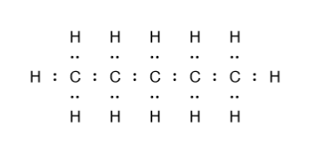 |
| Condensed structure (condensed formula) | Same as Lewis structure except groups of atoms are written as one condensed constituent element.                                                                                                                                                                                                                                                                                                                                                                                | $\ce{CH3-CH2-CH2-CH2-CH3}$           |
| Skeleton structure (skeleton formula)   | Only shows the position of the carbon bonds (i.e. bonds between carbon atoms). Carbon atoms are located at **points where lines meet** or the **ends of the lines**, and hydrogen atoms are not shown; it is implied that there are **attached hydrogens to every carbon**, and the number of hydrogens bonded to each carbon is however many is necessary to fulfill the octet rule. Some skeleton diagrams also include the carbon groups (e.g. $\ce{CH3}$) on the endpoints. | 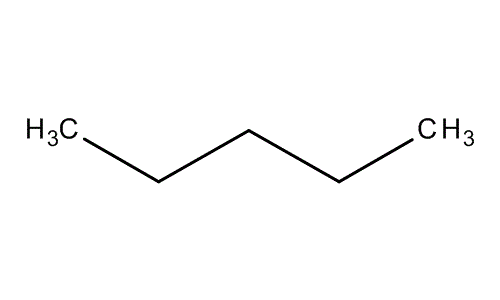           |

> In addition to these representations, software can be used to create **3D visualizations** of organic compounds by rendering the actual molecular geometry. See the [PubChem 3D viewer](https://pubchem.ncbi.nlm.nih.gov/pc3d/) for examples of how to do this.

The representations have different uses - pure Lewis structures are good at showing all the lone pairs and atoms, condensed structures show all the important groups while staying rather compact, and line (skeleton) structures are good for very complex molecules and for describing non-trivial geometries such as rings and branches (we'll see more about this later).

> **How do we know our structural representations are correct?** The oversimplified answer is that we often don't. We can come up with an empirical formula based on experimental measurements of a compound in various ways such as mass spectroscopy (we covered this earlier in stoichiometry). The law of the conservation of mass and the law of definite proportions guarantees this to be the case. However, beyond that, we can only _theorize_ structural representations based on our best understanding of bonding and molecular stability as well as the behavior of compounds. The more advanced answer is that with certain techniques such as [X-ray crystallography](https://en.wikipedia.org/wiki/X-ray_crystallography) and [electron diffraction](https://en.wikipedia.org/wiki/Gas_electron_diffraction) can be used to actually find the structure, and you can [read more about this here](https://en.wikipedia.org/wiki/Chemical_structure#Structural_elucidation).

### Hydrocarbons

Hydrocarbons are organic compounds that **only contain carbon and hydrogen**. These are insoluble in water but often used as fuels as they undergo combustion reactions in the presence of oxygen. There are four types of hydrocarbons: **alkanes**, **alkenes**, **alkynes**, and **aromatics**. We will now explore the first three in detail.

#### Alkanes

Alkanes are the least reactive type of hydrocarbon and have only **single** carbon-carbon bonds. They are also considered **saturated**, which means that they are maximally filled with hydrogen atoms. These properties mean that they are highly unreactive and are generally gaseous at room temperature.

The names of alkanes start with -ane. Each alkane has two hydrogen atoms at either end, and $\ce{CH2}$ groups between the ends. The below table lists the most common basic alkanes (up to $\ce{C10H22}$ although there are theoretically an unlimited number of alkanes possible):

> **Note:** unless otherwise noted, all of the below images (and all skeleton formulae of organic compounds from this point) contain alt text (label text) with the organic compound's name in [SMILES](https://en.wikipedia.org/wiki/Simplified_Molecular_Input_Line_Entry_System) format, which can be entered into a cheminformatics system, including several freely available online, for an accessible view of the skeleton formula.

| Alkane Name | Molecular Formula | Condensed formula          | Skeleton Formula                                                                                                                                                             |
| ----------- | ----------------- | -------------------------- | ---------------------------------------------------------------------------------------------------------------------------------------------------------------------------- |
| Methane     | $\ce{CH4}$        | $\ce{CH4}$                 | N/A |
| Ethane      | $\ce{C2H6}$       | $\ce{CH3-CH3}$             | 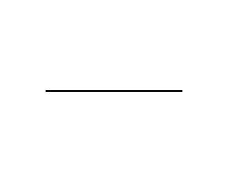                                                                                                      |
| Propane     | $\ce{C3H8}$       | $\ce{CH3-CH2-CH3}$         | 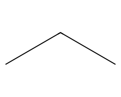                                                                                                   |
| Butane      | $\ce{C4H10}$      | $\ce{CH3-CH2-CH2-CH3}$     | 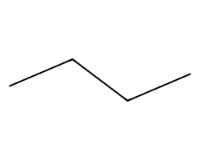                                                                                                  |
| Pentane     | $\ce{C5H12}$      | $\ce{CH3-CH2-CH2-CH2-CH3}$ | 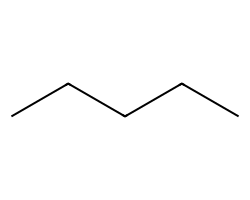                                                                                               |
| Hexane      | $\ce{C6H14}$      | $\ce{CH3-(CH2)4-CH3}$      | 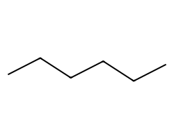                                                                                              |
| Heptane     | $\ce{C7H16}$      | $\ce{CH3-(CH2)5-CH3}$      | 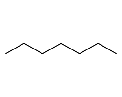                                                                                           |
| Octane      | $\ce{C8H18}$      | $\ce{CH3-(CH2)6-CH3}$      | 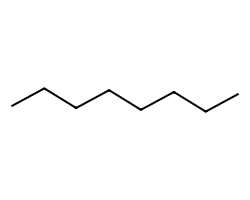                                                                                          |
| Nonane      | $\ce{C9H20}$      | $\ce{CH3-(CH2)7-CH3}$      | 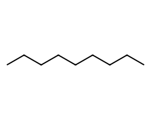                                                                                        |
| Decane      | $\ce{C10H22}$     | $\ce{CH3-(CH2)8-CH3}$      | 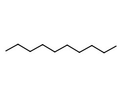                                                                                      |

For methane, notice that there is no skeleton formula. The reason why is because there are no carbon-carbon bonds (after all, methane has a single carbon atom). But its Lewis structure is very straightforward (4 hydrogens branching out of a single carbon atom) and it is the simplest alkane.

> **Note:** a mnemonic that may be helpful is that for all the alkanes after butane, additionally, follow the typical naming conventions, e.g. _hept-_ for five, _hex-_ for six, _oct-_ for octane, and so forth. In addition, due to the extremely long structural formulas of the larger alkanes (hexane, heptane, octane, nonane, decane) we use an abbreviated notation. As an example, hexane, given by $\ce{CH3-(CH2)4-CH3}$ is equivalent to $\ce{CH3-CH2-CH2-CH2-CH2-CH3}$, i.e. has 4 repeated $\ce{CH2}$ groups. Meanwhile, for the first four alkanes, just memorize "M.E.P.B", this will be extremely useful going forwards

To determine the chemical formula of an alkane is fairly straightforward; simply write out the condensed formula, count the number of carbon atoms (it is always one per substituent group in the condensed formula), and then count the number of hydrogen atoms. One may also devise a general formula for alkanes: they follow the chemical formula $\ce{C_nH_{2n + 2}}$. 

Alkanes can form more sophisticated structures through the process of adding additional alkane groups. An alkane group is a base alkane (like methane) but bonded to another group of atoms. The names of the alkane groups are very similar to their base alkanes. We simply take the base alkane's name and replace _-ane_ with _-yl_. For instance, methane becomes _methyl_, ethane becomes _ethyl_, and propane becomes _propyl_. The alkane groups also share the same basic structure as their base alkanes, in fact identical except for the fact that one of the end $\ce{CH3}$ groups is changed to a $\ce{CH2}$ group. This correspondence means that the skeleton formula of the alkane groups is in fact _identical_ to that of their base alkanes (unless if we choose to also draw on the $\ce{CH3}$ and $\ce{CH2}$ groups on the endpoints), which we can see below:

| Alkane group | Derived from | Condensed formula          |
| ------------ | ------------ | -------------------------- |
| Methyl       | Methane      | $\ce{CH3}$                 |
| Ethyl        | Ethane       | $\ce{CH2-CH3}$             |
| Propyl       | Propane      | $\ce{CH2-CH2-CH3}$         |
| Butyl        | Butane       | $\ce{CH2-CH2-CH2-CH3}$     |
| Pentyl       | Pentane      | $\ce{CH2-CH2-CH2-CH2-CH3}$ |
| Hexyl        | Hexane       | $\ce{CH2-(CH2)4-CH3}$      |
| Heptyl       | Heptane      | $\ce{CH2-(CH2)5-CH3}$      |
| Octyl        | Octane       | $\ce{CH2-(CH2)6-CH3}$      |
| Nonyl        | Nonane       | $\ce{CH2-(CH2)7-CH3}$      |
| Decyl        | Decane       | $\ce{CH2-(CH2)8-CH3}$      |

> **Notation:** it is also common to write $\ce{H2C-CH3}$ for ethyl, $\ce{H2C-CH2-CH3}$ for propyl, and so forth. These are equivalent to $\ce{CH2-CH3}$ and $\ce{CH2-CH2-CH3}$ for ethyl and propyl, but the reversed order is sometimes helpful for establishing one side as the start of the alkane chain and one side as the end.

The **name** of alkanes is derived from their longest chain in their structural formula. For instance, consider iso-octane, which, despite its common name, is not actually derived from octane. The structural formula is as follows:

{{ diagram(src="2,2-4-trimethylpentane.excalidraw.svg") }}

_SMILES format: `CC(C)(C)CC(C)C`_

The base name of alkanes is the name of their longest continuous chain, which, in this case, has 5 carbon atoms (starting from the leftmost carbon atom on the very left edge and ending at the right-bottom carbon atom on the very right edge), making it a **pentane**. If there are multiple chains that have the same maximal length, choose the one has the **greatest number of substituent groups** (i.e. group that branches outwards from the main chain, which we also call a _branch_). Keep this in mind as we continue.

We start counting from the end of the chain **closest to the first substituent group**, or if both ends are equidistant from the first substituent group, we count from the end with a) the substituent that comes first alphabetically, or if that is also identical, B) comparing the next substituent that comes, repeating as many times as necessary until there is one that is non-identical. Since both ends have the first bond in second position, our numbering would start from the left. Remember that carbon atoms are present both at the **edges** and **connections** between lines. The first position carbon is on the left edge. In counting, we find **two methyl** groups at the **second atom**, one on each side, which we denote _2, 2-dimethyl_ (the prefix _di-_ to indicate two methyl groups). We then find another **methyl** group on the **fourth atom**, which we denote as _4-methyl_. Therefore, the IUPAC name (scientific name) of iso-octane is _2,2-dimethyl-4-methyl-pentane_ which we can shorten to _2,2,4-trimethylpentane_, with prefix _tri-_ to indicate three methyl groups.

> Note here that we use _2,2,4-methyl-pentane_ (counting from the left) rather than _2,4,4-dimethyl-pentane_ (counting from the right) because (2, 2, 4) is a smaller progression of numbers than (2, 4, 4) i.e. it  increases term-by-term by smaller numbers. This is a general principle with IUPAC notation: whichever arrangement makes for the lowest sequence of numbers is the one we choose, which generally takes precedence over other rules (other than the alphabetical precedence rule).

In counting the groups, there are subtle nuances that are easily missed:

- The longest continuous chain may not be in a straight line. In fact, it may be a bent chain.
- When finding the longest continuous chain, we do _not_ count any branching groups. That is to say, any groups that branch out of the main chain are _not_ counted
- When there are **repeated groups**, we must use a prefix to indicate this. For instance, *3-methyl-4-methyl-hexane* would be called *3,4-methyl-hexane*
- When there is **a branch on either side** (or more than one branch on either side, we must repeat the position number, and following the previous rule, we must also add the suitable prefix. For instance, earlier we had to denote the 2 methyl groups that branched out from the same carbon by _2,2-dimethyl_ because of the two (_di-_) methyl groups that are both at second position
- When there is **more than one group**, we list the groups in alphabetical order. For instance, an ethyl group is named before a methyl group because E comes before M in the alphabet. 

While relatively unreactive, alkanes can participate in certain chemical reactions. First, they can burn in oxygen, releasing heat. This is known as a **combustion reaction**. For instance, the balanced chemical reaction for the combustion of methane in normally oxygenated air is:

$$
\ce{CH4}(g) + 2\ce{O2}(g) \to 2\ce{H2O}(g) + \ce{CO2}(g)
$$

In addition, alkanes can undergo **substitution reactions** when the hydrogen atoms are substituted for atoms of a more reactive element. Such reactions need energy put in to start the reaction. A very common type of substitution reaction is a **chlorination reaction**, where hydrogen atoms are replaced by chlorine atoms. The number of hydrogen atoms replaced is shown in the name of the reaction product; _(mono)chloromethane_, for instance, has one hydrogen atom substituted for one chlorine atom, and thus has the formula $\ce{CH3Cl}$; meanwhile, _trichloromethane_ has three hydrogen atoms substituted for three chlorine atoms, and thus has the formula $\ce{CHCl3}$.

#### Alkenes

Alkenes are very similar to alkanes in that they only contain carbon and hydrogen, except unlike alkanes, they contain a **double carbon-carbon bond**. For this reason, they follow a slightly different structure. An alkene is based in a $\ce{CH2=CH}$ group (we often write this as $\ce{H2C=CH}$ as we mentioned above to differentiate as the endpoint). The $\ce{CH2=CH}$ group is then attached to any number of $\ce{CH2}$ groups, with a $\ce{CH3}$ group at its end. Unlike alkanes, we consider alkenes **unsaturated hydrocarbons**.

| Alkane Name                   | Molecular Formula | Condensed formula             | Skeleton Formula                                                                          |
| ----------------------------- | ----------------- | ----------------------------- | ----------------------------------------------------------------------------------------- |
| Ethene (also called ethylene) | $\ce{C2H4}$       | $\ce{CH2=CH2}$                | 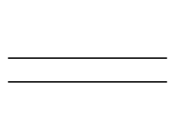                 |
| Propene                       | $\ce{C3H6}$       | $\ce{CH2=CH-CH3}$             | 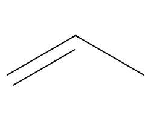              |
| Butene                        | $\ce{C4H8}$       | $\ce{CH2=CH-CH2-CH3}$         | 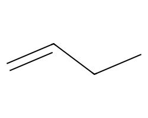             |
| Pentene                       | $\ce{C5H10}$      | $\ce{CH2=CH-CH2-CH2-CH3}$     | 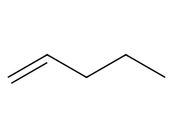          |
| Hexene                        | $\ce{C6H12}$      | $\ce{CH2=CH-CH2-CH2-CH2-CH3}$ | 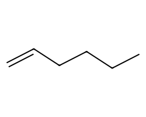         |
| Heptene                       | $\ce{C7H14}$      | $\ce{CH2=CH-(CH2)4-CH3}$      | 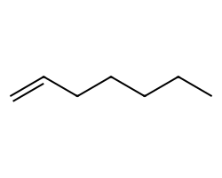      |
| Octene                        | $\ce{C8H16}$      | $\ce{CH2=CH-(CH2)5-CH3}$      | 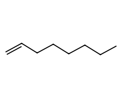     |
| Nonene                        | $\ce{C9H18}$      | $\ce{CH2=CH-(CH2)6-CH3}$      | 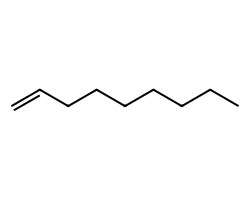   |
| Decene                        | $\ce{C10H20}$     | $\ce{CH2=CH-(CH2)7-CH3}$      | 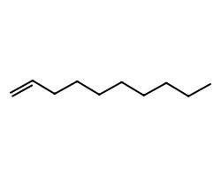 |

The molecular formulas of alkenes can be determined either through the same method as alkanes (writing out the condensed formula and counting the carbons and hydrogens) or by using the general formula $\ce{C_nH_{2n}}$. 

In an alkene, the longest carbon chain that contains the double bond is what establishes the root name of the alkene. We still count from edge to edge, but we start from the edge that is _closest_ to the double bond. If the double bond is *equidistant* from either side, we count from the side that is closer to the *first* substituent group. When naming alkenes, we _also_ insert the position of the double bond just before the root name of the alkene, and multiple groups are (again) given in alphabetical order. For instance, consider the following annotated alkene:

{{ diagram(src="diagram-3-ethyl-4-metheyl-1-pentene.excalidraw.svg") }}

_Associated SMILES format: `C=CC(CC)C(C)C`_

The longest chain extends from the top left to the bottom right (yes, this is somewhat confusing given the orientation of the skeleton structure) and has **five** carbon atoms, making it a _pentene_. The side with the double bond is the top left, so we begin counting from there, and we let the **top-left carbon** (implied to be on the left side of the double bond) be in **first position**. After the double bond at **first position**, we count one right, where we find an **ethyl group** to the right at **third position**. Then we count one down, where we find a **methyl group** to the left at **fourth position**, before finally reaching the bottom right carbon. Therefore its name is *3-ethyl-4-metheyl-1-pentene*, remembering that after our counting, we put the ethyl first because it comes first in alphabetical order.

Note that we referred to the base ethyl as _1-pentene_ rather than simply _pentene_, as this is necessary to specify that the double bond occurs at first position. In alkanes that have their double bond at non-first position, the first position is still located on the carbon on the endpoint of the longest chain closer to the double bond, but we must be careful to note down the position of the double bond. That is to say, 1-pentene is not the same as 2-pentene or 3-pentene, and we show the difference in the table below:

| Name      | Location of double bond | Condensed formula        | Skeleton structure                                                                          |
| --------- | ----------------------- | ------------------------ | ------------------------------------------------------------------------------------------- |
| 1-pentene | 1st-position carbon     | $\ce{CH2=CH-(CH2)2-CH3}$ |    |
| 2-pentene | 2nd-position carbon     | $\ce{CH3-CH=CH-CH2-CH3}$ |  |
| 3-pentene | 3rd-position carbon     | $\ce{CH3-CH2-CH=CH-CH3}$ | 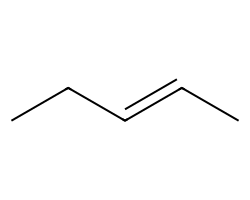   |

> **Note:** bare skeleton structures are very simplified and it is important to remember that implied carbons are located at all endpoints of each line and all points where lines join. Hydrogen atoms are also implied to be attached to the carbon atoms, however many is necessary to fill the carbon atoms' orbitals.

#### Alkynes

Alkynes are similar to alkenes in that they are also unsaturated hydrocarbons, and thus contain only carbon and hydrogen, but they are distinct in that they have **triple carbon-carbon bonds**. Their naming convention is almost the same as that of alkenes, except the counting starts from the end with the triple bond. Again, their numbering in the case of both ends being equidistant from the triple bond follows the lowest-number-progression order, and when multiple groups are present, they are ordered in alphabetical order. Additionally, when naming alkynes, we must add the position of the bond to the base alkyne name, such as _2-pentyne_ or _1-butyne_.

Alkynes follow the general formula $C_n H_{2n-2}$. The same general structure of alkanes and alkenes carry over to alkynes, as can be seen in the following table:

| Alkane Name | Molecular Formula | Condensed formula               | Skeleton Formula                                                                                   |
| ----------- | ----------------- | ------------------------------- | -------------------------------------------------------------------------------------------------- |
| Ethyne      | $\ce{C2H2}$       | $\ce{CH#CH}$                    |                |
| Propyne     | $\ce{C3H4}$       | $\ce{CH#C-CH3}$                 |               |
| Butyne      | $\ce{C4H6}$       | $\ce{CH#C-CH2-CH3}$             |              |
| Pentyne     | $\ce{C5H8}$       | $\ce{CH#C-CH2-CH2-CH3}$         |           |
| Hexyne      | $\ce{C6H10}$      | $\ce{CH#C-CH2-CH2-CH2-CH3}$     |          |
| Heptyne     | $\ce{C7H12}$      | $\ce{CH#C-CH2-CH2-CH2-CH2-CH3}$ |       |
| Octyne      | $\ce{C8H14}$      | $\ce{CH#C-(CH2)5-CH3}$          |      |
| Nonyne      | $\ce{C9H16}$      | $\ce{CH#C-(CH2)6-CH3}$          |    |
| Decyne      | $\ce{C10H18}$     | $\ce{CH#C-(CH2)7-CH3}$          |  |

> **Note:** Ethyne is also called *acetylene* and *vinylene* and (even more confusingly) _ethenylene_. These common names all refer to to the same compound, just with different naming conventions.

### Benzenes

We have already seen alkanes, alkenes and alkynes. Now we will examine _benzenes_, also referred to as aromatic hydrocarbons. Benzenes are distinguished by their benzene hexagonal ring composed of 6 hydrogen and 6 carbon atoms, shown as follows:

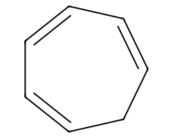

Benzene groups have the name _phenyl-_ when they are part of the dominant chain in an organic molecule molecule (i.e. when the chain is much bigger than the benzene). When that is the case, we simply follow the general conventions for naming the molecule, such as the naming conventions of alkanes, alkenes, or alkynes, and append _phenyl-_ and the position number to the compound. For instance, here is 2-phenyl-2-pentene:

=CCC.svg)

However, there are also cases where the benzene ring is the predominant structure of the compound and is where other groups branch off from. In this case, we follow a separate naming convention. We can start counting from wherever we want because benzene is a **cyclic compound** (i.e. has a ring). For instance, consider the following benzene-containing molecule:

=CC=CC=C(C)1.svg)

We start counting from the chlorine because it comes in alphabetical order before the methyl group. We then count in either clockwise or counterclockwise order, whichever order makes for the smallest progression of numbers. Thus, we _can_ call it *1-chloro-2-methylbenzene* but **not** 1-chloro-6-methylbenzene because (1, 6) is a larger progression of numbers compared to (1, 2). We may _also_ call it **ortho-chloromethylbenzene**, where we reference the table below:

| Prefix | Abbreviation | Meaning                                                                   | Example                                                                                                                            |
| ------ | ------------ | ------------------------------------------------------------------------- | ---------------------------------------------------------------------------------------------------------------------------------- |
| Para-  | P-           | Two branches that are on directly opposing sides of the ring              | =CC=C(C)C=C1.svg)   |
| Meta-  | M-           | Two branches attached to carbon atoms that have another carbon in between | =CC(C)=CC=CC1.svg) |
| Ortho- | O-           | Two branches attached to two adjacent carbons                             | =CC=CC=C(C)1.svg) |

### Alcohols

An **alcohol** is the next type of organic compounds. Alcohols are any organic compound that contain a hydroxyl ($\ce{OH}$) group at some point on their primary (longest) chain, and correspondingly have names that end with _-ol_, such as _ethanol_ and _hexanol_. Typically, they are similar to their corresponding alkanes, but have an appended hydroxyl group on the last carbon. The base names of the alcohols are based on the number of carbon atoms in the chain that the hydroxyl group is attached to, **not counting the hydroxyl group**. The first few alcohols are shown in the table below:

| Alkane Name | Molecular Formula | Condensed formula             | Skeleton Formula                                                                               |
| ----------- | ----------------- | ----------------------------- | ---------------------------------------------------------------------------------------------- |
| Methanol    | $\ce{CH3OH}$      | $\ce{CH3-OH}$                 | ![Methanol, SMILES format: C[OH]](smiles/C[OH].svg)         |
| Ethanol     | $\ce{C2H5OH}$     | $\ce{CH3-CH2-OH}$             | ![Ethanol, SMILES format: CC[OH]](smiles/CC[OH].svg)        |
| Butanol     | $\ce{C3H7OH}$     | $\ce{CH3-CH2-CH2-OH}$         | ![Butanol, SMILES format: CCC[OH]](smiles/CCC[OH].svg)      |
| Propenol    | $\ce{C4H9OH}$     | $\ce{CH3-CH2-CH2-CH2-OH}$     | ![Propenol, SMILES format: CCCC[OH]](smiles/CCCC[OH].svg)   |
| Pentanol    | $\ce{C5H11OH}$    | $\ce{CH3-CH2-CH2-CH2-CH2-OH}$ | ![Pentanol, SMILES format: CCCCC[OH]](smiles/CCCCC[OH].svg) |

> **Note:** hexanol, heptanol, octanol, and so forth follow in the same pattern.

When naming alcohols, we must *also* indicate the position of the hydroxyl group as a prefix before the alcohol. For instance, 2-pentanol means that the hydroxyl group is at the second position of the longest chain. Remember we would still need to use alphabetical order in the case that multiple branching groups are present. For general reference, these are different sub-variants of pentanol:

| Name       | Location of $\ce{OH}$ group | Skeleton Formula                                                                                     |
| ---------- | --------------------------- | ---------------------------------------------------------------------------------------------------- |
| 1-pentanol | 1st-position carbon         | ![1-Pentanol, SMILES format: CCCCC[OH]](smiles/CCCCC[OH].svg)     |
| 2-pentanol | 2nd-position carbon         | ![2-Pentanol, SMILES format: CCCC([OH])C](smiles/CCCC([OH])C.svg) |
| 3-pentanol | 3rd-position carbon         | ![3-Pentanol, SMILES format: CCC([OH])CC](smiles/CCC([OH])CC.svg) |

> **Note:** there is no 4-pentanol or 5-pentanol because 4-pentanol would just be 2-pentanol backwards and 5-pentanol would just be 1-pentanol backwards. We only count sub-variants that are structurally different, if a sub-variant is the same, we don't count it.

### Other functional groups

Beyond the ubiquitous hydrocarbons, benzenes and alcohols, there are more groups of organic compounds. Each constitutes a **functional group**, which can be thought of as branches to attach to a carbon chain.

| Functional Group Name      | Minimum components       | Condensed formula                                     | Skeleton formula                                                                                                                                                                                  |
| -------------------------- | ------------------------ | ----------------------------------------------------- | ------------------------------------------------------------------------------------------------------------------------------------------------------------------------------------------------- |
| Amines                     | Nitrogen                 | $\ce{N,NH,NH2}$ (both possible)                       |  _Also possible:_  |
| Ether                      | Carbon, oxygen           | $\ce{CO}$ (single bond)                               |                                                                                                       |
| Ketones                    | Typically carbon, oxygen | $\ce{CO}$ (double bond)                               | C?height=200)                                                                                                                    |
| Aldehydes                  | Carbon, oxygen, hydrogen | $\ce{COH}$ (double bond oxygen, single bond hydrogen) | (C)CC?height=200) _(Note: implicit hydrogen is the left bottom bond)_                                                            |
| Carboxyl (carboxylic acid) | Carbon, oxygen, hydrogen | $\ce{COOH}$                                           | O?height=200)                                                                                                                  |

We can also consider functional groups formed by the combination of two simpler groups. For instance, an **esther** is the product of the reaction between an alcohol and a carboxylic acid, where the hydroxyl end of the alcohol and the hydrogen end of the carboxylic acid are joined together with an oxygen atom, forming an ester and water.

Similarly, an **amide** is the product of the reaction between an amine and a carboxylic acid, adding an oxygen and carbon, so an amide has the condensed formula $\ce{CNO}$ (which can also be $\ce{C(NH)O}$ or $\ce{C(NH2)O}$).

The functional groups are still named according to the longest continuous carbon chain (remember, to find the longest continuous carbon chain we count the number of _carbon atoms_ in the chain). For instance, $\ce{H3C-(C=O)-CH3}$, which is a ketone with the $\ce{CH3}$ (methyl) group on either side, is named **2-propanone** (or more simply, just *propanone*) because the longest carbon chain is three carbon atoms long and the ketone group is located at second position, as shown below:

{{ diagram(src="2-propanone.excalidraw.svg"
           desc="A diagram describing 2-propanone, a ketone with two attached methyl groups") }}

### Isomerism

In inorganic chemistry, a chemical formula is almost certainly a unique identifier. But in organic chemistry, even among compounds that have identical chemical formulas, and thus have identical atomic mass, we find molecules that are structurally different. We term these **isomers**.

A molecule that is drawn simply rotated, flipped, or turned backwards is not an isomer. An isomer must be _structurally different_. For instance, an ether and a ketone can be possibly have the same chemical formula even though we know they are different functional groups. 

In addition, different arrangements of atoms in groups can also yield isomers. When two groups are joined together by single bonds to the central atom, the bond does not hold the two groups very tightly, so free rotation of the groups is possible. This means that even if some groups in particular molecules are oriented in opposite directions with each other, the free rotation quickly corrects for this and no isomerism occurs. However, in double-bonded and triple-bonded molecules, groups that have different orientations _cannot_ freely rotate to change their orientation. Therefore, each possible orientation results in a unique isomer. We can classify these as _cis-isomers_, where the orientations of both groups are the same, or as _trans-isomers_, where the orientations of the two groups are opposite.

We should also mention _iso-_ groups, such as isopropyl and isobutyl. These are Y-shaped groups, and the two most common, isopropyl and isobutyl, have the formulas $\ce{CH3CH2CH3}$ and $\ce{CH3CH2CH2CH3}$ respectively, but are _not_ the same as propane and butane (even though they share the same formulae). In general, isomerism produces even _more_ possible organic compounds, and is a key reason why the number of known organic compounds vastly outnumbers the number of known inorganic compounds.

### Chirality

We consider a molecule **chiral** when there is *at least* one carbon atom with four connected groups that are all different. As an example, consider the propane molecule, $\ce{CH3CH2CH3}$. If we take a look at its central carbon, we find that it is connected to 2 $\ce{-H}$ groups and two $\ce{-CH3}$ groups. Given that there are 2 repeated hydrogen groups, we say that propane is **achiral** (not chiral).

We may also consider the butane molecule, $\ce{CH3CH2CH2CH3}$. If we take a look at its central carbon, we find (again) that it is connected to 2 $\ce{-H}$ groups, one $\ce{CH3}$ group, and (unlike before) one $\ce{CH2CH3}$ group. We still do not have four different groups, so butane is **achiral**.

Now let us consider 2-chloro-2-fluoropentane. If we take a look at its C2 carbon (2nd-position carbon) we find that it is connected to a $\ce{-CH3}$ group, $\ce{-CH2CH2CH3}$ group, $\ce{-Cl}$ group, and $\ce{-F}$ group. We now have found a carbon atom that _does_ have four different groups, so 2-chloro-2-fluoropentane is **chiral**.

Chirality is important because chiral isomers are also called **optical isomers** which means that they polarize light (cause light to have a preferential direction). Polarization can be demonstrated through sunglasses: sunglasses are polarizing filters that allow light to pass through at only a certain angle, and block it otherwise, reducing the total light that enters (although still more than enough to see, because photons at any angle will have already randomly scattered everywhere). This allows sunglasses to block glare. For optical isomers, we refer to two types of isomers, $l$ isomers that rotate light clockwise, and $d$ isometers that rotate light counter-clockwise. However, when more than one isomer is present within a compound, we may not necessarily _observe_ polarization to occur, because a mixture could contain an equal amount of $l$ and $d$ isomers (we call this a **racemic mixture**), which cancel each other out.

### Summary of the primary organic functional groups

Recall that carbon has the ability to form incredibly-many compounds due to its ability to chain different groups of atoms together with its four bonds. Organic compounds are typically built of a mixture of such groups - functional groups - which we have discussed previously. A chart of the most common functional groups is given below:

{{ wideimg(src="functional-groups.excalidraw.svg"
           desc="Chart of common functional groups and their skeleton structures") }}

_Alt text: An illustration of all common organic functional groups listed in the prior sections._

> **Note:** To zoom into the chart in a web browser, you can right-click on the image and then select "Open Image in New Tab", then scroll to zoom.

### Organic reactions 

Just like organic compounds come in a great variety of structures, they also react in complex ways to form thousands of new compounds. While organic compounds can react in many different ways, we will focus on a few chemical reactions that are incredibly common for organic compounds:

| Reaction type/subtypes (if any)                                                         | Occurence                                                                                                    |
| --------------------------------------------------------------------------------------- | ------------------------------------------------------------------------------------------------------------ |
| **Combustion**                                                                          | Reaction with $\ce{O2}$ (oxygen)                                                                             |
| **Alkane substitution** (includes chlorination, bromination, halogination)              | Reaction of alkane (single-bond hydrocarbon) with $\ce{Cl, Br, I}$ gas most commonly                         |
| **Aromatic substitution** (includes benzene chlorination, bromination and halogination) | Reaction of benzene with $\ce{Cl, Br, I}$ gas most commonly                                                  |
| **Alcohol elimination**                                                                 | Reaction usually requires a strong acid as catalyst, $\ce{OH}$ group is taken from alcohol to form an alkene |

> **Note:** Other common organic reactions that are not covered here are alkene addition, alkene hydrogenation, alcohol substitution, and alcohol oxidation.

We will take a look at each in detail. The first category, combustion, is certainly the most familiar. A common example is the combustion of methane (one of the main components of natural gas) by the following reaction:


\ce{CH4(g) + 2O2(g) \to CO2(g) + 2H2O(g)}


This reaction only produces the inorganic compounds of carbon dioxide and oxygen, which is typical for combustion reactions, and is the case for the combustion of **all hydrocarbons**. The other types of organic reactions are more complex, because they result in the formation of _organic_ compounds.

Now let us examine an example of **aromatic substitution**: the chlorination of benzene. Recall that benzene has molecular formula $\ce{C6H6}$ and the following skeleton formula:

When benzene is reacted with chlorine gas in the presence of a catalyst (usually an acid), it reacts to form **chlorobenzene** ($\ce{C6H5Cl}$) as well as hydrogen chloride gas:


\ce{C6H6(l) + Cl2(g) \to C6H5Cl(l) + HCl(g)}


The skeleton formula of chlorobenzene is the same as benzene, but with one of its (implied) hydrogens replaced with a chlorine atom:

=CC1?height=100)

Alkene addition: react with acid (e.g. $\ce{KI, HCl, HF}$ etc.) or halogen (e.g. $\ce{Cl2, I2, F2}$ etc.), turns double bond into single bond, the hydrogen from the acid adds to the carbon atom of the double bond with the most hydrogen atoms, and the halogen from the acid attaches to one side of the other carbon (formerly) in the double bond. 

### Polymers

**Polymers** are long-chain organic molecules containing repeating groups of simpler molecules, called **monomers**. Many biological compounds are made of polymers, including, most famously, DNA. Polymers come in several different varieties.

An **addition polymer** is a polymer that is formed by an addition reaction. This means that addition polymers form by splitting a monomer apart and recombining the monomers into long chains, where monomers link together at the ends of each other. re-using _all_ the original atoms in the monomer without adding and losing any atom. The process of creating an addition polymer is _purely rearrangement_ of the _same_ atoms - moving them around and connecting them in different ways. 

By contrast, in **condensation reactions**, there is the loss of a water molecule or another group to be able to chain the monomers together, unlike addition polymers. Such polymers are known as **condensation polymers**.

## The kinetic theory of gases

The kinetic theory of gases is the most widely-used theory of molecular gases, developed over the course of countless experiments. It models gases as composed of countless gas particles, which are each very small in size, very rapidly moving, and only interact with each other when they collide. In addition, collisions between gas particles are assumed to be **perfectly elastic**, meaning that there is no loss of energy during collisions. Kinetic theory explains that **temperature** is just a manifestation of the _average kinetic energy_ of the gas molecules, and that **pressure** is just a macroscopic description of the sum of all collision forces between gas molecules.

> Note that the kinetic theory of gases is only an _approximate_ model. The behavior of real gases is far more complex, and has its own field of study, that being **thermodynamics** and more generally **statistical mechanics**. Please see the section on thermodynamics in the [classical dynamics series](@/classical-dynamics.md) for more.

### State variables and units

In kinetic theory, we describe gases based on five characteristics: quantity ($n$, expressed in moles), pressure ($P\,$), volume ($n$), and temperature ($T$). These characteristics are called **state variables**. Note that while we can substitute quantity (moles) for mass, gases often have so little mass and their masses are so hard to measure that it is far more convenient to speak of a number of moles of a gas than a number of grams of a gas. The units of the state variables are respectively as follows:

| State variable | Symbol | Unit(s)                                                                                                                                               |
| -------------- | ------ | ----------------------------------------------------------------------------------------------------------------------------------------------------- |
| Quantity       | $n$    | $\pu{mol}$ (moles)                                                                                                                                    |
| Pressure       | $P$    | $\pu{Pa}$ (pascals), $\pu{kPa}$ (kilopascals), $\ce{atm}$ (atmospheres), $\pu{Torr}$ (torr, no plural), $\pu{bar}$ (bar), $\pu{mmHg}$ (mm of mercury) |
| Volume         | $V$    | $\pu{L}$ (liters) or $\pu{mL}$ (milli-liters), equivalently $\pu{1 cm^3 = 1 mL}$, much less commonly $\pu{1m^3} \equiv \pu{1000 L}$                   |
| Temperature    | $T$    | $\pu{\degree C}$ (degrees Celsius) or $\pu{K}$ (kelvin) where $\pu{1 K = \degree C + 273.15}$                                                         |

The units for pressure are quite a hassle to work with, given the myriad of units to choose from. The **pascal**, symbol $\pu{Pa}$, is the standard SI unit for pressure, but chemists more often use **atmospheres**, where $\pu{1 atm = 101.325 kPa}$ is the standard pressure at sea level on Earth. The **torr** is defined as 1/760th of an atmosphere, which is _approximately_ the same as a **millimeter of mercury** (mmHg), a mostly-legacy unit from the times that mercury barometers were used to measure pressure. The torr and mmHg are so close - they are different by only $1.5 \times 10^{-5}$ percent - that they can well be considered the same unit. Meanwhile, the **bar**, defined as 100 kPa, is _almost_ the same as an atmosphere - $\pu{1 atm = 1.01325 bar}$.

### Ideal gases

Gases are frequently studied in chemistry and many gases are well-approximated as an _ideal gas_ that behaves predictably. The **ideal gas law** relates the three key thermodynamic variables of gases, that being the pressure $P$, volume $V$, and temperature $T$ as follows:


PV = n RT


Where $n$ is the number of moles of the gas, $R$ is the ideal gas constant, and all variables are in SI units (e.g. $T$ must be given in Kelvin, $V$ in liters, and $P$ in $\pu{kPa}$ _not_ pascals). The precise value of the ideal constant depends on the units used; the most common combinations are shown in the table below, with the numerical values expressed to 4 significant figures:

| Ideal constant value                     | Units                                                                                                    |
| ---------------------------------------- | -------------------------------------------------------------------------------------------------------- |
| R = \pu{8.314 L*kPa*K^{-1}mol^{-1}} | Pressure in $\pu{kPa}$, temperature in $\pu{K}$, volume in $\pu{L}$ (all formulations use moles for $n$) |
| R = \pu{0.08206 L*atm*K^{-1}*mol^{-1}} | Pressure in $\pu{atm}$, temperature in $\pu{K}$, volume in $\pu{L}$                                      |
| R = \pu{62.36 L*Torr*K^{-1}*mol^{-1}}  | Pressure in $\pu{Torr}$, temperature in $\pu{K}$, volume in $\pu{L}$                                     |

**All** ideal gases obey the ideal gas law regardless of chemical composition, and as such, under the same conditions (same pressure, same temperature, same volume, and same number of moles), two ideal gases (say, oxygen gas and water vapour) have the **exact** same properties. Further, keeping one of the thermodynamic variables constant provides the following proportionality relationships for ideal gases, which can be used to solve for $P, V, n, T$ for some given conditions:


\begin{align*}
n, T &= \text{const.} \rightarrow P_1 V_1 = P_2 V_2 \\
n, P &= \text{const.} \rightarrow \dfrac{T_1}{V_1} = \dfrac{T_2}{V_2} \\
n, V &= \text{const.} \rightarrow \dfrac{T_1}{P_1} = \dfrac{T_2}{P_2} \\
\end{align*}


> **Note:** Be careful to note that two gases with equivalent pressure, temperature, and volume do not necessarily behave the same way by the ideal gas law. They **must** also contain the same number of moles.

These relationships can be derived by some intuition. For instance, holding all other variables constant, we know that as _temperature increases_, the greater heat and thus kinetic energy of the gas molecules must increase, so _pressure also increases_. That is to say, $T \propto P$. We may rewrite this as $T = C P$ for some constant $C$, which we may rearrange to $\dfrac{T}{P} = C$. Given that $C$ is a constant, we have $\dfrac{T_1}{P_1} = \dfrac{T_2}{P_2} = C$. By constrast, holding all other variables constant, we know that as _volume increases_, the longer it takes for the gas molecules to collide with the walls of their container, so _pressure decreases_. Therefore, $V \propto \dfrac{1}{P}$. We may again rewrite this as $V = \dfrac{C}{P}$ for some constant $C$, which we can rearrange to $VP = C$. Given that $C$ is a constant, we have $V_1 P_2 = V_2 P_2 = C$.

> We often analyze ideal gases under **standard temperature and pressure**, abbreviated STP. STP conditions are a temperature of 0 Celsius (273.15 Kelvin) and (depending on convention) 1 atmosphere or $10^5$ Pascals (approximately 9.869 atmospheres) of pressure.

From the ideal gas law, we may also derive an expression for the **density** $\rho$ of a gas:


\rho = M_\mathrm{molar} \dfrac{P}{RT}


Where $M_\mathrm{molar}$ is the molar mass of the gas in units of $\pu{g/mol}$, and $\rho$ is in units of $\pu{g/L}$. We may also write the density in terms of the **molar volume** $V_m \equiv \dfrac{V}{n} = \dfrac{RT}{P}$ as follows:


\rho = \dfrac{M_\mathrm{molar}}{V_m}


When we are analyzing a mixture of gases, so long as the gases are not reacting with each other, the ideal gas law still applies. All gases in a gas mixture share the _same volume_; thus we simply need to account for the individual amounts and pressures of each gas in the mixture. 

Let us consider a mixture with gases $A, B, C$ where there are $n_A$ moles of gas $A$, $n_B$ moles of gas $B$, and $n_C$ moles of gas $C$. We may define a quantity known as the **partial pressure** $P_i$ of the gases, allowing each gas to be analyzed using the ideal gas law:


P_i V = n_i RT \quad \Rightarrow \quad P_i = \dfrac{n_i RT}{V}


That is to say, for our mixture, the partial pressures of gases $A, B, C$ are respectively $P_A, P_B, P_C$ and are given by:


\begin{matrix}
P_A = \dfrac{n_A RT}{V}, &P_B = \dfrac{n_B RT}{V}, &P_C = \dfrac{n_C RT}{V}
\end{matrix}


The **total pressure** of the gas mixture is given by the sum of the partial pressures:


P_\mathrm{total} = \sum_i P_i = P_A + P_B + P_C


We may calculate the partial pressures, if they are not known, by:


\dfrac{P_i}{P_\mathrm{total}} = \dfrac{n_i}{n_\mathrm{total}}\quad \Rightarrow \quad P_i = P_\mathrm{total}\,\dfrac{n_i}{n_\mathrm{total}}


Where $n_i$ is the number of moles of each gas and $n_{total}$ is the sum of the moles of every gas in the mixture. Thus in our 3-gas mixture case we have:


\begin{align*}
P_A = P_\mathrm{total}\,\dfrac{n_A}{n_\mathrm{total}} \\
P_B = P_\mathrm{total}\,\dfrac{n_B}{n_\mathrm{total}} \\
P_C = P_\mathrm{total}\,\dfrac{n_C}{n_\mathrm{total}}
\end{align*}


We can write this in terms of the **mole fraction** $\chi_i = \dfrac{n_i}{n_\mathrm{total}}$ as:


\begin{align*}
P_A = P_\mathrm{total} \chi_A \\
P_B = P_\mathrm{total} \chi_B \\
P_C = P_\mathrm{total} \chi_C \\
\end{align*}


Finally, note that we may find the number of moles of a gas by rearranging the ideal gas law to $n = \dfrac{PV}{RT}$. This is very useful for stoichiometric calculations, along with the previously-stated fact that **the component gases in gas mixtures share the same total volume**. Therefore, if we needed to find the total volume of a mixture of gases produced from a reaction, we can just consider one of the product gases rather than all of them, greatly simplifying the problem. Note, however, in these situations, that when calculating $V_\mathrm{total} = \dfrac{nRT}{P}$, the pressure is the _partial pressure_ of that particular gas in the mixture of product gases, **not** the total pressure.  Thus we may more accurately write, that for each component product gas in a gas reaction, we have $V_\mathrm{total} = \dfrac{n_\mathrm{product}RT}{P_\mathrm{partial}}$.

### Kinetic energy and effusion

Recall that kinetic energy takes its name due to the fact that it models the observed properties of gases in terms of the microscopic motion of its constituent molecules. Gas molecules are travelling very fast, meaning that they have a lot of **kinetic energy** - that is, energy due to motion. The average kinetic energy of gas particles in a gas is **directly proportional** to its temperature, and is given by:


K = \dfrac{3}{2} k_B T


Where $k_B$ is the Boltzmann constant from thermodynamics and $T$ is the temperature. Given that $K \propto T$, all ideal gases at a particular temperature, no matter their chemical composition, have gas particles with the *same* average kinetic energy.

We also observe that due to the constant motion of gas particles, gases spread over time, becoming less concentrated in the process (effusion) and escape slowly through the walls of their container (diffusion). While the exact mathematical equations describing diffusion and effusion are highly complex, the _rates_ of diffusion and effusion (expressed in $\pu{m/s}$) can be found more straightforwardly by **Graham's law**, which states that the rate of diffusion/effusion of a gas is inversely proportional to the square root of the molar mass of a gas. Thus, for two gases that have molar masses $m_\mathrm{molar, 1}$ and $m_\mathrm{molar, 2}$, their respective rates of effusion/diffusion $r_1, r_2$ are related by:


\dfrac{r_1}{r_2} = \sqrt{\dfrac{m_\mathrm{molar, 2}}{m_\mathrm{molar, 1}}}


### Real gases and the van der Waals equation

Recall that the ideal gas is an approximate model of gases that makes accurate predictions are **high temperatures and low pressures**. However, modelling the behavior of gases at low temperatures (such as cryogenic gases), high pressures (such as compressed gases), or both requires a more sophisticated model. This is because the assumptions that gas molecules have negligible volume and do not interact with each other except through collisions no longer hold. Instead of the ideal gas law, we instead have the **van der Waals equation**:


\left(P + a \left(\dfrac{n}{V}\right)^2\right)(V - n b) = n RT


Where $a$ is a correction coefficient to describe the molecular interactions (attraction as well as repulsion) between gas molecules, and $b$ is a correction coefficient to describe the nonzero volume of gas molecules.

## Equilibrium in chemical reactions

While at first glance it may appear that chemical reactions simply occur when two substances are brought together, or at most, combined with a catalyst, the reality of chemical reactions is far more complex. Chemical processes are roughly a result of atoms lowering their potential energy to be as negative as possible, thus creating stabler compounds. The breaking of bonds requires energy, but this is sometimes a suitable trade-off when new bonds are formed that are more stable than the original. Conversely, to go against the potential energy gradient (not to be confused with the mathematical term of the same name) requires an input of positive potential energy.

For a given chemical reaction, we find that the laws of nature may sometimes allow a reaction to occur more naturally in reverse rather than in the conventional forwards order that we write a chemical equation in. Consider the below generic chemical reaction between substances $A, B$ that produces product compounds $C, D$:


\ce{a A + b B <=> cC + dD}


We use the double-sided arrow to show that the reaction may occur in any of the two following ways (that is, going left-to-right, which we term as _forwards_, or right-to-left, which we term as _reverse_):


\begin{matrix}
\text{Forward:} &\ce{a A + b B -> cC + dD} \\
\text{Reverse:} &\ce{cC + dD -> a A + b B} \\
\end{matrix}


In chemical reactions, the direction the reaction proceeds is determined by which reaction - forward or reverse - brings the reaction to equilibrium. This means that a reaction can change from going in forwards to going in reverse, and that one or both may be necessary to attain equilibrium.

### The equilibrium constant

To quantitatively determine whether a reaction tends towards going in the forwards or reverse direction, we use the concept of the **equilibrium constant**. There are in fact two forms of the equilibrium constant, one conventionally used for gases, denoted $K_p$ ($p$ for _partial pressures_), and the other one used for everything else, denoted $K_c$ ($c$ for _concentration_). The names are suggestive of the manner of calculating each.

The **law of mass action** expresses the concentration-based equilibrium constant $K_c$ in terms of the reaction coefficient and the concentration of reactants and products _at equilibrium_. For the reaction we gave above, that is:


\ce{a A + b B <=> cC + dD}


The law of mass action takes the following form:


K_c = \dfrac{[C]^c[D]^d}{[A]^a[B]^b}


> Be careful that the variables are **concentrations**, _not_ numbers of moles. As a side note, the law of mass action can also be written in a more general, if less readable form for the chemical reaction $\displaystyle \sum_i r_i R_i \ce{<=>} \displaystyle \sum_i p_i P_i$ (or expanded, $r_1 R_1 + r_2 R_2 + \dots + r_n R_n \ce{<=>} p_1 P_1 + p_2P_2 + \dots + p_nP_n$) where $r_i$ are the coefficients of the reactants $R_i$ and $p_i$ are the coefficients of the products $P_i$ as $K_c = \dfrac{\prod_i [P_i]^{p_i}}{\prod_i [R_i]^{r_i}} = \dfrac{[P_1]^{p_1}[P_2]^{p_2}[P_3]^{p_3} \times \dots \times [P_n]^{p_n}}{[R_1]^{r_1}[R_2]^{r_2}[R_3]^{r_3} \times \dots \times [R_n]^{r_n}}$ where $\prod$ is the symbol for a product over all terms.

The equilibrium constant has a numerical significance:

- If $K \gg 1$ then the **forward reaction** is favored over the reverse reaction, and we say that the reaction lies to the **right** of the chemical equation
- If $K \ll 1$ then the **reverse reaction** is favored over the forward reaction, and we say that the reaction lies to the **left** of the chemical equation
- If $K \approx 1$ there is no favored reaction and the reaction only continues to halfway

The partial-pressure-calculated equilibrium constant $K_p$ is closely related to $K_c$, but is defined specifically for gases, and takes a different form. For the same reaction $\ce{a A + b B <=> cC + dD}$ mentioned above, $K_p$ is given by:


K_p = \dfrac{(P_C)^c(P_D)^d}{(P_A)^a (P_B)^b}


Where $P_A, P_B, P_C, P_D$ are the partial pressures of $A, B, C, D$ respectively. Recall that we may calculate the partial pressure by $P_i = \dfrac{n_i}{n_\mathrm{total}}$ where $n_i$ is the number of moles of the specific gas and $n_\mathrm{total}$ is the total number of moles in the mixture. We may also calculate $K_p$ from $K_c$ as follows:


K_p = K_{c}\left(RT\right)^{\left(n_{f}-n_{i}\right)}


Where $n_i$ is the total number of moles of reactant (i.e. the sum of all reactant coefficients on the left-side of the chemical equation),  $n_f$ is the total number of moles of product (i.e. the sum of all product coefficients on the right-side of the chemical equation), and $R, T$ are the ideal gas constant and temperature respectively. From the equilibrium constant's definition, we can infer several of the mathematical rules governing the equilibrium constant, which are as follows:

- If the reaction is reversed, we must take the reciprocal of the reaction constant
- If the reaction is scaled by $n$, the equilibrium constant must be taken to the power of $n$, i.e. $n\ce{aA} + n\ce{bB} \ce{<=>} n\ce{cC} + n\ce{dD}$ has the new equilibrium constant $K_{c, new} = (K_{c, old})^n$
- Only **mixtures** and **solutions** are counted in the equilibrium constant as they have a well-defined concentration. Pure substances and all solids are not counted as by definition their concentration is 100%. For instance, acids and bases (which are by definition aqueous solutions) are counted, but liquid water is not counted (although gaseous water i.e. water vapor _is_ counted).

### The reaction quotient

The equilibrium constants $K_c, K_p$ that we have just seen have a caveat - they are only valid _at the point of equilibrium_. But what if we were to track the progression of a reaction at any time, not just at equilibrium? For this, we introduce the **reaction quotient** $Q$. For the aforementioned reaction $\ce{a A + b B <=> cC + dD}$ the reaction quotient takes the form:


Q(t) = \dfrac{[C]^c[D]^d}{[A]^a[B]^b}\quad \forall\, t, [C], [D], [A], [B]


> $\forall$ is a symbol that means "for all", which shows that the reaction quotient is valid at all times and all conditions. Also, as with the equilibrium constant, be careful that the variables are **concentrations**, _not_ numbers of moles.

The reaction quotient's numerical values has the following numerical significance:

- At $Q < K_c$ the reaction moves towards the products
- At $Q > K_c$ the reaction moves towards the reactants
- At $Q = K$ the reaction is at equilibrium and stops

### Calculating equilibria with I.C.E. tables

To calculate the equilibrium constant for a particular reaction, it is useful to create an I.C.E table. Here, I.C.E stands for _initial_, _change_, and _end_. Let us consider an example - we want to analyze the reaction of magnesium with $\pu{0.05 M}$ hydrochloric acid, described by the chemical equation:


\ce{Mg(s) + 2HCl(aq) -> MgCl2(g) + H2(g)}


We first determine the _initial concentrations_ of the four compounds ($\ce{Mg}, \ce{HCl}, \ce{MgCl2}, \ce{H2}$). Since the reaction has not started yet, everything on the right of the equation automatically has an initial concentration of zero (unless otherwise specified in the problem). The initial concentration of the hydrochloric acid is known - it is $\pu{0.05 M}$. Since it is the only solution (for which a concentration can be meaningfully assigned), it will be what we'll be interested in. We can now draw a table with the information we have, like so:

|             | $[\ce{HCl}]$  |
| ----------- | ------------- |
| Initial     | $\pu{0.05 M}$ |
| Change      | ?             |
| Equilibrium | ?             |

Then, we want to find the *change* in concentration based on how many units of the compound are used up ($+x$) or how many units are created ($-x$) as a result of the reaction, where $x$ denotes a certain, unknown quantity of the compound that *changes* as a result of the reaction. In our particular case, notice that we have a term of $\ce{2HCl}$ (that is, 2 units of $\ce{HCl}$) at the left-hand (reactant) side and no term with $\ce{HCl}$ (that is, zero units of $\ce{HCl}$) on the right-hand (product) side of our chemical equation. Thus, the change can be expressed as $-2x$. Filling in this information, our table now looks like this:

|             | $[\ce{HCl}]$  |
| ----------- | ------------- |
| Initial     | $\pu{0.05 M}$ |
| Change      | $-2x$         |
| Equilibrium | ?             |

To complete the table, we need to add in the equilibrium value. Luckily, the equilibrium value is simply the initial value plus the change. Thus we have $\ce{[HCl]}_\mathrm{equil.} = 0.05 - 2x$ for the equilibrium concentration of $\ce{HCl}$, which we can write as follows:

|             | $[\ce{HCl}]$  |
| ----------- | ------------- |
| Initial     | $\pu{0.05 M}$ |
| Change      | $-2x$         |
| Equilibrium | $0.05 - 2x$   |

We can re-apply this process for more complicated chemical reactions to analyze them in the same way and thus find their equilibria.

### Le Châtelier's principle

While making scientific observations of chemical reactions, French chemist Henry Louis Le Châtelier discovered that when chemical reactions are put into disequilibrium by something external to the reaction, they naturally restore themselves back to equilibrium. This is **Le Châtelier's principle**:

> All chemical reactions tend towards equilibrium. If the reaction is disrupted, such as adding or decreasing a reactant or product, a shift in the reaction occurs to counteract the disruption and restore equilibrium.

| Action                                                                                                       | Effect to equilibrium                                                                                                                                                                                                                                                                        | Shift caused according to Le Châtelier's principle                                                                                                                                                                                                                                                          |
| ------------------------------------------------------------------------------------------------------------ | -------------------------------------------------------------------------------------------------------------------------------------------------------------------------------------------------------------------------------------------------------------------------------------------- | ----------------------------------------------------------------------------------------------------------------------------------------------------------------------------------------------------------------------------------------------------------------------------------------------------------- |
| Increasing a reactant's concentration                                                                        | Surplus of reactants, causing a **leftward shift** by undershooting past equilibrium (ending up left of equilibrium)                                                                                                                                                                         | Use more reactants to make products, causing a **rightward shift**                                                                                                                                                                                                                                          |
| Decreasing a reactant's concentration                                                                        | Surplus of products, causing a **rightward shift** by overshooting past equilibrium (ending up right of equilibrium)                                                                                                                                                                         | Use more products to make reactants, causing a **leftward shift**                                                                                                                                                                                                                                           |
| Increasing a product's concentration                                                                         | Same as **decreasing** a reactant's concentration                                                                                                                                                                                                                                            | Same as **decreasing** a reactant's concentration                                                                                                                                                                                                                                                           |
| Decreasing a product's concentration                                                                         | Same as **increasing** a reactant's concentration                                                                                                                                                                                                                                            | Same as **increasing** a reactant's concentration                                                                                                                                                                                                                                                           |
| Mix of increasing and decreasing the concentrations of different reactants _or_ different products _or_ both | Depends; in the case that the increases and decreases cancel out, there is **no shift**.                                                                                                                                                                                                     | Depends; again, in the case that the increases and decreases cancel out, there is **no shift**.                                                                                                                                                                                                             |
| Increase volume                                                                                              | Depends on coefficients of reactants vs products. If the coefficients of *products* are greater, there is a **surplus** of *reactants* and a leftward shift. If the coefficients of *reactants* are greater, there is a **surplus** of *products* and a rightward shift.                     | Depends on coefficients of reactants vs products. If the coefficients of *products* are greater, more reactants are used to make products, resulting in a **rightward shift**. If the coefficients of *reactants* are greater, more products are used to make reactants, resulting in a **leftward shift**. |
| Decrease volume                                                                                              | The opposite of increasing the volume. That is, there is a **surplus** of *products* when the coefficients of *products* are greater, and a **surplus** of *reactants* when the coefficients of *reactants* are greater.                                                                     | The opposite of increasing the volume. That is to saw, if the coefficients of *products* are greater, there is a **leftward shift**, and if the coefficients of *reactants* are greater, there is a **rightward shift**.                                                                                    |
| Increase temperature                                                                                         | Depends on whether the reaction is exothermic (releases heat, negative $\Delta H^\circ$) or endothermic (absorbs heat, positive $\Delta H^\circ$). For *exothermic* reactions, there is a **surplus** of *reactants*, and for _endothermic_ reactions, there is a **surplus** of *products*. | If the reaction is *exothermic*, then there is a **rightward shift**. However, if the reaction is *endothermic*, there is a **leftward shift**.                                                                                                                                                             |
| Decrease temperature                                                                                         | The opposite of increasing the temperature.                                                                                                                                                                                                                                                  | The opposite of increasing the temperature.                                                                                                                                                                                                                                                                 |

> Note: the effects of volume changes are counterintuitive, because **volume is inversely proportional to concentration**. A higher volume means a lower concentration, while a lower volume means a higher concentration.

### Acid and base solutions and equilibria

Acids and bases are by definition solutions, and thus their concentration and composition is essential to understanding their behavior. In general, both acids and bases are composed of chemical groups that disassociate into free ions when dissolved in water. However, we can distinguish between "strong" acids and bases, versus "weak" acids and bases. The primary difference is that a strong acid **completely disassociates into its component ions** when dissolved; we therefore say that it is *fully ionized*. A weak acid only partially disassociates into its component ions, so it is *partially ionized*.

A way to measure the level of ionization - and thus to distinguish between weak and strong acids (and bases) - is to measure the pH. The pH is given by the common logarithm ($\log_{10}$) of the concentration of $\ce{H3O+}$ (hydronium) ions:


\ce{pH} = -\log [\ce{H3O+}]


> Recall that $[\ce{H3O+}]$ and $[\ce{H+}]$ are _completely equivalent_. Thus we may also write $\ce{pH} = -\log [\ce{H+}]$.

We may find $\ce{[H3O^+]}$ for an aqueous solution of either pure water or a strong acid/base with the constant $K_w$, the self-ionization constant of water. In an aqueous solution, the relation between $\ce{[OH]^-}$, the concentration of hydroxide anions, and $\ce{[H3O^+]}$, the concentration of hydronium (hydrogen) cations, is given by:


\ce{[H3O^+][OH^-]} = K_w


Which may be rearranged to yield:


\begin{align*}
\ce{[H3O^+]} = \dfrac{K_w}{\ce{[OH^-]}} \\
\ce{[OH^-]} = \dfrac{K_w}{\ce{[H3O^+]}}
\end{align*}


> For strong acids and bases, these assume that there is one cation and one anion bonded together in the compound that disassociates to the acid or base. If one cation is bonded to two anions, then we would have $\ce{[H3O^+]\cdot 2[OH^-]} = K_w$, and in the general case for $n$ cations bonded to $m$ anions we would have $n\ce{[H3O^+]}\cdot m\ce{[OH^-]} = K_w$.

From here, we can give our first *formal* definition of how to distinguish an acid and a base:


\begin{align*}
[\ce{H3O^+}] > [\ce{OH^-}] & \rightarrow \text{acidic solution} \\
[\ce{H3O^+}] < [\ce{OH^-}] & \rightarrow \text{basic solution}
\end{align*}


For weaker acids and bases, we can no longer use the above formulas, as weak acids and bases do not completely ionize water. Rather, we must use compound-specific constants, $K_a$ for a weak acid and $K_b$ for a weak base. These are also given in terms of their logarithms, where $pK_a = -\log K_a$ and $pK_b = -\log K_b$. Conversely, $K_a = 10^{-pK_a}$ and $K_b = 10^{-pK_b}$.

A weak acid in the form $\ce{HA}$ (e.g. $\ce{HNO2, HClO, HF}$) where $\ce{A^-}$ is the anion of the acid has the **acid ionization constant** $K_a$ given by:


K_a = \dfrac{\ce{[H3O+][A–]}}{\ce{[HA]}}


For instance, formic acid, given by $\ce{HCOOH}$, is composed of the $\ce{H+}$ cation and the $\ce{COOH^-}$ anion. The respective concentrations can be found by writing out the chemical equation of the dissociation of the weak acid into water, $\ce{HA -> \ce{H3O+} + \ce{A-}}$. Then, by using an ICE table, we can find the respective concentrations of $[\ce{H3O^+}]$ and $\ce{[A^-]}$.

> For such purposes we use initial concentrations of $[\ce{H3O^+}] = \ce{[A^-]} = 0$ (unless otherwise given in the problem).

In the _small $x$ approximation_ for weak acids in the form $\ce{HA}$ , the $\ce{H3O+}$ concentration (in M, i.e. mol/liter) can be found by the following formula:


[\ce{H3O+}] = \sqrt{K_a[\ce{HA}]}


> We may use this approximation when $\dfrac{x}{\ce{[HA]}} \leq 5\%$.

Similarly, a weak base $\ce{B}$ has the **base ionization constant** $K_b$ given by:


K_b = \dfrac{\ce{[BH+][OH–]}}{\ce{[B]}}


In many cases, we find that a (usually weak) acid and a base differ by only one $\ce{H^+}$ ion. These situations are called **conjugate acid-base pairs**. For a conjugate acid-base pair, we can use the identity $K_a K_b = K_w$ to simplify their calculations.

### pH and pOH

As discussed, the pH is a measure of the acidity or basicity of a solution. The pH is defined by $\mathrm{pH} = -\log \ce{[H3O^+]}$ and generally ranges from 0 to 14 (there are special exceptions). The **pOH** is analogously defined by $\mathrm{pOH} = -\log\ce{[OH^-]}$. The two are related by $\ce{pH + pOH = 14}$.

The numerical value of the pH is often used in the **pH scale** for measuring the relative strengths of acids and bases. For $\mathrm{pH} < 7$ we have an **acidic** solution, for $\ce{pH} > 7$ we have a **basic** solution, and for $\mathrm{pH} = 0$ we have a **neutral** solution.

_An image of the pH scale. Source: [Wikimedia Commons](https://commons.wikimedia.org/wiki/File:PH_Scale.png)_

The pH is a consistent measure of the strength of an acid (or a basee). For creating mixtures, we may calculate the pH in the following fashion:

- If it's a mixture of two strong acids, it is given by $\mathrm{pH}_\mathrm{mix.} = -\log(\ce{[A] + [B]})$ where $A$ is the first acid, $B$ is the second acid
- If it's a mixture of a strong acid with weak acid, it is given by $\mathrm{pH}_\mathrm{mix.} = -\log \ce{[A]}$ where $A$ is the strong acid. We can effectively ignore the contribution of the weak acid.
- If it's two weak acids, we create an ICE table for the stronger of the two acids based on which has the greater value of $K_a$. Using the ICE table, we may calculate the pH of the stronger acid, and this is the pH of the mixture.

## Thermochemistry

We have, up until this point, referred to the concept of temperature in only vague terms. In the ideal gas law, it was simply an input parameter; in kinetic gas theory, we described it as a measure of the average kinetic energy of molecules. We must now quantify the concept of temperature.

The concept of temperature is closely linked to two other concepts: **energy** and **heat**. Energy is the ability, broadly speaking, to "make things happen" in physics and chemistry. The more technical definition is that energy is a conserved quantity (i.e. something that cannot be created or destroyed) that can be exchanged between different objects or systems (groups) of objects, and whose exchange drives dynamical processes. When we say _dynamical process_, we mean that is, processes that involve some sort of motion or change of a system through time.

> **For the advanced and very advanced reader:** In physics, we may also define energy as a combination of potential energy $U$ and kinetic energy $K$, where $E = K + U$. In terms of Newton's second law we say that $\mathbf{F} = -\nabla U$ and $K = \dfrac{1}{2} m \left(\dfrac{d\mathbf{x}}{dt}\right)^2$. In even more advanced physics we say that energy $H$ (also termed the **Hamiltonian**) is the conserved quantity under the time-invariance of the Lagrangian, and is the generator of time-evolution, which generalizes to its quantum analogue $\hat H$. **This is only relevant to physical and quantum chemistry**.

In chemistry, we categorized energy in one of two main forms: **chemical energy**, associated fundamentally with the locations of atomic and molecular orbitals (which give rise to differing potential energies, recall the energy levels of atoms), and **thermal energy**, associated with the nonzero kinetic energies of atoms.

The total thermal energy, which is conserved, may flow between the system and its surroundings in one of two forms: **heat** and **work**. Heat, symbol $\Delta q$, is the energy transfer caused by a temperature difference (also called _temperature gradient_) between a system and its surroundings, and may be positive or negative. Work, symbol $\Delta w$, is the energy transfer caused by by some driving force moving atoms or molecules (as an example, a paddlewheel, which lifts water, doing work and therefore increasing its energy). This is the **first law of thermodynamics**: any change $\Delta E$ in the total energy of the system plus its surroundings may be expressed as a sum of the relative amounts of heat and work:


\Delta E = \Delta q + \Delta w


We may also write the first law of thermodynamics for continuously-varying quantities (which is useful in physics) as:


dE = dq + dw


> **Note:** unlike temperature, which is a property of the system itself, heat and work are both measures of changes in energy into and out of a system. Thus we never write $q$, we write $\Delta q$ or $dq$ (although some texts omit the $\Delta$ sign for brevity), and likewise for $\Delta w$ for which we write $\Delta w$ or $dw$, depending on whether the application necessitates calculus.

Certain processes may draw energy from the surroundings to effect a change in the system, and other processes may release energy into the surroundings due to a change in the system. Thus, a system may grow hotter or cooler, dependent on the process in question. We typically use a *minus* sign to denote **heat flowing out** of a system, and a *plus* sign to denote **heat flowing into** the system. This sign convention is elaborated in the table below:

| Symbol     | Positive sign means...                                                                         | Negative sign means...                                                                                     |
| ---------- | ---------------------------------------------------------------------------------------------- | ---------------------------------------------------------------------------------------------------------- |
| $q$, heat  | System _gains_ energy from surroundings                                                        | System _loses_ energy to surroundings                                                                      |
| $w$, work  | Work is done _on_ the system (e.g. an external force is applied on a piston to compress a gas) | Work is done _by_ the system (e.g. a gas expands rapidly, applying pressure to the walls of its container) |
| $\Delta E$ | Energy is transferred from system to surroundings                                              | Energy is transferred from surroundings to system                                                          |

### Heat

Changes in heat depend both on the system's chemical composition, mass, and the initial and final temperatures of the system. The expression for the change in heat $\Delta q$ is given by:


\Delta q = m c \Delta T


Where $c$ is the specific heat capacity associated with its chemical composition (always positive), $m$ is the reactant, and $\Delta T$ is the temperature change in the reaction. 

#### Enthalpy

In the special case that the change in heat $\Delta q$ occurs under constant pressure conditions (such as atmospheric pressure, which, in one location, is constant), we define a quantity $\Delta H$ known as the **enthapy** given by:


\Delta H = \Delta q\, \bigg|_{p = \text{const.}} = \Delta E + p\Delta V \bigg|_{p = \text{const.}}


> **Note:** If a reaction that produces a change in heat of $\Delta q$ *does not* take place under constant pressure, we can find the **equivalent enthalpy** of the same reaction assuming it was redone under constant pressure conditions. The equivalent enthalpy in terms of the original non-constant reaction quantities $q_\mathrm{original}, \Delta w_\mathrm{original}, \Delta E_\mathrm{original}$ would be given by $\Delta H_\mathrm{equiv.} = \Delta q_\mathrm{original} = \Delta E_\mathrm{original} - \Delta w_\mathrm{original}$.

Enthalpy is **negative** when a physical process releases heat from a system into its surroundings, causing the system to cool down; we call such a process **exothermic**, _exo-_ for _out_ of the system. An example would be water becoming ice in a fridge. Meanwhile, enthalpy is **positive** when a physical process absorbs heat from the surroundings into a system, causing the system to heat up; we call such a process **endothermic**. An example would be boiling water in a kettle.

{{ diagram(src="endothermic-exothermic.excalidraw.svg") }}

We may relate our _macroscopic_ observations of endothermic vs. exothermic reactions with _microscopic_ interactions. Recall that breaking bonds requires using energy, but forming bonds releases energy, and atoms descend to a more stable state and therefore lower their potential energy. A lower potential energy results in the release of excess energy that we perceive macroscopically as _heat_ (as well as sound and light, which are also forms of energy).

**Exothermic** reactions **release more energy** forming bonds than **use energy** breaking bonds, which results in a net release of energy, that is, energy is liberated and *leaves* the system. Therefore, for exothermic reactions, $\Delta H < 0$, the negative sign indicating that energy is transferred _out_ of the system into the environment. By contrast, **endothermic** reactions **use more energy** breaking bonds than **release energy** breaking bonds. Therefore, for endothermic reactions, $\Delta H > 0$, the positive sign indicating that energy is taken from the environment and _enters_ the system.

In a chemical reaction, the change in enthalpy is given by the **enthalpy of reaction** $\Delta H_\mathrm{rxn}$. The total change in enthalpy $\Delta H$ can be calculated from the enthalpy of reaction for a given generic chemical reaction $n_a A + n_b B \to n_c C + n_d D$ involving reactants $A, B$ and products $C, D$ via:


\Delta H = \dfrac{n_\mathrm{mol, A}}{n_A} \Delta H_\mathrm{rxn} = \dfrac{n_\mathrm{mol, B}}{n_B}  \Delta H_\mathrm{rxn}


Where $n_\mathrm{mol, A}$ is the number of moles of reactant $A$ (which can be calculated from the number of grams via the molar mass) and similarly $n_\mathrm{mol, B}$ is the number of moles of reactant $B$.

> **Note:** The total enthalpy always has the same sign as the enthalpy of reaction.

The enthalpy of reaction follows the following mathematical properties:

- If the reaction is reversed, $\Delta H_\mathrm{rxn}$ switches sign
- If the reaction is scaled by some constant value, $\Delta H_\mathrm{rxn}$ is also scaled by the same value
- For several reactions taking place one after the other, the total $\Delta H_\mathrm{rxn}$ is the sum of the enthalpies of reaction of each individual reaction (also called **Hess's law**)

When we write a chemical equation, we may include the enthalpy in the reaction to show the intake or release of heat. For *exothermic* reactions we put the magnitude (i.e. absolute value) of the enthalpy $\Delta H\degree$ on the right-hand (product) side of the chemical equation to show that the reaction _releases_ energy into the surroundings. Meanwhile, for *endothermic* reactions we put the enthalpy $\Delta H\degree$ on the left-hand (reactant) side of the chemical equation to show that the reaction _takes_ energy from the surroundings. 

#### Calculation of enthalpy of reaction

Recall that by the conservation of energy, it must be the case that the energy transfer *into* the surroundings must equal the energy *loss* in the system (system of substances participating in the reaction), and analogously, energy transfer _from_ the surroundings must equal energy _gain_ in the reaction. In the constant-pressure case, we may express this principle as follows:


\Delta q_\mathrm{surr.} = -\Delta q_\mathrm{rxn}


Where $\Delta q_\mathrm{surr.}$ is the change in heat in the surroundings, and $\Delta q_\mathrm{rxn}$ is the change in heat in the reaction. If the surrounding medium is water, as is often the case for many chemical and physical processes (e.g. change of state, dissolving a salt in war, acid-base neutralization), then we have $\Delta q_\mathrm{surr.} = -q_\mathrm{water}$. The enthalpy of reaction can therefore be calculated as follows:


\Delta H_\mathrm{rxn} = -\dfrac{q_\mathrm{rxn}}{n} = -\dfrac{m_\mathrm{water} c_\mathrm{water}\Delta T\mathrm{water}}{n_\mathrm{rxn}}


Where $n_\mathrm{rxn}$ is the molar mass of all substances that are reacting (excluding water and any aqueous solutions).

> The enthalpy of reaction is reaction-specific. For one reaction, assuming it takes place under constant-pressure situations, the enthalpy of reaction will depend on the concentrations, masses, and quantities of reactants used. One may, however, find the [standard enthalpies of reaction](https://en.wikipedia.org/wiki/Standard_enthalpy_of_reaction) assuming a fixed temperature, pressure, and the molar quantity of reactants involved.

#### Enthalpy of formation

We may characterize the enthalpy of reaction, which is a property of the reaction and a non-intensive property of its constituents, to **standard enthalpies of formation** $\Delta H^F$, which is a property of the constituents. The enthalpy of formation is the change in heat $\Delta q$ that must be put in to form 1 mole of a compound. Standard enthalpies of formation can be found by consulting tables of experimental values from a reference sheet or textbook.

> Substances made of only one element (e.g. solid carbon, $\ce{O2}$ gas, liquid $\ce{Br2}$) in their standard phase (i.e. solid, liquid, gas) have a zero enthalpy of formation as they do not require different atoms to be bonded together or energy to change their phase of matter to form them.

We may calculate the enthalpy of reaction $\Delta H_\mathrm{rxn}$ for a given chemical reaction by summing up the enthalpies of formation of the products and subtracting the enthalpies of formation of the reactants, both multiplied by their molar coefficients in the balanced equation. For a given reaction $n_a A + n_b B \to n_c C + n_d D$ the enthalpy of reaction is given by:


\Delta H_\mathrm{rxn} = \left[n_c\Delta H^F_{(C)} + n_d \Delta H^F_{(D)}\right] - \left[n_a\Delta H^F_{(A)} + n_b \Delta H^F_{(B)}\right]


> In the general case this becomes $\Delta H_\mathrm{rxn} = \displaystyle \sum \limits_\mathrm{products} n_i \Delta H^F_{(i)} - \displaystyle \sum \limits_\mathrm{reactants} n_i \Delta H^F_{(i)}$

### Work

An expanding (or contracting) gas that has a change in volume $\Delta V$ that expands (or contracts) into surroundings that have pressure $p_\mathrm{ext.}$ does work given by:


\Delta w =-p_\mathrm{ext.}\Delta V 


This has the broader consequence that **for _any_ process taking place under constant volume**, $\Delta w = 0$, that is, there is no work done.

## Concluding remarks

We have now reached the end of this introductory guide to chemistry. Of course, chemistry is a far broader topic than one guide could cover, and studying just one topic in chemistry can be an entire career. For the reader interested in learning more, here are some reading suggestions:

- For more on the physics behind chemistry, see the [introductory quantum mechanics](@/intro-quantum-phys.md) and the [quantum mechanics](@/quantum-mechanics/index.md) guides
- For more on the application of chemistry to biology, see the [biology series](@/intro-bio-series.md)
- For more intermediate and advanced-level topics in chemistry, read the [free chemistry library](https://chem.libretexts.org/) by LibreTexts

Having now taken a bird's eye view of chemistry, it is up to you to find what to explore next!