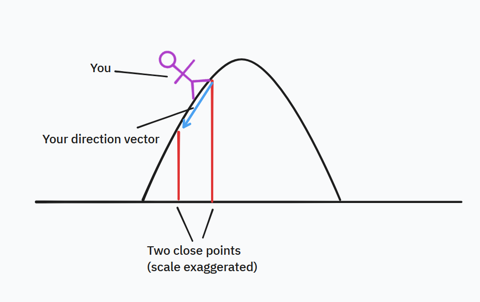
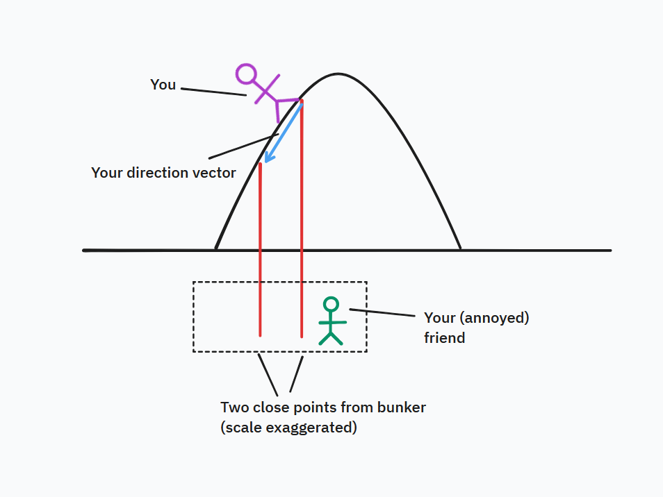
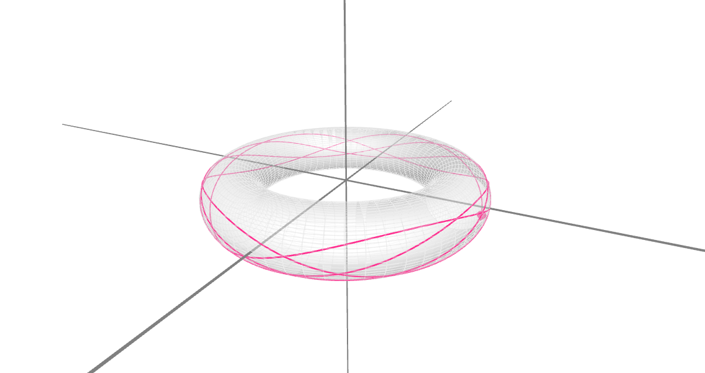
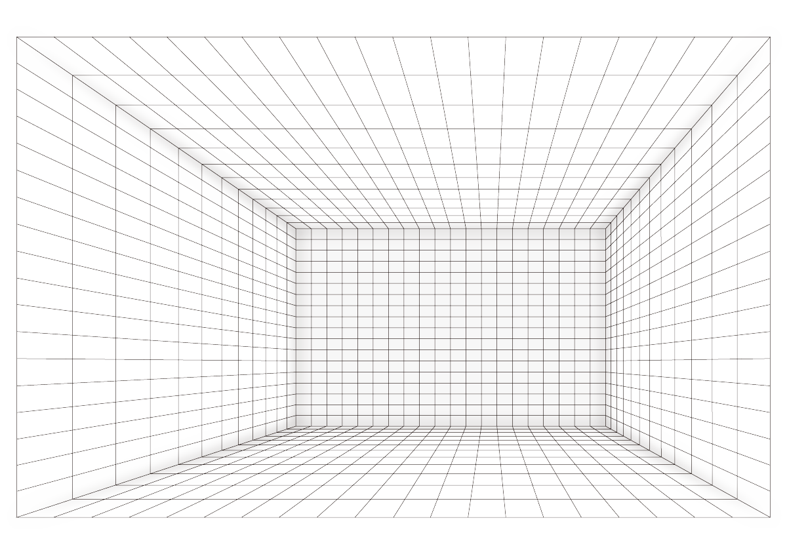

+++
title = "A guide to modern theoretical physics"
date = 2024-09-26
+++

Modern theoretical physics is a vast and technically challenging subject, which is often explained in a very unhelpful manner and with an overwhelming amount of mathematical language that is introduced too quickly. This guide attempts to explain the broad theoretical physics concepts in a clear and relatively less-mathematical/jargon-based way.

<!-- more -->

For more advanced readers or those familiar with graduate-level mathematics and advanced physics, there is something for you too: I have placed in the footnotes section an extended and unabridged version of the theories and mathematics.

_Just a picture of physics, sourced from [Medium](https://medium.com/dr-alice-g-on-education/physics-with-maths-teacher-training-a-bogus-good-idea-7943aa2c23b3)._

## What is $SU(3)$, $SU(2)$, or $U(1)$?

Let's start from what these come from - the fact that physicists like to generalize things. As a basic and somewhat childish example, it is like a toddler seeing a green toy, a blue toy, and a red toy, and exclaiming "wow all of these are toys!" Physicists like to do the same, unifying different theories of physics into very general theories that describe all the results of those different theories in terms of one model. This allows us to package all the diverse phenomena of this Universe into a neat theoretical framework, like a tiny book containing the contents of all the libraries in the world.

_A picture of a Janga tower, sourced from [WIRED magazine](https://www.wired.com/story/a-robot-teaches-itself-to-play-jenga/)._

Our best model of physics right now is kind of like a janga tower, the type in the image above. About 75% of that janga tower is made up of a theory you might've heard of - it's called the **Standard Model**. The rest 25% of that janga tower is made of another famous theory, called **General Relativity**, a.k.a Einstein's theory of gravity. We will talk about the Standard Model first because grasping it is conceptually harder.

The Standard Model comes from reducing all matter and energy into the most basic components there is. It goes deeper than atoms, deeper than even subatomic particles like protons and neutrons, and into the depths of the most basic, fundamental particles we know. Some examples include the more-familiar **electrons**, which we associate with electricity and charge, as well as the less-familiar **quarks**, which combine to form protons and neutrons, and the **photon** which we associate with light.

Taken on their own, all these fundamental particles seem like they have nothing alike. But the Standard Model has an elegant way to show that actually, they fall into one of three categories.

The first category is what physicists write as shorthand as $U(1)$. What does that mean? It describes what we call a **symmetry group**, and I will now present the context. A symmetry is present in a lot of parts of nature and we find it beautiful - the symmetry in the arms of a sea star, the symmetry of a butterfly's wings, the symmetry of leaves that we see so beautifully descend in autumn. Symmetries describe things that **don't change**. If we took a leaf and rotated it by 360 degrees, it looks the same. "But that's obvious!", I can imagine you saying. Yes, but we can generalize it to a lot of things that _aren't_ so obvious.

In the late 19th-century, after decades of both experiments and theoretical work, scientists thought they finally had a consistent theory to describe both electricity (e.g. wires, lightbulbs, generators) and magnetism (e.g. compasses, electromagnets, the Earth's magnetic field) which described the two together as one combined thing called **electromagnetism**. They had found that electricity and magnetism obeyed a set of consistent mathematical laws, which you can solve to predict what things subject to electricity or magnetism do (including if you accidentally get a bit of a shock touching a metal door handle). The mathematical laws were actually a set of **vector equations**. There is a specifically interesting thing about vectors. To do that, imagine that you were walking down a hill. Then your direction vector would just be pointing down that hill. But how to actually calculate it? You could take two really really close points (I drew it with exaggerated spacing) and find the vector that points between them, like this:

But suppose you were in a silly mood that day and decided that you were going to make a friend measure the same two points from an underground bunker (highly not recommended). Your friend will give you different height measurements, but you'd get the same direction vector to finish:

This is a property of vectors in general. We can describe vectors as something that points betwen two (close) points we measure from some place[^1]. _Where_ we measure from doesn't actually matter, because the **end result** - the vector we get after calculating - is **the same**. In physics language we call that an **invariant**, which is a fancy name for just something that does not change. Now, back to electricity and magnetism - remember we said the laws that describe them are **vector equations**. This means that if we solve for them, no matter what starting points we measure from, **we still get the same vector**. Extended to the Standard Model, we say that electromagnetism (the general term for both electricity and magnetism) has two properties derived from using vector equations:

- It is **invariant** (unchanging) under a **coordinate transform** (change of choice of points)
- It is also **invariant** on **adding or subtracting a constant** (like asking your friend to measure from underground instead of on the ground, which is a constant shift down a certain height)

Since the theory of electromagnetism has these **invariant** properties, we say that it possesses **symmetry**. It might be a bit far-fetched to think of a physics model as having symmetry. But symmetry just means that the theory **doesn't change** if you apply **these two transformations**, that of coordinate transforms (changing where you measure from) and constant addition/subtraction (getting the same vector from points shifted a fixed amount). In a way this is just like how a symmetric leaf looks the same if you rotate it 360 degrees. The technical word for this is a special type of symmetry known as **gauge symmetry**[^2], which is an archaic name derived from railway gauges which physicists continue to use despite acknowledging its confusing nature. Theories that have gauge symmetry are called **gauge theories**. It just means that the theories of the Standard Model (including electromagnetism) don't change upon constant addition/subtraction or by changing your coordinates. Read the past few paragraphs over and the bullet points above carefully to really absorb what this means. I repeat this: the theory of **electromagnetism**, one of the parts of the Standard Model of modern physics, has **gauge symmetry**, a specific type of symmetry, because it has **invariant properties** that don't change.

But physicists want to generalize and condense into elegant neat forms, remember, so physicists have found yet _another_ way to describe symmetry that is even more abstract. This way is called **symmetry groups**. Symmetry groups kind of mean exactly what they're called: **groups of transformations** that keep things invariant and thus result in a symmetry. We've already met one of those groups: the **combination of coordinate transformations and constant shifts**, which is what results in a gauge symmetry for the theory of electromagnetism. But we can do one better than that. We can say that no matter *how much* we apply these transformations, so long as we only do transformations in the group[^4], we're going to **keep everything invariant and thus symmetric**. What's another thing that we can transform an arbitrary amount by a specific set of transformations and keep it all the same? A circle! We can rotate the circle however much we want and no one could possibly tell because a rotated circle is a circle that looks _exactly_ the same. No matter if you rotate it 1 degree or 360 degrees or 1,567,829,452,673 degrees, _it will still look like the exact same circle_. So we can say that the transformation group (the combination of the transformations we talked about) can be represented by essentially _anything that transforms like a circle_. In mathematical language, this is the transformation group called $U(1)$ (which is just a mathematical notation for the group). 

But this is not all. A group only allows a certain physical theory to be possible, and determines the theory's mathematical structure. Tell a (diligent PhD level physicist) "I spy, with my little eye, a physics theory of the $U(1)$ group" (that is, a theory that obeys all the transformations in the $U(1)$ group of transformations) and with some effort, they will be able to actually derive the whole theory of electromagnetism from scratch. And while doing it, they will realize that $U(1)$ group results in something else that is conserved (unchanging) - something associated with electromagnetism that can be transferred but never be created or destroyed. This is called **electric charge**[^3] and you are certainly familiar with it if you ever used a battery and saw that it had a positive and a negative end. Negative charges (electrons) are deposited on the negative end and (roughly speaking) flow through whatever connects the negative end to the positive end (which is usually a wire). This is a beautiful consequence of the fact that the theory is described by the $U(1)$ group.

This is the ultimate end goal of the physicist's insatiable need for mathematical elegance and neatness - instead of writing complicated equations, writing $U(1)$ is all that is necessary to understand the theoretical model and the mathematics that underlie it (with sufficient physics education, of course). That is why symmetry groups are the way we write down modern physics theories.

In a similar fashion, we have the $SU(3)$ group and $SU(2)$ group - they are associated with theories that describe how nuclear dynamics happen deep inside an atom. $SU(3)$ is the group associated with the theory of the **strong nuclear force** and $SU(2)$ is associated with the theory of the **weak nuclear force** which are just different aspects of nuclear mechanics[^6].  However, since they have different groups, they have different types of transformation that keep the theory invariant. Remember that $U(1)$ led to the conservation of *electric charge*. In $SU(3)$ and $SU(2)$, instead of one type of charge, there are several types of charge. The strong nuclear force with group $SU(3)$ has what we call _flavor charge_; the weak nuclear force with group $SU(2)$ has something called _hypercharge_ (which is related to another invariant quantity called _isospin_ that was mentioned in class). Just like electric charge, both of these stay invariant and cannot be created or destroyed. Combining the theories respectively of electromagnetism and the strong and weak nuclear force results in a theory that combines the groups of $U(1)$, $SU(2)$, and $SU(3)$. This theory is what we commonly know as the **Standard Model**, and this is why the Standard Model is often written out as simply the theory of the group $SU(3) \times SU(2) \times U(1)$.

## What is General Relativity?

General Relativity is because one smart person had a few good ideas, spent close to two decades thinking about them, and then wrote down one (okay, several) equations that changed the world. You've heard of that person - it's Albert Einstein!

Okay, but is it _really_ about? General relativity is the idea that gravity doesn't _really_ exist. That might sound preposterous, gravity obviously exists for the Earth to orbit the Sun, and for the Moon to orbit the Earth! However, Einstein showed how we can prove, in a beautifully elegant way called a _thought experiment_, that gravity actually doesn't _really_ exist. And this is a way that involves no math at all.

Imagine you were travelling up in an elevator going up an infinitely high shaft in outer space. You happen to have a ball with you - as it drops, it falls in an arc because the elevator is going up with constant acceleration. It is as if there was *something* pulling that ball down, but you know that really, there _isn't_ something. The ball is just following its ordinary path - if you just let go from rest (very carefully so as not to disturb the ball), the ball has nothing to make it move and would actually just stay stationary. But the elevator is accelerating upwards, so *that's* why you see it falling.

The key question Einstein asked was this: how could you possibly know that you weren't just on an elevator stationary on the surface of the Earth, and that your observation of the falling ball is actually from the gravity of the Earth? This is not a trick question: physicists have proven over and over by countless experiments that _there is no way you can tell_. Whether you were on an accelerating elevator in space or one on Earth, the ball will fall in _exactly_ the same way. This is called the **equivalence principle**. When we use the terms _inertial_ and _gravitational mass_, this is just another way of saying that a mass (which he writes as $I_M$) undergoing an acceleration (like the ball in the traveling elevator) behaves _exactly like_ an identical mass (which he writes as $M_G$) pulled downwards by gravity.

Einstein realized that actually, everything under the influence of gravity, which is everything in the Universe, is actually moving on an ordinary path - stationary if nothing makes them move, and forward at constant speed if they are already moving and nothing makes them stop or go faster. This path is a straight line, which is the shortest path between two points. But what happens if the shortest path between two points is _not_ a straight line? An example from everyday life you'd notice is that long-distance international flights, such as those from Asia to North America, _aren't_ actually straight lines. Rather, they are what are called _great circles_, which are the actual shortest paths between the plane's departure and destination airports because of the fact that the Earth is *curved*. Of course, airplanes that flew such far distances didn't exist until late in Einstein's lifetime, but airplanes aren't the only way to discover this principle. If you draw a straight line on a piece of flat paper, then fold the paper into a non-flat curved shape, you'd notice that the line you drew isn't flat anymore. In fact, this is true for _any_ shortest line on a curved surface. A nice interactive version can be found [here](https://timhutton.github.io/GravityIsNotAForce/constant_gravity_4d.html) and here is another excellent visualization:

_A visualization of shortest paths becoming curved on a simple curved space (a torus, the mathematical shape of a donut), all credit to [Road to Reality](https://sritchie.github.io/clojure-conj-2023/notebooks/conj/toroid.html)_

Einstein postulated that all things that seemed to be attracted by gravity were actually just following the shortest path through a curved geometry. But what could possibly be the curved surface, if we don't see it or experience it directly? Einstein thought of a way to formulate this mathematically, as a four-dimensional geometry called **spacetime**, with three dimensions of space and one of time, hence the name. Why do we include time as a dimension? Because we can speak equally of distances in time as well as space, even in the everyday world (see [this clever video explainer here](https://youtu.be/Wp20Sc8qPeo) by the YouTube channel MinutePhysics), so we treat it as a dimension on equal footing with the three dimensions of space. Objects move through spacetime in straight lines, except where spacetime is curved, in which the shortest paths become curved as well. We call these paths **geodesics** and they are the general shortest paths no matter what geometry we speak of, a sheet of paper, the Earth's surface, or of spacetime in general. Further, Einstein theorized that the _cause_ of this curvature was the matter and energy within spacetime. He wrote down a series of equations whose left-hand side was a mathematical expression for the curvature and whose right-hand side was a mathematical expression for the matter and energy. By using known physics, he was able to show that this equation completely explained gravity in terms of curvature, without needing it to be a force as Newton believed and how all physics before Einstein described it as. What's the name of the equation? It's called the Einstein Field Equation (EFE), one of the most beautiful equations of physics, so small you could write it on a post-it note, but one that describes exactly how gravity works in terms of the geometry of spacetime. When used with the equation that governs geodesics, unsurprisingly called the **geodesic equation**, the trajectories of any particle within spacetime can be predicted. The mathematical models used for general relativity are from the field of **differential geometry**, which defines concepts such as curvature and geodesics using a combination of geometry and calculus.

Visualizing GR using the method of hyperspace foliations as little 3D surfaces that you show different slices at different points in time to visualize relativity. e.g. schwarzschild geometry would be a bunch of coordinate grids on spheres that I'll plot next to each other for each hypersurface foliation in time. Oh definitely tell evan about it his research has given me so many good ideas.

But this all sounds very theoretical: where do you need to use General Relativity in practical matters? One big application is GPS satellites, something anyone who drives absolutely knows the importance of. GPS satellites use highly, highly precise synchronized clocks to measure the tiny deviations of microwaves sent by your GPS to the different GPS satellites. The difference in travel times for those microwaves to reach each satellite determines your position. Another big application is in determining the orbits of planets in our solar system. Knowing where planets were in the past and where they will be in the future allows us to better understand the past and future of the solar system. The calculations of general relativity are crucial in this respect because they differ from Newtonian gravity. It is a tiny amount - 43 arcseconds per century (an arcsecond is 1/3600th of a degree) - but it builds up over timescales of millions, if not billions, of years. For scientists investigating the origins and formation of our solar system, and of its future evolution over cosmic timescales, this information is crucial and can tell us the answer to big questions, like why Earth is the only planet we know of that can support life. So general relativity is both a very interesting theory in general, and something that finds applications even for things that you might not expect needing heavy theoretical physics for.

## What is special relativity?

Special relativity (SR) is a special case of General Relativity (GR) that applies in relatively empty space where there is not much or no gravitating mass (or energy). This is not how it is usually taught - students are usually introduced to SR first and GR second, so as to avoid an exam failure rate of 99% and student brain meltdowns - but General Relativity is the more complete theory and special relativity is only part of it.

The specific features of special relativity come from the fact that spacetime takes a particular form in empty space. Spacetime is still a 4D geometric structure that has a dimension of time and three of space, and is different from Euclidean 3D geometry, but in empty space spacetime is flat, not curved. This specific form of spacetime is usually called **Minkowski spacetime** after a professor who Einstein hated (long story). Geodesics are straight lines through Minkowski spacetime, but spacetime has a hyperbolic (non-parallel) grid rather than square grid as in Euclidean geometry.

_A showcase of the (hyperbolic) spacetime geometry of Minkowski space. Sourced from [Wikipedia](https://commons.wikimedia.org/wiki/File:Hyperbolic_coordinates.svg) and all credit to the original author. We usually take the horizontal (left-to-right) axis to represent position $x$, and the vertical (bottom-to-top) axis to represent time $t$._

Spacetime is a hyperbolic geometry in Minkowski spacetime even if it is not curved - which is a easy source of confusion given that the Minkowski geometry _looks like_ it's curved but objects actually follow straight lines through it and the only difference is that straight lines that started parallel will eventually diverge from each other and end up no longer parallel. This gives rise to properties such as _time dilation_, where an object moving will experience time more slowly than a stationary object. You can show this by just drawing two straight lines that represent particle trajectories on a Minkowski grid, one that is vertical to show that particle 1 is at rest, and one that is diagonal to show particle 2 is moving at constant speed. The grid spacings in time will not be equivalent. There is also _length contraction_ where an object moving will be shorter than an object that is stationary - an excellent way to squeeze through a narrow door if you could instantly accelerate and decelerate to 99.99% of the speed of light. Which is an important thing to note: while special relativity applies universally, its effects are only apparent when moving very very fast, speeds only slightly slower than light itself, which is the fastest thing there is.

## What are Lagrangian and Hamiltonian mechanics?

We've come to the last big content part of the guide. We've discussed the Janga tower of modern physics - 75% made up by the Standard Model, 25% made up by General Relativity. I deliberately called it a Janga tower - this is because the Standard Model and General Relativity very much _do not_ work well with each other, and trying to apply both at the same time will make the Janga tower of modern physics fall. When doing physics, we usually either use one or the other and don't even try to use both at once.

That doesn't mean, however, that they don't share many commonalities. One of those commonalities is in _how_ they are constructed and formulated. More specifically, the fun damental framework of both General Relativity and the Standard Model is the use of Lagrangian and Hamiltonian mechanics.

We start from the fact that physics is dynamic because of energy. Transferring energy, giving something more energy, and taking energy away from something else is essentially what makes physics *happen*, so to speak. Otherwise everything will be unchanging and static. 

Now, in the 18th-century, physicists recognized a curious pattern: physical objects travel along a path that requires the **least** amount of energy to get somewhere. Previously, the motions of objects was governed by Newtonian mechanics, which uses the concept of forces, but this observation allowed motion to be described in a different and much more elegant way. The problem of minimizing the amount of energy over the time an object takes to reach a location could be expressed as finding the minimal points[^7] of the **action** (the continuous sum of a function of energy over time). This is fundamentally a calculus problem[^8] that we won't go into, especially in the realm of relativistic physics[^9]. The solutions, however, are given in general form by using the [Euler-Lagrange equation](https://en.wikipedia.org/wiki/Euler%E2%80%93Lagrange_equation), which just require you to input a Lagrangian to solve the dynamics of a system. Some physicists will consider it as *the* most fundamental equation in physics.

The starting point of the Lagrangian in the most basic situation is that we consider two types of energy: **kinetic energy**, representing the energy carried by moving particles, and **potential energy**, representing the energy stored in various forms that can be released for a particle to move. Combining the two creates a **Lagrangian** that we often use the symbol $\mathscr{L}$ (cursive-style script $L$) for. In the simplest case we can show[^10] that the proper way to combine them to make sure we get the same results as Newton's second law is to simply subtract the potential energy from the kinetic energy, that is, $\mathscr{L} = K - U$. In more complicated situations, the Lagrangian involves more terms but still packages the key information about a particle's (or group of particles') energy[^11] within a single instant of time at a single position in space. The Euler-Lagrange equations still apply, which makes it convenient to define a theory in terms of a specific Lagrangian. In fact, both the Standard Model and General Relativity are defined in terms of their Lagrangians. While one represents a quantum Lagrangian and the other represents a (differential) geometric Lagrangian, they are both Lagrangians and the Euler-Lagrange equations work for both of them, which makes it so that the physics can be expressed in a convenient and compact way.

Finally, I should mention **Hamiltonian mechanics**. Hamiltonian mechanics is, at its core, just a rearrangement of Lagrangian mechanics such that in the most basic case, the Hamiltonian (symbol $\mathcal{H}$) is equal to $K + U$ (sum of potential and kinetic energy) instead of $K - U$. What makes it useful in some cases over Lagrangian mechanics is that it is **directly associated** with energy. The Hamiltonian tells you *exactly* how much total energy is in a system, whereas the Lagrangian is a _function_ of energy at an specific instant and a specific location. Hamiltonian mechanics becomes extremely useful in quantum physics, where it maps clearly to the quantum description of energy. Almost everything in the Hamiltonian stays exactly the same, with a few minor changes, which means that the classical Hamiltonian easily beomes the quantum Hamiltonian and still can be used to find the total energy. The Hamiltonian approaches and Lagrangian approaches work well together, and so modern physics uses both of them very heavily.

## Why learn all this?

The reason is that modern theoretical physics, although quite possibly far outside of our ordinary experience, is where all the rest of physics comes from. Projectile motion that you might've studied in high school physics? That's from gravitation, which we know from general relativity is really simply the consequence of the curving of spacetime from the matter within it. The fact that (if you drink it) your coffee comes out nice and hot? That comes from the conservation of energy, the fact that you're using electrical energy and converting it to heat, which is just our way of talking about the energy of many moving atoms. The conservation of energy itself results from a symmetry that comes from the fact that the Hamiltonian (both classical and more fundamental quantum versions of it) stays the same through time. Delicious pizza is formed from the heat treatment and arrangement of protein structures in each of its ingredients, molecules formed by chaining smaller molecules with peptide bonds between nitrogen and oxygen atoms. These bonds that are formed by atoms sharing electrons, which are fundamentally described by electromagnetic theory, the theory of the $U(1)$ group. We track ancient history by measuring trace amounts of carbon-14, which decays at a consistent rate due to the weak nuclear force. The fact that fridge magnets work at all is due to _ferromagnetism_ which is a fundamentally quantum property derived from the quantum theory of electromagnetism as well. Our world of moving objects and constantly-evolving energy is described by the Euler-Lagrange equations, from the quantum scale all the way to the cosmological scale. So it makes sense that this is something worth learning. The fundamental physics of the universe, which is what we explore in the most modern and advanced theories of physics, are truly the foundation on which all of physics and much of engineering are built upon. They are the reason why we have such things as the conservation of charge, energy, and momentum, the equivalence of coordinate systems and the propagation of local effects away from a source, without which we wouldn't be able to do any physics at all.

## More stuff on quantum field theory and differential geometry

You may hear various terms from differential geometry in advanced physics, such as connection coefficients, parallel transport, tangent vectors etc. These are all different quantities that are some form of geometric measurement. The **connection coefficients** represent the deviation of a normal straight-line path to a geodesic on a curved surface. **Tangent vectors** are the travel direction of a particle moving along geodesics. Parallel transport means that we take a vector normal (perpendicular to) the tangent vectors and shift it following different axes along some sort of curved geometrical shape in a way that keeps the vectors parallel. This is analogous to drawing a square by drawing separate lines along the page and keeping your pencil pointed in the same direction. Curvature means that parallel transport will not in general draw out the shape of a square. That is only possible in flat spacetime.

Spacetime is our name for a *specific 4D geometric structure* (the technical term is _pseudo-Riemannian manifold_) that we use to model space and time in the universe. You can visualize Euclidean geometry, which is 3D, as an infinite grid that stretches out in all directions where the gridlines form perfect right angles and all the grid spaces look like big cubes:

_Euclidean (3D) space, our geometric structure for classical physics. Image sourced from [pngtree](https://pngtree.com/freepng/room-grid-black-line-perspective_6957320.html)_

Spacetime geometry, however, has non-constant gridlines, non-constant grid spacings, and is curved as well as being 4-dimensional and unifying space and time. That is why we speak of geodesics, which are the shortest paths considering the curvature of spacetime. All objects in the universe follow geodesics, but it is most obvious around very strong gravity such as near a black hole. In such cases, the full effects of General Relativity is present, including highly-curved geodesics.

Finally, we can extend spacetime to quantum mechanics. Quantum mechanics fundamentally says that all particles, but especially particles on small enough scales, can only be studied through probabilities. A particle may have a 99% probability of being at a particular position, or 1% probability of having a specific amount of energy, but those probabilities are all we know about a particle. This is unless we measure the particle, fixing its properties but irreversibly disturbing its state and erasing all information about its previous state. Without measurement, we can only calculate probabilities, but the mathematics of quantum mechanics allows us to calculate these probabilities for single to extremely high precision. However, once we have more than one particle and add in the non-Euclidean geometry of special relativity (Minkowski spacetime), things get very complicated. So instead of single particles, we think of each individual particle as placed within a **field**, an invisible medium that extends across all spacetime. The fields spreads each particle's influence to other particles, allowing multi-particle interactions to occur. A quantum treatment of a field is called a **quantum field theory** and is able to make probability predictions for the properties of essentially any number of particles.

For those wanting a more in-depth treatment of these topics, you would want to learn the right mathematics for each. For general relativity it is highly recommended to look into tensor calculus, which deals with differential geometry and is the mathematical basis of general relativity, as well as ordinary and partial differential equations (ODEs & PDEs), as well as Lagrangian mechanics in general as the formalism of classical physics. For quantum field theory, introductory quantum mechanics and the Heisenberg picture of quantum mechanics specifically, as well as basic complex analysis and functional analysis is essential, such an understanding of Hilbert spaces, the theory of linear operators and of eigenvectors and eigenvalues, and Fourier transforms. Abstract algebra including Lie groups and group theory in general are necessary for advanced study and are very powerful. There is much to learn - but it is worth it!

## Appendix

There is more that can be covered. Theoretical physicists can seem like magicians when they create theories that decipher the complex but beautiful workings of our Universe from simply mathematical manipulations, universal principles, and sets of fundamental postulates[^5]. Going into how to do all of that is a wonderful learning experience but also guaranteed to take years of study to truly get it. For our psych modeling course, we just need to have the general idea of the landscape of modern physics. And I hope this has offered that to you.

## Useful readings to learn more

- (What I think is the best and coolest resource ever) [the scienceclic english youtube channel](https://www.youtube.com/@ScienceClicEN) which explains all of this super well while not oversimplifying anything, and I personally consulted it to make sure things in this guide were accurate
- For people who are super passionate about this sort of stuff and want much more intensive (though still absolutely amazingly explained) content, see [Richard Behiel's youtube channel](https://www.youtube.com/@RichBehiel)
- The [Feynmann Lectures on Physics](https://www.feynmanlectures.caltech.edu/) (free!)
- Sean Caroll's No Nonsense General Relativity [here](https://preposterousuniverse.com/wp-content/uploads/grtinypdf.pdf)
- The pages on [General Relativity](https://brilliant.org/wiki/general-relativity-overview/), the [Standard Model](https://brilliant.org/wiki/standard-model/), [String Theory](https://brilliant.org/wiki/string-theory/), [Quantum Mechanics](https://brilliant.org/wiki/quantum-mechanics/),   [Gravitation](https://brilliant.org/wiki/gravitation/) on Brilliant wiki (you may have seen a lot of ads for [Brilliant](https://brilliant.org/) on youtube, personally I'm not sold on their educational platform but I think their wiki with lots of articles and is relatively more gentle-paced is super good for self-learning and study)
- The [MinutePhysics](https://www.youtube.com/user/minutephysics) youtube channel which explains physics using cute animations and is just enjoyable to watch in general even if you're not into advanced physics

## The appendix for advanced readers

This is for whoever is just curious and wants to learn more, as well as those that want a deep dive into the material and the nuances that were not explained in the guide.

[^1]: Technically we consider the infinitesimal version of this difference, i.e a scalar-valued function that forms the potential field such that the vector field is its derivative, which in one dimension and multiple dimensions respectively is given by:

$$
U(x)\quad \small{\text{where}\quad \mathbf{v} = (-)\frac{dU}{dx} \hat x}, \quad
$$

[^2]: This in gauge symmetry is technically the addition of a term that is constant upon addition of a function that vanishes under the partial derivatives, resulting in the invariance of the vector potential associated with a field to the follwing transformations:

$$
\small \mathbf{A} \to \mathbf{A} + \nabla f, \quad \phi = \phi - \frac{\partial f}{\partial t}
$$

[^3]: This involves recognizing that the theory posseses a Noether current that leads to a continuity equation that has all the properties of charge and therefore demands the conservation of charge, just as the Schrödinger equation can be proven to have a probability interpretation by finding its conserved Noether current that results in a similar continuity equation.

[^4]: Gauge symmetries are not necessarily why the electromagnetic theory is governed by the U(1) symmetry group. Gauge symmetry comes from the fact that taking combinations of partial derivatives of the electromagnetic four-potential which is analogous to a "hill" allows one to define the electric and magnetic field. The electromagnetic four-potential can have a gauge term added without affecting its associated Lagrangian, thus we say it has gauge symmetry, but this does not necessarily lead to the U(1) group. The more technical reason is that the Lagrangian of electromagnetism in quantum electrodynamics couples the Faraday tensor in classical electromagnetism to the Dirac Lagrangian for the electron field. Since the Dirac Lagrangian is composed of complex-valued (bi)spinors, it is invariant under rotations in the complex plane by definition, completely analogous to the rotations of a circle, and thus both can be described by the U(1) symmetry group.

[^5]: Okay, so not entirely out of thin air. Rather physicists write down a general Lagrangian _ansatz_ using whatever fields they are considering, add and modify such a Lagrangian based on desired physical properties and couplings. Then the equations of motion can be found by extremizing the action, and promoting those equations into quantum operators by the process of quantization (which can take several different forms) results in the most complete quantum description of the theory. Of course, the classical limit of such a quantum field theory becomes a classical field theory, and the Newtonian limit of the classical field theory becomes the familiar equations of Newtonian mechanics.

[^6]: The word "force" has to be specified carefully in this context. The strong and weak interactions are not forces in the colloquial or Newtonian sense of the word. They more accurately refer to the fact that particles can interact with each other in various ways, which you can consider as a subatomic analogy to our common idea of forces. However, no "force" is present and the concept of forces does not exist at the fundamental level. All particle interactions are mediated by their respective fields and mathematically described by the respective Feynman diagrams (and thus Feynman integrals), other than General Relativity which also uses the concept of fields, but describes particle interactions through the Einstein field equations and the geodesic equation.

[^7]: Technically, these points do not need to be minimal points. They can just as well be saddle points or maximum points, because from a calculus point of view these are all equivalent in obtaining a _stationary_ point that minimizes the energy.

[^8]: The technical formulation is found through the calculus of variations. The quantity of energy summed over every point in time is defined as the **action** which is the integral of the Lagrangian. Taking an infinitesimal variation of the action and demanding it stay the same is the criteria of finding a stationary point of the Lagrangian, which leads to the Euler-Lagrange equations, the partial differential equation that governs the motion of classical objects. The mathematical formulations of the former and latter are given by:

$$
\small \delta \int \, \mathscr{L}(x^i, \dot x^i, t)\,dt = 0 \Rightarrow \frac{\partial \mathscr{L}}{\partial x^i} - \frac{d}{dt} \left(\frac{\partial \mathscr{L}}{\partial \dot x^i}\right) = 0
$$

[^9]: In more generalized spacetime coordinates, the Euler-Lagrange equation unifies the space and time components, such that the above equations become:

$$
\small \delta \int d^4 x\, \mathscr{L}(x^\mu, \partial_0 x^\mu) = 0 \Rightarrow 
\frac{\partial \mathscr{L}}{\partial x^\mu} - \frac{d}{dx^0} \left(\frac{\partial \mathscr{L}}{\partial (\partial_0\,x^\mu)}\right)= 0
$$

[^10]: This Lagrangian is given by L = K - U and plugging in the classical definitions of kinetic energy and potential energy into the Lagrangian, and then using the Euler-Lagrange equations, we reproduce Newton's second law, that is:

$$
\small m \frac{d^2 x}{dt^2} = -\frac{dU}{dx}
$$

[^11]: For many-body systems we usually consider it from the perspective of a field theory, where each particle contributes to a field that propagates the particle's interactions to those of other particles in the field. The field Lagrangian would then have a structure somewhat similar to the classical Lagrangian, with a kinetic term, potential term, coupling terms, and nonlinear terms to describe more complex dynamics for theories that involve them. For instance, the simplest classical field theory, that of a scalar field with a constant coupling can be written with the following Lagrangian (using natural units where c = 1):

$$
\small \mathscr{L} = \frac{1}{2} \left(\frac{\partial \phi}{\partial t}\right)^2 - \frac{1}{2} (\nabla \phi)^2 - \frac{1}{2} m^2 \phi^2 - V(\phi) = 0
$$