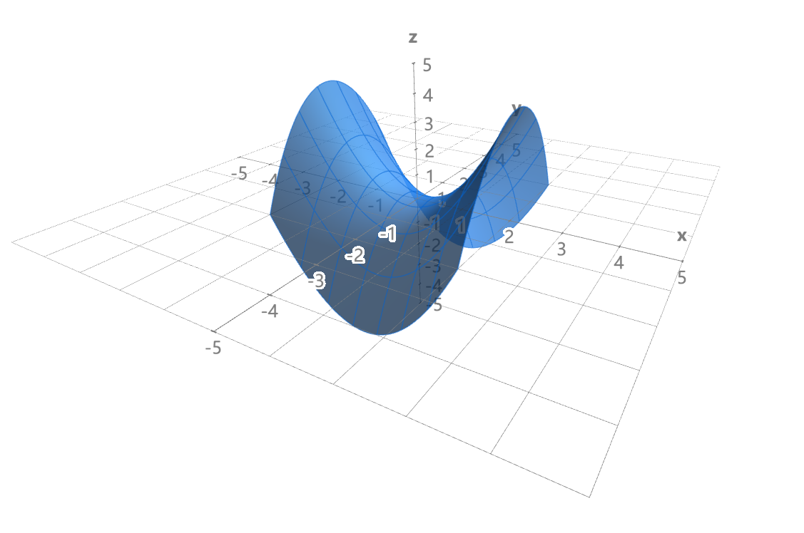

+++
title = "Introduction to multivariable calculus"
date = 2024-02-12
draft = false
+++

This is a guide to multivariable calculus from its fundamentals. We will cover differentiation of multivariable functions, the gradient, divergence, and curl operators, as well as integration in multiple dimensions. It is highly recommended to look over this guide before (or at the same time as) learning any advanced topics in math and physics.

These notes are shared with the permission of [Dr. Elizabeth Brown](https://faculty.rpi.edu/elisabeth-brown) of Rensselaer Polytechnic Institute., to whom much is appreciated.

<!-- more -->

## Multivariable functions

A multivariable function is a function of two or more variables. For instance, $f(x, y)$ is a function of two variables and $g(x, y, z)$ is a function of three variables, so both can be considered multivariable function. Meanwhile, $h(x)$ is a function of just one variable, and therefore is not a multivariable function.

The set of $(x_1, x_2, \dots, x_n)$ on which a function of $n$ variables $f(x_1, x_2, \dots, x_n)$ is defined is its **domain**, which are the valid *inputs* to the function. The set of points that can be obtained by evaluating the function is its **range**, which are valid *outputs* to the function.

As an example, consider the function $f(x, y) = \sqrt{4 - x^2 - y^2}$, which can be rewritten $f(x, y) = \sqrt{4 - (x^2 + y^2)}$. Such a function is not defined for $(x^2 + y^2) > 4$ which can also be written $r^2 > 4$. Therefore its domain $\mathcal{D}$ is $(x, y) \in \mathbb{R}^2:\, x^2 + y^2 \leq 4$. Visually speaking, this is all points in the XY plane inside or on a circle of radius $2$ because $r^2 = 4 \to r = 2$. Meanwhile, due to its restricted domain, $f(x, y)$ can only output values between 2 (for $r^2 = 0$) and 0 (for $r^2 = 4$). Therefore the range $\mathcal{R}$ is $0 \leq f(x, y) \leq 2$.

We may plot a function of two variables $f(x, y)$ in 3D space, such that $z = f(x, y)$. From doing so, we create a surface. This is usually done by computer, and is shown below:

_Created with [Math3D](https://www.math3d.org/)_

Instead a surface plot, we may alternatively make various 2D representations of functions of 2 variables. To do so, we first find the **horizontal traces** (also called _isolines_), which are all curves in which $f(x, y) = C$ where $C$ is a constant. This results in an implicit equation that can be solved to result in the equation of a curve in one variable. Doing this for equally spaced $C$ results in a contour map, as shown:

We can also plot values of $f(x, y)$ for values of constant $x$ or constant $y$ to find **vertical traces**, curves of constant value in one plane. So as a summary:

- **Horizontal traces** are curves of constant height, found by solving for $f(x, y) = C$ where $C$ is a specified constant
- **Vertical traces** are curves of constant $x$ or $y$, found by solving $z = f(C, y)$ or $z = f(x, C)$
- **Level curves** result from finding multiple horizontal traces for equally-spaced $C$
- **Contour maps** (occasionally called _isoline plots_) are the result of level curves drawn on the XY plane

What about for function of more than two variables? With few exceptions, functions of three variables cannot be directly plotted in 3D space because they would require 4D space to plot. However, we can plot _level surfaces_ (also called isosurfaces), which are partially-transparent surfaces of constant value just like level curves, like these:

Functions of more than three variables cannot be plotted at all through conventional means, but specialized data visualization methods can be used to visualize them. However, even if visualization is not possible, the methods of calculus can still be used to analyze them.

## Partial derivatives

Partial derivatives are the equivalent of ordinary derivatives, but for **multivariable functions**. They are found by treating all variables not differentiated with respect to as **constant**. Formally, they are defined using limits just as ordinary derivatives are, and notated with script $\partial$ rather than the normal $d$. For a function $f(x, y)$, the respective definitions of the partial derivatives with respect to $x$ and of $y$ are:


\begin{align*}
\frac{\partial f}{\partial x} = \frac{f(x + h, y) - f(x, y)}{h} \\
\frac{\partial f}{\partial y} = \frac{f(x, y+h) - f(x, y)}{h}
\end{align*}


The geometric interpretation is that $\dfrac{\partial f}{\partial x}$ is the derivative with respect to $x$ of the trace curve in the XZ plane, and $\dfrac{\partial f}{\partial y}$ is the derrivative with respect to $y$ of the trace curve in the XY plane.