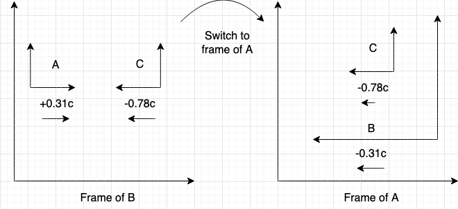

+++
title = "Notes on special relativity"
date = 2023-10-06
+++

These are notes taken in RPI's Physics 1140 class, relating to special relativity.

<!-- more -->

## The standard model

The standard model is one of the most successful theories in physics. Within the standard model, there are several categories of particles. The standard model describes a number of elementary particles - point particles that have no volume and are indivisible. The elementary particles include:

- Fermions (spin-1/2 particles, which include 6 quarks, 6 leptons, and their antiparticles)
- Gauge bosons (these are force carriers with integer spin, which are the photon, gluon, W, and Z)
- Scalar bosons (the Higgs boson)

Quarks are the building blocks of hadrons, such as protons and neutrons. They are never found in isolation, and always found within hadrons. They have half-integer spin, but unlike leptons, they interact with the strong force as well as the weak force.

Leptons are composed of electrons, muons, and tauons, as well as their respective neutrinos. They also have half-integer spin, but do not interact with the strong force.

Gauge bosons are massless with exception of the W and Z bosons. Each carries a fundamental interaction - the photon is the force carrier of electromagnetism, the gluon carries the strong force, and the W & Z bosons carry the weak force.

Composite particles are composed of elementary particles, and include hadrons (mesons and baryons), and everything made of them (such as atoms and molecules). Elementary particles are thought to be point particles that have mass but no volume, whereas composite particles do have a volume.

## Units in physics

Velocity is often measured relative to the speed of light, such as $0.8c$. Charge is often measured with respect to the elementary charge, such as $5e$. Energy is often measured in terms of electron volts (eV), where $1 \text{ eV} = 1.6 \times 10^{-19} \text{ J}$.

## Overview of Special Relativity

A **reference frame** is a specific place you designate as an origin. By constructing a coordinate system from that origin, measurements can be made. An inertial reference frame is a reference frame that isn't accelerating. The laws of special relativity **only** apply to inertial reference frames.

Every observer considers themselves to be at rest with respect to their own reference frame, and everyone else to be moving. For example, an astronaut would consider themselves to not be moving, and the Earth to be moving away from them. Similarly, an observer on Earth would consider themselves to not be moving, and the astronaut in the rocket as moving away from them.

The two postulates of special relativity are that 1) the laws of physics are the same for observers in all inertial reference frames, and that 2) the speed of light is **constant** in all reference frames.

A **proper frame** is a reference frame that is attached to an object, in which an object is measured to be stationary. For instance, the proper frame of a spaceship would be an observer travelling within the spaceship. As the observer travelling within the spaceship is attached to the spaceship (here "attached" is not literal, it can mean "within" or "following along"), it is a proper frame. Everything in a proper frame is considered stationary by the observer.

A **non-proper frame** is any reference frame that is not attached to an object. For instance, an observer on Earth would be in a non-proper frame of a rocket moving relative to Earth, as that observer is not attached to the rocket.

**Proper time** is the time measured by an observer in a proper frame. **Coordinate time** is the time measured by an observer in a non-proper frame. Coordinate time $\Delta t$ is related to proper time $\Delta \tau$ by:

$$
\Delta t = \gamma \Delta \tau
$$

where:

$$
\gamma = \frac{1}{\sqrt{1 - \left(\frac{v}{c}\right)^2}}
$$

Using a Taylor series expansion, $\gamma \approx 1$ at very low speeds, and $\gamma \approx 1 + \frac{v^2}{2c^2}$ at low speeds.

**Proper length** is the length of an object as measured by an observer in a proper frame. **Coordinate length** is the length of an object measured by an observer in a non-proper frame. Proper length $\Delta \ell$ is related to coordinate length $\Delta L$ by:

$$
\Delta L = \frac{\Delta \ell}{\gamma}
$$

## Time dilation and length contraction

Consider an observer to be in the proper frame of a moving spaceship. The observer observes the ship's length as the proper length $\Delta \ell$ and the ship's time as proper time $\Delta \tau$. That observer considers the ship (and everything on it) to be stationary with respect to themselves. Meanwhile, consider a distant observer in a non-proper frame, perhaps situated away on Earth. That distant observer observes the ship's length as the coordinate length $\Delta L$, and the ship's time as the coordinate time $\Delta t$.  We use the familiar equation:

$$
\Delta t = \gamma \Delta \tau
$$

Recall that $\gamma > 1$ for all moving objects. That means for the distant observer who measured a time interval of $\Delta t = 1$ second, the proper time of the observer in the spaceship must be $\Delta \tau < 1$ second. Therefore, the observer in the spaceship's clock ticks slow.

This is the principle of _time dilation_ - **time ticks slow for moving objects**. Recall that any observer would measure every other observer as moving with respect to their own reference frame, however. This means an observer on a rocket would measure a person on Earth as having a slower clock, whereas a person on Earth would _also_ measure the person on the spaceship as having a slower clock!

One area where this has been demonstrated is with muon decay, where muons are measured to be able to travel longer distances than they possibly could given their short lifetimes, as the "internal decay clock" of a muon ticks slow and allows it to travel longer.

## Practicing time dilation problems

Consider an astronaut on a spaceship moving at $0.927c$ who says that the trip between two stationary stars took 7.49 years. How long does this journey take as measured by an observer at rest relative to the two stars? (Credit: Peter Persans, RPI)

To answer this question, we first identify the two observers in the question - the astronaut, who is aboard the spaceship, and the observer who is at rest relative to the two stars. We then identify the object that is considered moving within the problem - in our case, it is the spaceship. Therefore, the proper frame is the frame that is attached to the object, or in other words, the frame of the astronaut. This means the proper time would be the astronaut's measured time, or 7.49 years. After calculating the Lorentz factor for $0.927c$, where $\gamma \approx 2.66$, we can then use:

$$
\Delta t = \gamma \Delta \tau = (2.66)(7.49) = 20.01 \text{\ yrs}
$$

Now, consider an unstable particle moving at a speed of $0.87c$ relative to a laboratory. Its lifetime is measured by a stationary observer in the laboratory to be $4.7 \times 10^{-6}$ seconds. What is the lifetime of the particle, measured by an observer in the frame of the particle? (Credit: Peter Persans, RPI)

Here, we note that the object considered to be moving is the particle. Therefore, the proper time is the time measured by an observer attached to the particle. We, however, do not have measurements from the proper frame. We do have the measurements from the non-proper frame, which is the stationary observer's frame. Measurements of time from the non-proper frame are the coordinate time. Therefore, we can write:

$$
\Delta \tau = \frac{\Delta t}{\gamma} = \frac{4.7 \times 10^{-6}}{2.028} \approx 2.3 \mathrm{\ \mu s}
$$

## Lorentz Transformations

The Lorentz transformations give the relativistically correct transformations between an observer's reference frame (the unprimed coordinates) and another reference frame (the primed coordinates). They are given by:

$$
\Delta t' = \gamma \left(\Delta t - \frac{v\Delta x}{c^2}\right)
$$
$$
\Delta x' = \gamma( \Delta x- v\Delta t)
$$
$$
\Delta y' = \Delta y
$$
$$
\Delta z' = \Delta z
$$

## Practicing the Lorentz transformations

Suppose we have light emitted in the direction of the $y$ axis in one observer's frame. Suppose we have another observer that moves with velocity $\vec v$ along the $x$ axis. We can then use the Lorentz transformations to find the speed of light measured in the other observer's frame.

To start with, let's write the Lorentz transformations:

$$
\Delta x' = \gamma(\Delta x - v \Delta t)
$$
$$
\Delta t' = \gamma \left(\Delta t - \frac{v \Delta x}{c^2}\right)
$$
$$
\Delta y' = \Delta y
$$

Now note that the speed of light measured in the first observer's frame is $c = \sqrt{v_x^2 + v_y^2}$, where:
$$
v_x = \frac{\Delta x}{\Delta t}
$$
$$
v_y = \frac{\Delta y}{\Delta t}
$$
Since the light is moving along the $y$ axis, $\Delta x = 0$, and thus $v_x = 0$, and since $c = \sqrt{0^2 + v_y^2}$, this also means that $v_y = c$. Rearranging the $v_y$ equation, we get $\Delta y = c \Delta t$. So, to summarize:

$$
\Delta x = 0
$$
$$
\Delta y = c \Delta t
$$

Now, we can plug in these values to the Lorentz transformations, which yields:

$$
\Delta x' = -\gamma v \Delta t
$$
$$
\Delta t' = \gamma \Delta t
$$
$$
\Delta y' = c \Delta t
$$

We can then find $v_x'$ and $v_y'$:

$$
v_x' = \frac{\Delta x'}{\Delta t'} = \frac{-\gamma v\Delta t}{\gamma \Delta t} = - v
$$
$$
v_y' = \frac{\Delta y'}{\Delta t'}= \frac{c\Delta t}{\gamma \Delta t} = \frac{c}{\gamma}
$$

Then, the speed is given by $\sqrt{(-v)^2 + \frac{c^2}{\gamma^2}} = c$. Thus we verify that the speed of light is constant in different reference frames. 

## Minkowski spacetime diagrams

In a Minkowski spacetime diagram, we have $ct$ on the vertical axis and $x$ on the horizontal axis. A photon would make a 45 degree angle on a Minkowski diagram.

## Velocity addition

In classical mechanics, velocity addition is simple: $u' = u + v$. That is, if we have a train moving at speed $v$ measured by an observer, and a person running within the train at speed $u$ in the train frame, then the speed of the person with respect to the observer is $u + v$. So, it is perfectly reasonable to say "she's running at 185 km/h" because the runner might be running at 5 km/h with respect to the train frame and the train frame might be moving at 180 km/h with respect to the observer.

In relativity, two velocities $u$ and $v$ add by:

$$
u' = \frac{u + v}{1 + \frac{uv}{c^2}}
$$

Here, note that:

- $u'$ is the object's speed to the observer
- $v$ is the enclosing frame's speed 
- $u$ is the object's speed within the enclosing frame

## Velocity addition exercises

Consider three spaceships A, B, and C that are in motion. The commander on ship B observes ship C approaching with a relative velocity of $-0.78c$. The commander also observes ship A, advancing in the rear, with a relative velocity of $+0.31c$. What is the velocity of ship C, relative to an observer on ship A? (credit: Peter Persans, RPI)

To solve this problem, we must switch frames from spaceship B to spaceship A, as all our velocities are measured with respect to spaceship B. Therefore, spaceship A measures any velocity $u$ measured in B's frame as:

$$
v = \frac{v_B + u}{1 + \frac{u v_B}{c^2}}
$$
where $v_B$ is the velocity of spaceship B with respect to spaceship A. We can sketch this problem as follows:

(here, in the sketch, frames that are moving with respect to another frame are placed inside that other frame)

Now, we know that if spaceship B measures spaceship A as travelling at $0.31c$, then spaceship A must also measure spaceship B as travelling at $-0.31c$. This leads to an important result in terms of the velocities of frames:

$$
v' = -v
$$

Thus, if we set $v_B = -0.31c$ and $u = -0.78c$, we get our desired result - $v = -0.877c$.

## Using spacetime diagrams

To showcase coordinate transforms, we can use a spacetime diagram. To do so, we label the $x$ axis (that is, the line $t = 0$) and the $ct$ axis (that is, the line $x = 0$). The new transformed frames are given by $x' = 0$ (the $t'$ axis) and $t' = 0$ (the $x'$ axis). That is, for the $t'$ axis, we have $x' = 0$, or:

$$
x' = \gamma(x - vt) = 0 \Rightarrow x = vt
$$

Meanwhile, for the $x'$ axis, we have $t' = 0$, or:

$$
t' = \gamma \left(t - \frac{vx}{c^2}\right) = 0 \Rightarrow t = \frac{vx}{c^2}
$$
These new axes are shown below:

(Credit: TikZ)

To figure out the scaling of axes in the Lorentz transformations, we start with the point $(x, ct) = (1, 0)$ and calculate the resulting $(x', ct')$. We find that $(x', ct') = (\gamma, \gamma \beta)$ where $\beta = \frac{v}{c}$. Thus, the scaling factor of axes for the Lorentz transformations is given by:

$$
\sqrt{\frac{1 + \beta^2}{1 - \beta^2}}
$$

## Doppler shift

There are two cases of the Doppler effect - longitudinal, where the emitter and observer are moving towards/away from each other, and transverse, where the emitter and observer are at 90 degrees to each other. The transverse Doppler effect formula is given by:

$$
\frac{1}{f'} = \gamma \frac{1}{f}
$$
Meanwhile, the longitudinal Doppler effect formula is given by:

$$
f' = f \sqrt{\frac{1 - \beta}{1 + \beta}}
$$
## Ordering of events

On a Minkowski spacetime diagram, all events that fall within $\pm 45^\circ$ of the $\pm ct$ axis are known as timelike intervals. This means that if two events are within this region, it is possible for one event to have caused the other event.

Meanwhile, all events that are outside $\pm 45^\circ$ of the $\pm ct$ axis are known as spacelike intervals. This means that if two events are within this region, it is **not** possible for one event to have caused the other event.

Events exactly along the $\pm 45^\circ$ line are known as **lightlike**. This means that only photons can travel between those events.

## The invariant interval

Distances in space and distances in time are dependent on the frame chosen. But a distance in spacetime - a combination of a distance in space and a distance in time - are **invariant**. The invariant interval, also known as the spacetime interval, is given by:

$$
\Delta s^2 = c^2 \Delta t^2 - \Delta x^2
$$

This is the same in every reference frame, just as the speed of light is invariant in every reference frame, so it is called a Lorentz invariant quantity.

The invariant interval gives another way to define the ordering of events:

- When $\Delta s^2$ is positive, then it is timelike
- When $\Delta s^2$ is negative, then it is spacelike
- When $\Delta s^2$ is zero, then it is lightlike
