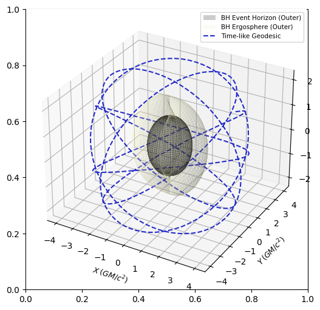

+++
title = "Simulating superradiance reactors, part 1"
date = 2023-04-12
draft = true
+++

We return to the superradiance series, a series of posts focused on creating a preliminary, naive raytracer for simulating superradiance reactors. This time, we will explore geodesics in the Kerr spacetime, and write a Runge-Kutta solver for systems of differential equations.

<!-- more -->

As a brief overview, geodesics are the paths freely-falling particles travel through spacetime. As spacetime around a black hole is heavily curved by the black hole, geodesics are not straight lines around a black hole. To get a good idea of how they would actually look like, take a look at [this simulator](https://alexnieddu.github.io/Kerr-Black-Holes/Web/KerrGeodesicSimulator.html).

To find the equations of motion around a black hole requires the geodesic equations, given below:


\frac{d^2 x^\sigma}{d\tau^2} + \Gamma^\sigma_{\alpha \beta} \frac{dx^\alpha}{d\tau} \frac{dx^\beta}{d\tau} = 0


However, given its second-order derivatives, this form of the geodesic equations is often hard to solve. In practice, an alternate form of the geodesic equations is frequently easier to solve:


\frac{d}{d \tau}\left[g_{\alpha \beta} \frac{d x^\beta}{d \tau}\right]-\frac{1}{2} \partial_\alpha g_{\mu \nu} \frac{d x^\mu}{d \tau} \frac{d x^\nu}{d \tau} = 0


This method yields the equations of motion for Kerr spacetime, which I have taken from [here](https://alexnieddu.github.io/Kerr-Black-Holes/):


\frac{dt}{d\tau}=E+\frac{2 r\left(r^2+a^2\right) E-2 a r L}{\Sigma \Delta}



\frac{dr}{d\tau}=\frac{\Delta}{\Sigma} p_r



\frac{d\theta}{d\tau}=\frac{p_\theta}{\Sigma}



\frac{d\phi}{d\tau}=\frac{2 a r E+(\Sigma-2 r) L / \sin ^2 \theta}{\Sigma \Delta}



\frac{dp_r}{d\tau}=\frac{1}{\Sigma \Delta}(((r^2+a^2) \mu-(Q + L^2 + a^2(E^2 + \mu)))(r-1) + \\
r \Delta \mu+2 r(r^2+a^2) E^2-2 a E L)-\frac{2 p_r^2(r-1)}{\Sigma}



\frac{dp_\theta}{d\tau}=\frac{\sin \theta \cos \theta}{\Sigma}\left(\frac{L^2}{\sin ^4 \theta}-a^2\left(E^2+\mu\right)\right)


Where the constants of motion are $\mu, E, L, Q$, and $\Sigma$ and $\Delta$ are respectively given by:


\Sigma = r^2 + a^2 \cos^2 \theta \\
\Delta = r^2 - 2 M r + a^2


It is straightforward to plot Kerr geodesics by numerically solving the equations of motion:



The goal is to be able to adapt the Kerr geodesics to find the intersection point of a light ray and the surface of the mirror. To do so, we need to create a `kerr_intersection()` function that returns a point $(x, y, z)$ which is the intersection point.

In my implementation, I used the [Trimesh](https://trimsh.org/) library to create a rough function that gives whether a point is on the surface of the mirror. While Trimesh does not explicitly have a function that detects if a point is a surface point, it does have a function to detect if a point is inside or outside the geometry. So it makes sense that if a point is on the surface, the point $[x - \Delta, y - \Delta, z - \Delta]$ would be inside the geometry, while the point $[x + \Delta, y + \Delta, z + \Delta]$ would be correspondingly outside. Thus, in combination with trimesh's `contains_points()` function, which detects whether a point is inside or outside, we have a rudimentary surface test with:

```python
def is_on_surface(mesh, point):
    a = mesh.ray.contains_points([point - 0.01])
    b = mesh.ray.contains_points([point + 0.01])
    return a == True and b == False
```

Finally, we can use a [Runge-Kutta 4th order method](https://stackoverflow.com/questions/63811138/solving-system-of-coupled-differential-equations-using-runge-kutta-in-python) to solve for the intersection point by numerically integrating alone Kerr geodesics:

```python
def kerr_intersection(mesh, f, u0, t0, tf, n):
    """
    Expects a function in the form y' = f(y, t) to solve
    f - function, MUST return numpy array of derivatives
    u0 - initial values
    t0 - initial time
    tf - final time
    n - number of samples
    """
    t = np.linspace(t0, tf, n+1)
    u = np.array((n+1)*[u0])
    h = t[1]-t[0]
    for i in range(n):
        k1 = h * f(u[i], t[i])
        k2 = h * f(u[i] + 0.5 * k1, t[i] + 0.5*h)
        k3 = h * f(u[i] + 0.5 * k2, t[i] + 0.5*h)
        k4 = h * f(u[i] + k3, t[i] + h)
        u[i+1] = u[i] + (k1 + 2*(k2 + k3 ) + k4) / 6
        # Get the position from the step
        r = u[i + 1][1]
        theta = u[i + 1][2]
        phi = u[i + 1][3]
        # Convert spherical to cartesian
        x = r * np.sin(theta) * np.cos(phi)
        y = r * np.sin(theta) * np.sin(phi)
        z = r * np.cos(theta)
        point = np.array([x, y, z])
        if is_on_surface(mesh, point):
            return point
```

And finally, we can input our Kerr differential equations as follows:

```python
r0 = 3
theta0 = np.pi / 2
phi0 = 0.1
t0 = 0
p_r0 = 0.1
p_theta0 = 1.9558

# Initial conditions
initial_kerr = [r0, theta0, phi0, t0, p_r0, p_theta0]

# Values of derivatives
def kerr_d_dt(t, X, mu=-1, E=0.935179, L=2.37176, Q=3.82514, a=0.9, M=6e30):
    t, r, theta, phi, p_r, p_theta = X
    delta = r ** 2 - 2 * M * r + a ** 2
    sigma = r ** 2 + a ** 2 * np.cos(theta) ** 2
    dt_dt = E + (2 * r * (r ** 2 + a ** 2) * E - 2 * a * r * L) / (sigma * delta)
    dr_dt = delta / sigma * p_r
    dtheta_dt = p_theta / sigma
    dphi_dt = (2 * a * r * E + (sigma - 2 * r) * (L / (np.sin(theta) ** 2))) / (sigma * delta)
    dp_r_dt = 1 / (sigma * delta) * (((r ** 2 + a ** 2) * mu - (Q + L ** 2 + a ** 2 * (E ** 2 + mu))) * (r - 1) + r * delta * mu + 2 * r * (r ** 2 + a ** 2) * E ** 2 - 2 * a * E * L - (2 * (p_r ** 2) * (r-1)) / sigma)
    dp_theta_dt = (np.sin(theta) * np.cos(theta)) / sigma * ((L ** 2) / ((np.sin(theta) ** 4)) - a ** 2 * (E ** 2 + mu))
    return [dt_dt, dr_dt, dtheta_dt, dphi_dt, dp_r_dt, dp_theta_dt]
```

So, the first task of implementing a naive superradiance raytracer - a numerical integrator for kerr geodesics - is complete. Next post, I will describe how I implement the utility library for the angle between vectors and ray direction calculations.
