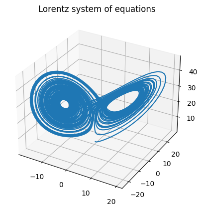
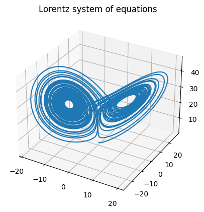

+++
title = "Simulating superradiance reactors, part 2"
date = 2023-04-17
+++

Again, we return to the superradiance series, a series of posts focused on creating a preliminary, naive raytracer for simulating superradiance reactors. This time, we will explore differential equation solvers.

<!-- more -->

Differential equations are the equations that describe how almost every physical system behave. In the case of black holes, the geodesic equation, a second-order differential equations, governs the trajectories of moving objects around the black hole:

$$
\frac{d^2 x^\sigma}{d\tau^2} + \Gamma^\sigma_{\alpha \beta} \frac{dx^\alpha}{d\tau} \frac{dx^\beta}{d\tau} = 0
$$

Differential equations are typically unsolvable or very difficult to solve exactly through analytical means. However, they can be solved numerically. This is where numerical methods for differential equations comes in. To demonstrate them, we can solve the Lorentz system of equations, a system of differential equations defined by:

$$
\frac{dx}{dt} = \sigma (y - x)
$$

$$
\frac{dy}{dt} = x (\rho - z) - y
$$

$$
\frac{dz}{dt} = xy - \beta z
$$

The Runge-Kutta 4th order method, often called RK4, is one of the most common numerical methods used for solving differential equations. It is defined by:

$$
y_{n + 1} = y_n + \frac{1}{6} (k_1 + 2k_2 + 2k_3 + k_4)h
$$

Where:

$$
k1 = f(t_n, y_n)
$$

$$
k2 = f(t_n + h / 2, y_n + h k_1 / 2)
$$

$$
k3 = f(t_n + h / 2, y_n + h k_2 / 2)
$$

$$
k4 = f(t_n + h, y_n + h k_3)
$$

A simple implementation in Python is given as follows:

```python
def rk4(f, u0, t0, tf, n):
    """
    Expects a function in the form y' = f(y, t) to solve
    f - function, MUST return numpy array of derivatives
    u0 - initial values
    t0 - initial time
    tf - final time
    n - number of samples
    """
    t = np.linspace(t0, tf, n+1)
    u = np.array((n+1)*[u0])
    h = t[1]-t[0]
    for i in range(n):
        k1 = h * f(u[i], t[i])    
        k2 = h * f(u[i] + 0.5 * k1, t[i] + 0.5*h)
        k3 = h * f(u[i] + 0.5 * k2, t[i] + 0.5*h)
        k4 = h * f(u[i] + k3, t[i] + h)
        u[i+1] = u[i] + (k1 + 2*(k2 + k3 ) + k4) / 6
    return u, t
```

We can use the basic RK4 method to solve the Lorentz equations and plot the results:

```python
def lorentz(X, t, rho=28, sigma=10, beta=8/3):
    x, y, z = X
    dx_dt = sigma * (y - x)
    dy_dt = x * (rho - z) - y
    dz_dt = x * y - beta * z
    return np.array([dx_dt, dy_dt, dz_dt])
```

```python
initial = [0., 1., 1.05]
sol = rk4(lorentz, initial, t0=0, tf=50, n=5000)

x = sol[0][:,0]
y = sol[0][:,1]
z = sol[0][:,2]

fig = plt.figure()
ax = fig.add_subplot(projection='3d')

ax.plot3D(x, y, z)
ax.set_title("Lorentz system of equations")
plt.show()
```

And the result:



However, note that we can get higher accuracy with an _adaptive_ step size rather than the fixed step size we have been using with RK4. To do this, we need two methods, a fourth-order method and fifth order method. By comparing the difference between the predictions of the two methods, we can find the error, which we can use to adjust the step size. Here is the code for the RK45 solver:

```python
def rk45(f, u0, t0, tf=100000, epsilon=0.00001, hmax = 0.2, debug=False):
    """
    Expects a function in the form y' = f(y, t) to solve
    f - function, MUST return numpy array of derivatives
    u0 - initial values
    t0 - initial time
    tf (optional) - final time
    No step size is required to be inputted as
    RK45 uses an adaptive step size
    """
    # h0 doesn't really matter as the step size is adaptive
    # it can really be anything, just a suitably small number
    h = 0.0002
    u = u0
    t = t0
    # solution array
    u_array = [u0]
    t_array = [t0]
    
    if debug:
        print(f"t0 = {t}, u0 = {u}, h = {h}")
    while t < tf:
        h = min(h, tf-t)
        k1 = h * f(u, t)
        k2 = h * f(u+k1/4, t+h/4)
        k3 = h * f(u+3*k1/32+9*k2/32, t+3*h/8)
        k4 = h * f(u+1932*k1/2197-7200*k2/2197+7296*k3/2197, t+12*h/13)
        k5 = h * f(u+439*k1/216-8*k2+3680*k3/513-845*k4/4104, t+h)
        k6 = h * f(u-8*k1/27+2*k2-3544*k3/2565+1859*k4/4104-11*k5/40, t+h/2)
        u1 = u + 25*k1/216+1408*k3/2565+2197*k4/4104-k5/5
        u2 = u + 16*k1/135+6656*k3/12825+28561*k4/56430-9*k5/50+2*k6/55
        R = np.mean(abs(u1-u2) / h)
        if R == 0:
            delta = 1
        else:
            delta = 0.84*(epsilon/R) ** (1/4)
        
        if R <= epsilon:
            # Keep u1 as the solution for the current time step
            # and move to the next step
            # otherwise recalculate current step with more accurate step
            u = u1
            t += h
            u_array.append(u)
            t_array.append(t)
        # base step size for next step on current step
        # limit maximum size of step to hmax
        if delta * h > hmax:
            h = hmax
        else:
            h = delta * h
        if debug:
            print(f"t = {t}, u = {u1}, h = {h}")
    return np.array(u_array), np.array(t_array)
```

When plotted, we have a much more accurate result:



The average error of the RK45 method is approximately $1 \times 10^{-15}$ off from the analytical solution. This is accurate enough for nearly all applications of a differential equation solver. In fact, the superradiance simulation will be using this exact method.
