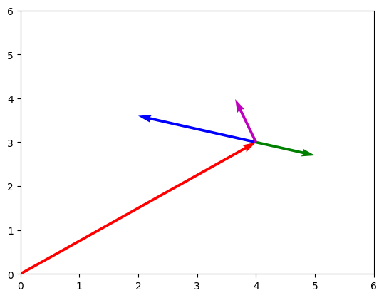
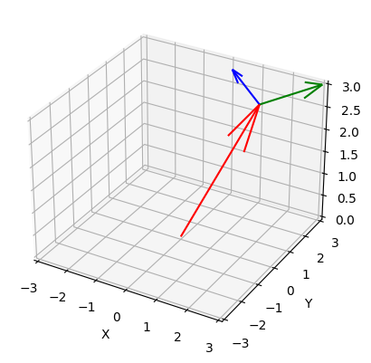

+++
title = "Simulating superradiance reactors, part 3"
date = 2023-04-19
draft = true
+++

In this third part of the superradiance series, a series of posts focused on creating a preliminary, naive raytracer for simulating superradiance reactors, we will explore solving for the vector of a reflected light ray.

<!-- more -->

Light rays follow a very special property, known as the law of reflection. This law states that the angle of incidence (the angle at which a light ray approaches a surface) must be equal to the angle of reflection:


\theta_i = \theta_r


Using the law of reflection, we can find the direction of an outgoing vector $\vec v_o$ given an incoming vector $\vec v_i$, a normal vector $\vec N$, and a point of surface intersection $(P_x, P_y, P_z)$.

First, the angle between the normal vector and incoming vector can be found like so:


\cos \theta = \frac{\vec v_i \cdot \vec N}{\| \vec v_i \| \| \vec N \|}


Then, the resulting vector can be found as follows:


\vec v_0 = -\vec N \times 
\begin{bmatrix}
\cos \theta & -\sin \theta \\
\sin \theta & \cos \theta
\end{bmatrix}


In Python, we can compute the vectors:

```python
def norm(x): 
    return np.sqrt(x.dot(x))

def angle_between_vectors(v1, v2):
    return np.arccos((v1.dot(v2)) / (norm(v1) * norm(v2)))
```


```python
def direction_from_angle(theta, normal):
    # counterclockwise rotation matrix
    rotation_matrix = np.array([[np.cos(theta), -np.sin(theta)], 
                                [np.sin(theta), np.cos(theta)]])
    return np.matmul(-normal, rotation_matrix)
```

Below, the incoming vector is the red vector, normal vector is the green vector, and outgoing vector the purple vector:


```python
v_i = np.array([4, 3])
v_i_origin = np.array([0, 0])
normal = np.array([1, -0.3])
normal_origin = np.array([4, 3])
angle = angle_between_vectors(v_i, normal)
outgoing = direction_from_angle(angle, normal)

origins = np.array([v_i_origin, normal_origin, normal_origin, normal_origin])
vectors = np.array([v_i, normal, -2 * normal, outgoing])

plt.quiver(origins[:, 0], origins[:, 1], vectors[:, 0], vectors[:, 1], color=["r", "g", "b", "m"], angles="xy", scale_units='xy', scale=1)
plt.xlim(0, 6)
plt.ylim(0, 6)
plt.show()
```



Now, we extend this concept to 3D space. We can use the same reflectance formula as 2D space by decomposing the 3D incoming vector $\vec a$ and normal vector $\vec N$ into two 2D vectors in the $y = 0$ and $x = 0$ plane. This is done by respectively setting $y = 0$ for $\vec a_y$ to get the projection of the vector in the plane $y = 0$, and setting $x = 0$ for $\vec a_x$ to get the projection of the vector in the plane $x = 0$, and doing the same for the normal vector:


\vec a_y = 
\begin{bmatrix}
a.x \\
a.z
\end{bmatrix}



\vec a_x = 
\begin{bmatrix}
a.y \\
a.z
\end{bmatrix}



\vec N_y = 
\begin{bmatrix}
N.x \\
N.z
\end{bmatrix}



\vec N_x = 
\begin{bmatrix}
N.y \\
N.z
\end{bmatrix}


Then, the angles can be found in 2D using the 2D projections of the 3D incoming and normal vectors:


\theta_y = \operatorname{angle} \left(\vec a_y, \vec N_y\right)



\theta_x = \operatorname{angle} \left(\vec a_x, \vec N_x\right)


Finally, the 2D projections of the outgoing vector $\vec b$ can be found by applying the rotation matrix $R(\theta)$ to the flipped 2D normal projection vector: 


\vec b_y = R(\theta_y) \times (-\vec N_y)



\vec b_x = R(\theta_x) \times (-\vec N_x)


From which the final outgoing vector $\vec b$ can be found:


\vec b = \begin{bmatrix}
c_y.x \\
c_x.x \\
c_y.z
\end{bmatrix}


The python code for this is as follows:

```python
def reflected_ray(incoming, normal):
    incoming_y = np.array([incoming[0], incoming[2]])
    incoming_x = np.array([incoming[1], incoming[2]])

    normal_y = np.array([normal[0], normal[2]])
    normal_x = np.array([normal[1], normal[2]])

    theta_y = angle_between_vectors(incoming_y, normal_y)
    theta_x = angle_between_vectors(incoming_x, normal_x)

    outgoing_y = direction_from_angle(theta_y, normal_y)
    outgoing_x = direction_from_angle(theta_x, normal_x)

    outgoing = np.array([outgoing_y[0], outgoing_x[0], outgoing_y[1]])
    return outgoing
```

Which produces the following vector plot:
    

    
We are now one step closer to completing the simulations of the black hole reactors. However, throughout this series, I've come to the realization that calulating the vectors of the light rays is ulimately not really useful, because the `KerrIntersection()` function doesn't require providing the vectors as argument. So the new, drastically simplified code is:

```python
mesh = loadmesh("geometry.stl")

N = 10000

ray_origin = [0.0, 0.0, 0.0, 0.99]
ray_positions = np.array((N + 1) * [ray_origin])

for i in range(N):
  # Find the point of intersection accounting for curving
  # of straight path in Kerr spacetime
  intersection_point = KerrIntersection(ray_positions[i - 1])
  # Intersection point is next ray position
  ray_positions[i] = intersection_point

t = np.arange(0, N)
plt.plot(t, ray_positions)
```
