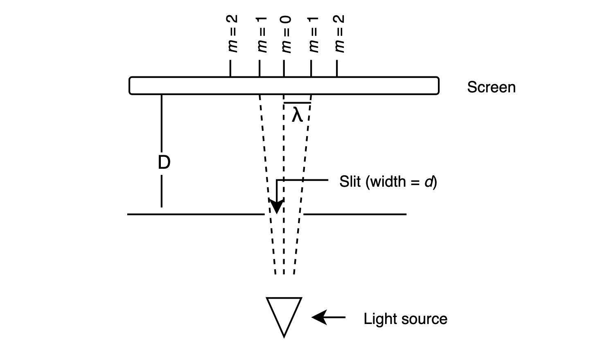
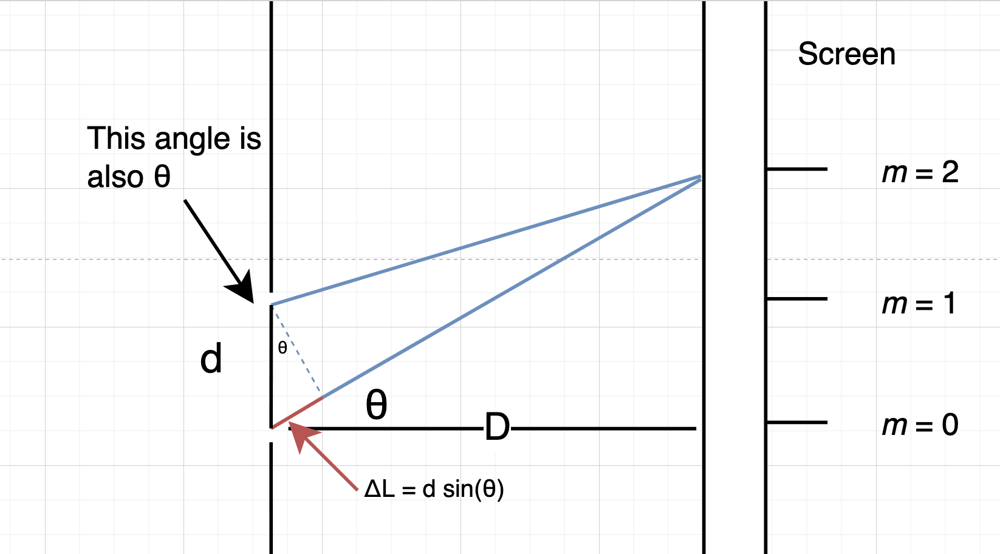

+++
title = "Waves and oscillations notes"
date = 2023-09-01
+++

These are notes taken during RPI's PHYSICS 1140 course, relating to a review of waves and oscillations.

<!-- more -->

It is recommended to use `Ctrl F` or the equivalent search function to find the relevant section, as these notes are quite long.

## Oscillating systems

A system that **oscillates** is described as undergoing **periodic motion** - motion that repeats. 

## Periodic waves

**Periodic waves** that satisfy the following characteristics:

- They repeat with the same period $T$
- Each repeat has the same amplitude $A$

## Harmonic waves

A harmonic wave is a 1D period wave that can be represented mathematically as:


y(t) = A \sin (\omega t + \phi_0)


Where $\phi_0$ is the phase shift (in radians), $A$ is the amplitude (in meters), and $\omega = \frac{2\pi}{T} = 2\pi f$ is the angular frequency (in radians per second).

## Traveling waves

Traveling waves are waves that move through space. Unlike non-traveling waves, which describe 1D motion, they describe 2D motion. They take a wide variety of forms, from mechanical waves to electromagnetic waves. Waves (or at least ideal waves) can be expressed as:

u(x, t) = f(x - vt)


if traveling in the positive x-direction, or:

u(x, t) = f(x + vt)


if traveling in the negative x-direction. The reason for the opposite sign is that $f(x - C$) describes a rightward shift in a graph, and $f(x - C)$ describes a leftward shift in a graph.
Traveling harmonic waves are a special case of traveling waves that are described by:

y(x, t) = y_m \sin\left(\frac{2\pi}{\lambda} (x - vt) + \phi_0\right)


where $\omega = 2\pi f$ and  $v = \lambda f$. If we let $k = \frac{2\pi}{\lambda}$, we can more simply write this equation as:

y(x, t) = y_m \sin(k(x - vt) + \phi_0)


Note that unlike non-traveling harmonic waves, which are functions of time, traveling waves are functions of position _and_ time.
To find the values of each of the constants describing harmonic traveling waves:

| Constant | Method (if given a graph) | Method (if given a function) |
|---|---|---|
| $y_m$ | Looking at amplitude of graph | Reading it off the standard form of the function |
| $\lambda$ | Looking at the horizontal distance between 2 high peaks | Deriving it from the wavenumber given $\lambda = \frac{2\pi}{k}$ |
| $k$ (wavenumber) | Calculating using $k = \frac{2\pi}{\lambda}$ | Reading it off the standard form of the function |
| $v$ | Cannot be calculated from just a graph | Reading it off the standard form of the function |
| $\phi_0$ (phase shift) | Find the initial height $y_0$ and the amplitude $y_m$, then use $\phi = \sin^{-1} (y_m / y_0)$ | Reading it off the standard form of the function |
| $\omega$ | Cannot be calculated from just a graph | Deriving it from the frequency given $\omega = 2\pi f$ |
| $T$ | Cannot be calculated from just a graph | Deriving it from the frequency given $f = \frac{1}{T}$ |
| $f$ | Cannot be calculated from just a graph | Deriving it from velocity given $f = \frac{v}{\lambda}$ |

## Phase and Phase Difference

**Phase** is an angular measure of how much of the graph is covered up to a certain point, and is given by (for a traveling wave):

\phi = \frac{2\pi}{\lambda} (x - x_0)


A phase of $2\pi$, for instance, indicates that the graph has covered $\lambda$ units of distance and completed one full cycle.
Phase changes through time and through space for a traveling harmonic wave. The change in phase $\Delta \phi$ between two times is given by:

\Delta \phi = \frac{2\pi}{\lambda} v\Delta t


And between two points separated in space is given by:

\Delta \phi = \frac{2\pi}{\lambda} v\Delta x


## Superposition

Traveling waves that pass through each other can be added to form a **superposition**:

y(x, t) = y_1(x, t) + y_2(x, t)


## The importance of amplitude

We see a lot of appearances of the factor of $A^2$ in the study of waves - the square of the amplitude.

The energy carried by many sinusoidal waves is often proportional to the square of the amplitude:

- String: $P = \frac{1}{2} \sqrt{\mu F} \omega^2 A^2$
- Sound wave: $I = \frac{1}{2} \sqrt{\rho B} \omega^2 A^2$
- Electromagnetic waves: $I = \frac{1}{2} \frac{{E_{max}^2}}{\mu_0 c}$

(one minor note: intensity $I$ is power per unit area, that is, $\frac{P}{A}$, but in this instance the difference between intensity and power doesn't matter because we are just trying to show a pattern)

In addition, it turns out that for a quantum mechanical wavefunction $\Psi$, the probability of finding a particle at a certain location in space is given by square of the wavefunction's amplitude:

|\Psi^2 | dV


And the probability current density in quantum mechanics is also related to the amplitude:

J = \frac{\hbar k}{m} A^2


## Addition of waves

When two or more waves arrive at the same point in space and time, **interference** occurs. Interference is only observable (constructive) if the two waves are in phase - that is, their peaks are aligned:

(Credit: Quora)

If two waves are out of phase (unequal frequency), then the sum of the two waves at a point would be:


\sin (\omega_1 t) + \sin(\omega_2 t) = 2 \sin \left(\frac{(\omega_1 + \omega_2)t}{2}\right)\cos \left(\frac{(\omega_1 - \omega_2)t}{2}\right)


## Illustrating phase difference

Here we have two waves that are out of phase:

(Credit: University of Rhode Island and Inner Space Center)

Recall that the phase difference between two spacial waves ($y$ as a function of $x$) with separation $\Delta x$ between their two peaks is given by:

\frac{2\pi}{\lambda} \Delta x


And the phase difference between two temporal waves ($y$ as a function of $t$) with separation $\Delta t$ between their two peaks is:


\frac{2\pi}{T} \Delta t


(earlier in the notes these were given in a slightly different form, but with the same result)

## Interference of Waves

If we had two waves with the same amplitude and frequency but different phase:


y_1(t) = y_0 \sin(\omega t + \phi_1)


y_2(t) = y_0 \sin(\omega t + \phi_2)


Then the new wave that results from the addition of the two waves, using the trig sine addition identity, is:


y_3 (t) = 2y_0 \cos \left(\frac{\phi_1 - \phi_2}{2} \right) \sin \left(\omega t + \frac{\phi_1 + \phi_2}{2}\right)


Therefore, the amplitude of the new sine wave is:


A = 2y_0 \cos \left(\frac{\phi_1 - \phi_2}{2} \right)

## Interference intensity

The time-averaged intensity $I_R$ of two waves is given by:


I_R = I_1 + I_2 + 2\sqrt{I_1 I_2} \cos(\Delta \phi)


If the two original waves had the same intensity and have a phase difference $\Delta \phi$, then:


I_R = 4 I_1 \cos^2 \left(\frac{\Delta \phi}{2}\right)


### Reasons that phase differences occur

- Waves that come from differing sources
- Waves that travel through different paths
- Waves that reflect off surfaces

The phase difference at a distance $L$ from a point source is:


\Delta \phi_L = \frac{2\pi}{\lambda} L


The phase difference in general from multiple sources can be calculated from the difference formula, where for a point source at $(x_1, y_1, z_1)$, we have:


L = \sqrt{(x - x_1)^2 + (y - y_1)^2 + (z - z_1)^2}


## Michelson Interferometer

(Credit: Encyclopedia Britannica)

In the Michelson interferometer, a beam with intensity $I_0$ leaves the light source (usually a laser) and passes through a beam-splitter. 50% of each beam goes into each mirror, and of that beam 50% goes into the detector. So only a quarter of the original beam actually enters the detector. By measuring how the two beams interfere, it is possible to find the difference in distance


I_{detector} = I_0 \cos^2 \left(\frac{2\pi}{\lambda}|A - B|\right)

(Note: the reason of the factor of 2 is due to the fact that the light beam travels $2A$ lengths and $2B$ lengths from each mirror as it reaches the detector)

## Young double-slit experiment

Given light waves passing through two slits separated by distance $d$ which are a distance $D$ from a distant screen, and that a peak (maximum) in the observed interference pattern on the screen is $m$ wavelengths from the center of the screen, then, using geometry, we can model the experiment. The model is shown below, and is rotated 90 degrees from the previous diagram to show detail:


y = m \lambda



\Delta L = d \sin \theta



\theta = \operatorname{arctan} \left(\frac{y}{D}\right)


Using some geometry, we find that:


\Delta L = m \lambda


Which results in:


\lambda = \frac{d \sin \theta}{m}


## The nature of light

Light is an electromagnetic wave with an electric and magnetic field moving together at the speed $c$, and is mathematically modeled as a wave where the $\vec E$ (electric) and $\vec B$ (magnetic) fields oscillate with time:


\vec E(x, t) = E_0 (\sin k(x - vt))


\vec B(x, t) = B_0 (\cos k(x - vt))


where $E_0 = \frac{B_0}{c}$.

## The photoelectric effect

When light is shined on a metal at a high enough frequency, it causes electrons to be emitted from the metal, and a current to be detected - this is the **photoelectric effect**.

## Quantizing light

Einstein proposed that the photoelectric effect was evidence that light was composed of particles called **photons**, where the energy of each photon is given by:


E = hf


where $h$ is called Planck's constant.

## The Photoelectric effect, in detail

In the experiment, light is incident on a metal cathode in a vacuum tube. Regardless of the intensity of the light, if the light is low frequency, nothing happens. However, if the light is high enough frequency, electrons are ejected from the cathode, and reach the anode on the other side of the vacuum tube. This creates a current in the circuit, which can be measured.

For electrons traveling from the cathode (C) to the anode (A), if the kinetic energy of electrons at the cathode is denoted by $K_A$, at the anode denoted by $K_C$, and the potential difference between the two metal plates $\Delta V$, the conservation of energy gives:


K_C - eV_C = K_A - e V_A \Rightarrow K_A = K_C + e \Delta V


Here, $e$ is the elementary charge, the charge of the electron.

The **stopping potential** $V_0=-\Delta V$ is the potential that results in no current, and is given by:


V_0 = 
\begin{cases}
0, f < f_0 \\
\frac{hf}{e} - \frac{h f_0}{e}, f \geq f_0
\end{cases}


Millikan found that the stopping potential depends only on the **frequency** of the incident light wave, and **not** on the intensity of the light. No current is observed when light has a frequency below a _threshold_ frequency $f_0$. The (confusingly-named) work function, the energy of a photon of the threshold frequency, is given by $W = hf_0$, and is a constant. Additionally, there is no time delay between when the light is turned on and when the cathode emits electrons. Both results violate the classical theory of electromagnetism.

## Photons

Einstein proposed that:

- Photons are the _quanta_ of light
- They travel at the speed of light $c$ in a vacuum and are massless
- They have energy $E = hf = \frac{hc}{\lambda}$ and carry momentum $p = \frac{h}{\lambda} = \frac{E}{c}$

The intensity of light is given by:


I = \phi E = \phi hf


where $\phi$ is the flux, given by:


\phi = \frac{N}{A t}


## Waves to particles

A light wave with a perfectly defined wavelength (and thus perfectly defined momentum $p$) has **infinite length** $x$.

However, adding several waves together creates **interference**. Some areas constructively interfere, and some areas destructively interfere. The more waves we add together, the more defined the length of the wave becomes (instead of infinity, it approaches a finite number), but the harder it is to say what the wavelength of the wave is.

Adding infinite waves together creates a localized peak of finite length, which we call a **wave packet**. This is what we observe as the photon. Mathematically speaking, we have:


u(x, t) = \int \limits_{k_1}^{k_2} A\sin\left(kx+\omega t\right) \, dk


where $k_1$ and $k_2$ define the boundaries of the wave packet. There is **no need** to remember this for the exam.

What is important (and most likely on the exam) is that as wavelength, and thus momentum, becomes less well-defined, the length becomes more well-defined. This is the **Heisenberg uncertainty principle**:


\sigma_x \sigma_p \geq \frac{\hbar}{2}


## The Mach-Zehnder Interferometer

In the Mach-Zehnder interferometer, two light beams are shone through a beam-splitter. Half of both beams then reflect on two mirrors, and the other half reflect in two other mirrors, where they are incident on another beam-splitter. Upon passing or reflecting in the second beam-splitter, they travel into one of two detectors. We can use the following equation to determine the power measured at either detector:


P = \frac{4 P_0}{2N} \cos^2 \left(\frac{\Delta \phi}{2}\right) 


where $N$ is the number of beams incident on the detector.
